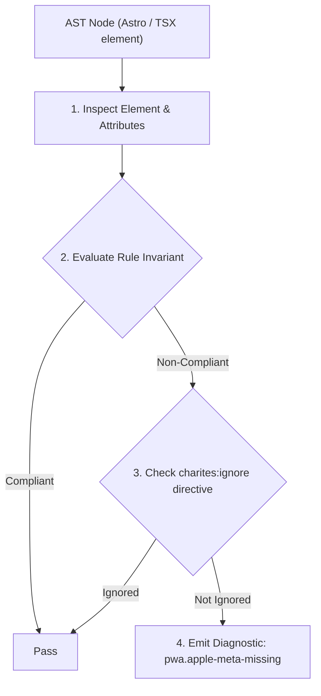
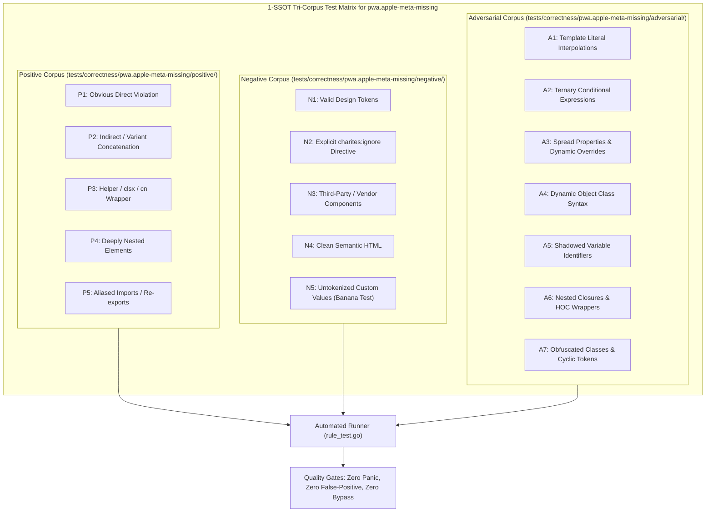

# pwa.apple-meta-missing

> **Rule ID:** `pwa.apple-meta-missing`
> **Severity:** `WARN`
> **Category:** `pwa`
> **Target Standards:** Apple Safari Web Content Guide (Configuring Web Applications), WebKit Standalone PWA Architecture, W3C Web App Manifest (Apple Ecosystem Compatibility)

---

## 1. Overview & Core Invariant

Warns when an HTML document head with a Web App Manifest is missing Apple WebKit standalone meta tags (apple-mobile-web-app-capable and apple-touch-icon)

### Core Invariant:
> **"When an HTML document <head> links to a Web App Manifest, it must declare '<meta name="apple-mobile-web-app-capable" content="yes">' and '<link rel="apple-touch-icon" href="...">'."**

---
## 2. Technical Grounding & Engine Realities

On Apple iOS (iPhone and iPad), Mobile Safari historically ignores the W3C Web App Manifest 'display: standalone' and 'icons' array when a user taps 'Add to Home Screen'.

To ensure the web app launches in an immersive fullscreen standalone mode without browser chrome (URL bar and bottom toolbar) and displays a sharp, high-resolution app icon on the iOS springboard, developers must declare Apple WebKit meta tags.

Providing both 'apple-mobile-web-app-capable' and 'apple-touch-icon' guarantees native-feeling PWA experiences on Apple devices.

---
## 3. Vulnerability & Risk Taxonomy

| Risk Vector | Severity | Impact |
| :--- | :---: | :--- |
| **Browser Chrome Intrusion on iOS** | MEDIUM | PWA launched from iOS Home Screen opens inside a regular Safari browser tab with URL navigation bars. |
| **Degraded Springboard Branding** | LOW | iOS displays a shrunken screenshot placeholder instead of the official high-resolution application icon. |

---
## 4. Non-Compliant Code Patterns (Bad Examples)
### TSX (Head with manifest link but missing Apple WebKit meta tags):
```tsx
<head>
  <title>Layanan Desa</title>
  <meta name="viewport" content="width=device-width, initial-scale=1" />
  <link rel="manifest" href="/manifest.webmanifest" />
</head>
```

---
## 5. Compliant Implementation Patterns (Good Examples)
### TSX (Head declaring both WebKit standalone meta and apple-touch-icon):
```tsx
<head>
  <title>Layanan Desa</title>
  <meta name="viewport" content="width=device-width, initial-scale=1" />
  <link rel="manifest" href="/manifest.webmanifest" />
  <meta name="apple-mobile-web-app-capable" content="yes" />
  <link rel="apple-touch-icon" href="/apple-touch-icon.png" />
</head>
```

---

## 6. Detection & Verification Pipeline (How The Rule Evaluates Code)
This rule evaluates source code through the standard AST inspection pipeline:



### Step-by-Step Evaluation:
1. **AST Traversal:** Visits normalized `ir.Node` structures during AST streaming.
2. **Invariant Check:** Compares node attributes against rule invariants.
3. **Directive Suppression Check:** Honors inline `charites:ignore pwa.apple-meta-missing` directives.
4. **Diagnostic Emission:** Emits compiler-grade diagnostic on invariant violation.

---

## 7. Verification & Test Harness (How The Test Works: 1-SSOT Tri-Corpus)

This rule is rigorously tested and validated across the canonical **1-SSOT Tri-Corpus** in `tests/correctness/pwa.apple-meta-missing/`:



- **Positive Fixtures (P1-P5):** Verified to trigger diagnostics at exact lines and column spans.
- **Negative Fixtures (N1-N5):** Verified to produce zero diagnostics on valid tokens and legitimate exemptions.
- **Adversarial Fixtures (A1-A7):** Verified to prevent evasion across dynamic expressions, string interpolations, and cyclic references.

---

## 8. How to Suppress (Ignore Directives)

If this pattern is required for an intentional exception, suppress the diagnostic using the canonical Charites Rule ID:

```astro
<!-- charites:ignore pwa.apple-meta-missing intentional exception -->
```

```tsx
// charites:ignore pwa.apple-meta-missing intentional exception
```

---

## 9. Configuration Reference (`charites.yaml`)

```yaml
rules:
  pwa.apple-meta-missing:
    severity: warn # error | warn | info | off
```

