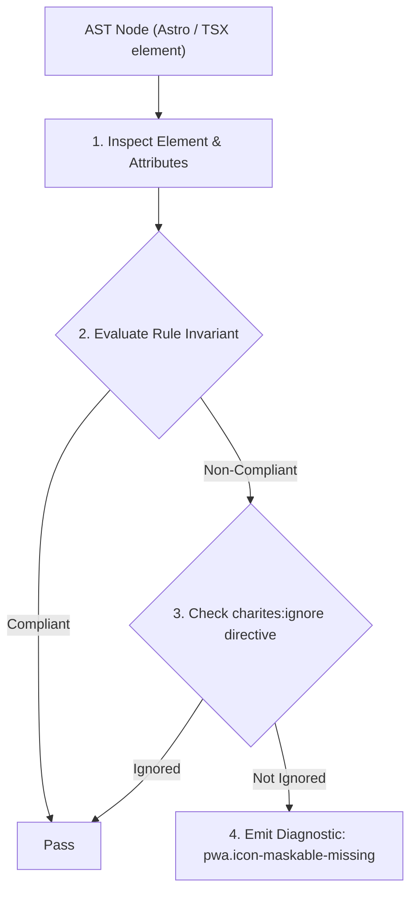
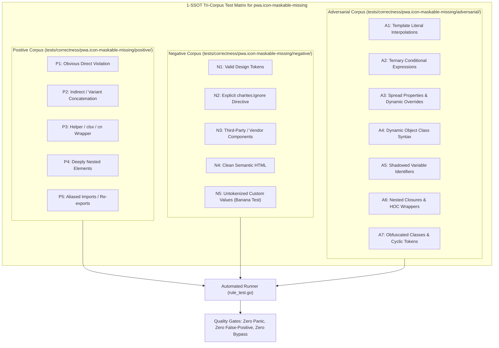

# pwa.icon-maskable-missing

> **Rule ID:** `pwa.icon-maskable-missing`
> **Severity:** `WARN`
> **Category:** `pwa`
> **Target Standards:** W3C Web App Manifest Specification (Adaptive Icon Masking), Google Android Maskable Icons Specification, Android Oreo+ Adaptive Launcher Icon Architecture

---

## 1. Overview & Core Invariant

Warns when a Web App Manifest defines icons but none has purpose: 'maskable' for Android adaptive launcher icons

### Core Invariant:
> **"When a Web App Manifest defines icons, at least one icon must declare 'purpose: "maskable"' to prevent Android launcher letterboxing."**

---
## 2. Technical Grounding & Engine Realities

Starting in Android 8.0 Oreo, native device launchers crop application icons according to user-selected device masks (circles, squircles, rounded rectangles).

When a PWA provides only standard icons (purpose: 'any' or omitted purpose), modern Android launchers place the icon inside a small white square box (letterboxing) to fit the mask. This disrupts the visual consistency of native mobile app trays.

Providing at least one icon with 'purpose: "maskable"' (with an appropriate safe zone margin) ensures the launcher can scale and mask the icon seamlessly to fill the full shape.

---
## 3. Vulnerability & Risk Taxonomy

| Risk Vector | Severity | Impact |
| :--- | :---: | :--- |
| **Letterboxed Android Launcher Icons** | MEDIUM | PWA icon appears inside an awkward white square box on Android device home screens. |
| **Degraded Native Visual Immersion** | LOW | Breaks aesthetic parity with native Android apps installed from Google Play. |

---
## 4. Non-Compliant Code Patterns (Bad Examples)
### TSX (Manifest defines icons without any maskable purpose):
```tsx
<script type="application/manifest+json">
  {JSON.stringify({
    name: "Desa Digital",
    start_url: "/",
    display: "standalone",
    icons: [
      { src: "/icon-512.png", sizes: "512x512", type: "image/png" }
    ]
  })}
</script>
```

---
## 5. Compliant Implementation Patterns (Good Examples)
### TSX (Manifest includes an adaptive icon with purpose: maskable):
```tsx
<script type="application/manifest+json">
  {JSON.stringify({
    name: "Desa Digital",
    start_url: "/",
    display: "standalone",
    icons: [
      { src: "/icon-512.png", sizes: "512x512", type: "image/png" },
      { src: "/icon-512-maskable.png", sizes: "512x512", type: "image/png", purpose: "maskable" }
    ]
  })}
</script>
```

---

## 6. Detection & Verification Pipeline (How The Rule Evaluates Code)
This rule evaluates source code through the standard AST inspection pipeline:



### Step-by-Step Evaluation:
1. **AST Traversal:** Visits normalized `ir.Node` structures during AST streaming.
2. **Invariant Check:** Compares node attributes against rule invariants.
3. **Directive Suppression Check:** Honors inline `charites:ignore pwa.icon-maskable-missing` directives.
4. **Diagnostic Emission:** Emits compiler-grade diagnostic on invariant violation.

---

## 7. Verification & Test Harness (How The Test Works: 1-SSOT Tri-Corpus)

This rule is rigorously tested and validated across the canonical **1-SSOT Tri-Corpus** in `tests/correctness/pwa.icon-maskable-missing/`:



- **Positive Fixtures (P1-P5):** Verified to trigger diagnostics at exact lines and column spans.
- **Negative Fixtures (N1-N5):** Verified to produce zero diagnostics on valid tokens and legitimate exemptions.
- **Adversarial Fixtures (A1-A7):** Verified to prevent evasion across dynamic expressions, string interpolations, and cyclic references.

---

## 8. How to Suppress (Ignore Directives)

If this pattern is required for an intentional exception, suppress the diagnostic using the canonical Charites Rule ID:

```astro
<!-- charites:ignore pwa.icon-maskable-missing intentional exception -->
```

```tsx
// charites:ignore pwa.icon-maskable-missing intentional exception
```

---

## 9. Configuration Reference (`charites.yaml`)

```yaml
rules:
  pwa.icon-maskable-missing:
    severity: warn # error | warn | info | off
```

