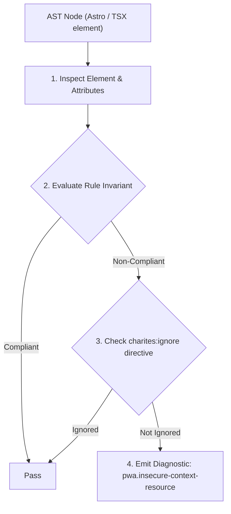
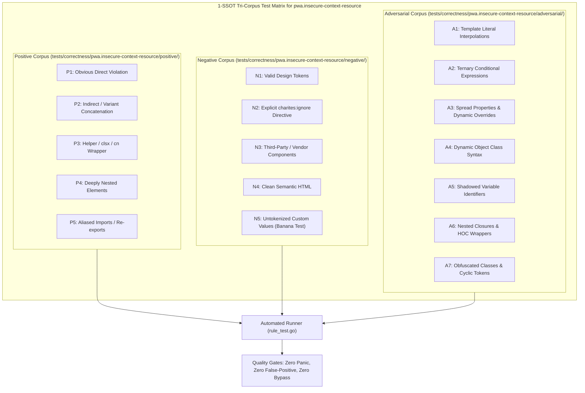

# pwa.insecure-context-resource

> **Rule ID:** `pwa.insecure-context-resource`
> **Severity:** `ERROR`
> **Category:** `pwa`
> **Target Standards:** W3C Secure Contexts Specification, W3C Mixed Content Level 2 Specification, RFC 7258 Pervasive Monitoring Is an Attack

---

## 1. Overview & Core Invariant

Errors when a resource element loads assets over an insecure HTTP protocol (http://) in violation of W3C Secure Contexts

### Core Invariant:
> **"Resource elements (<script>, <link>, , <iframe>, <video>, <audio>) must not load external assets over insecure 'http://' (except localhost loopback)."**

---
## 2. Technical Grounding & Engine Realities

Progressive Web Apps strictly require a Secure Context (HTTPS) to enable service workers, cache storage, and device hardware APIs.

Loading external assets (scripts, stylesheets, images, media, iframes) via an unencrypted 'http://' connection triggers Mixed Content blocking. Active mixed content (scripts, stylesheets) is blocked immediately by modern mobile browsers, breaking application functionality. Passive mixed content (images, audio) generates security warnings and can be intercepted or tampered with on public Wi-Fi networks.

All asset references must use HTTPS ('https://'), protocol-relative URLs ('//'), or local origin paths. Localhost addresses ('http://localhost' and 'http://127.0.0.1') are excepted for development purposes.

---
## 3. Vulnerability & Risk Taxonomy

| Risk Vector | Severity | Impact |
| :--- | :---: | :--- |
| **Active Mixed Content Blocking** | HIGH | Browsers completely block insecure scripts and stylesheets, breaking UI styling and interactive application logic. |
| **Man-in-the-Middle Asset Tampering** | HIGH | Unencrypted HTTP traffic can be intercepted, inspected, or modified by malicious actors on untrusted networks. |

---
## 4. Non-Compliant Code Patterns (Bad Examples)
### TSX (Insecure HTTP external script and stylesheet links):
```tsx
<div>
  <script src="http://cdn.example.org/tracker.js" />
  <link rel="stylesheet" href="http://assets.desa.id/styles.css" />
</div>
```

---
## 5. Compliant Implementation Patterns (Good Examples)
### TSX (Secure HTTPS asset loading conforming to Secure Contexts):
```tsx
<div>
  <script src="https://cdn.example.org/tracker.js" />
  <link rel="stylesheet" href="https://assets.desa.id/styles.css" />
</div>
```

---

## 6. Detection & Verification Pipeline (How The Rule Evaluates Code)
This rule evaluates source code through the standard AST inspection pipeline:



### Step-by-Step Evaluation:
1. **AST Traversal:** Visits normalized `ir.Node` structures during AST streaming.
2. **Invariant Check:** Compares node attributes against rule invariants.
3. **Directive Suppression Check:** Honors inline `charites:ignore pwa.insecure-context-resource` directives.
4. **Diagnostic Emission:** Emits compiler-grade diagnostic on invariant violation.

---

## 7. Verification & Test Harness (How The Test Works: 1-SSOT Tri-Corpus)

This rule is rigorously tested and validated across the canonical **1-SSOT Tri-Corpus** in `tests/correctness/pwa.insecure-context-resource/`:



- **Positive Fixtures (P1-P5):** Verified to trigger diagnostics at exact lines and column spans.
- **Negative Fixtures (N1-N5):** Verified to produce zero diagnostics on valid tokens and legitimate exemptions.
- **Adversarial Fixtures (A1-A7):** Verified to prevent evasion across dynamic expressions, string interpolations, and cyclic references.

---

## 8. How to Suppress (Ignore Directives)

If this pattern is required for an intentional exception, suppress the diagnostic using the canonical Charites Rule ID:

```astro
<!-- charites:ignore pwa.insecure-context-resource intentional exception -->
```

```tsx
// charites:ignore pwa.insecure-context-resource intentional exception
```

---

## 9. Configuration Reference (`charites.yaml`)

```yaml
rules:
  pwa.insecure-context-resource:
    severity: error # error | warn | info | off
```

