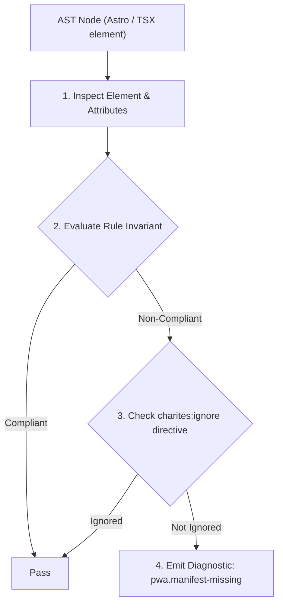
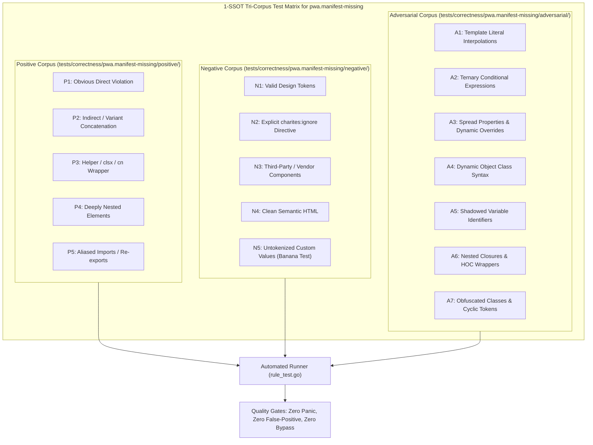

# pwa.manifest-missing

> **Rule ID:** `pwa.manifest-missing`
> **Severity:** `WARN`
> **Category:** `pwa`
> **Target Standards:** W3C Web App Manifest Section 4 (Linking to a Manifest), HTML Living Standard Section 4.2.4 (The link element), Chromium Progressive Web App Discovery Engine

---

## 1. Overview & Core Invariant

Warns when the HTML document <head> is missing a <link rel="manifest" href="..."> declaration

### Core Invariant:
> **"The HTML document <head> or root layout must include a '<link rel="manifest" href="...">' tag with a non-empty href attribute."**

---
## 2. Technical Grounding & Engine Realities

For mobile and desktop browsers to locate and parse a web application's manifest file, the root HTML document must link to it via a <link rel="manifest" href="..."> tag within the <head> section.

Without this explicit link element, browsers cannot discover the manifest, and consequently will never offer the install banner ('Add to Home Screen') or configure standalone display mode.

Including a valid manifest link in the document head ensures seamless PWA discovery across Chromium, Safari, and Gecko engines.

---
## 3. Vulnerability & Risk Taxonomy

| Risk Vector | Severity | Impact |
| :--- | :---: | :--- |
| **PWA Feature Invisibility** | HIGH | Browsers treat the site as a traditional desktop webpage and never offer PWA installation or offline capabilities. |
| **Missing Homescreen Install Capability** | MEDIUM | Users on mobile devices cannot install the web app to their home screen or application launcher. |

---
## 4. Non-Compliant Code Patterns (Bad Examples)
### TSX (HTML head without a manifest link element):
```tsx
<head>
  <title>Layanan Surat Desa</title>
  <meta name="viewport" content="width=device-width, initial-scale=1" />
</head>
```

---
## 5. Compliant Implementation Patterns (Good Examples)
### TSX (HTML head declaring a manifest link with valid href):
```tsx
<head>
  <title>Layanan Surat Desa</title>
  <meta name="viewport" content="width=device-width, initial-scale=1" />
  <link rel="manifest" href="/manifest.webmanifest" />
</head>
```

---

## 6. Detection & Verification Pipeline (How The Rule Evaluates Code)
This rule evaluates source code through the standard AST inspection pipeline:



### Step-by-Step Evaluation:
1. **AST Traversal:** Visits normalized `ir.Node` structures during AST streaming.
2. **Invariant Check:** Compares node attributes against rule invariants.
3. **Directive Suppression Check:** Honors inline `charites:ignore pwa.manifest-missing` directives.
4. **Diagnostic Emission:** Emits compiler-grade diagnostic on invariant violation.

---

## 7. Verification & Test Harness (How The Test Works: 1-SSOT Tri-Corpus)

This rule is rigorously tested and validated across the canonical **1-SSOT Tri-Corpus** in `tests/correctness/pwa.manifest-missing/`:



- **Positive Fixtures (P1-P5):** Verified to trigger diagnostics at exact lines and column spans.
- **Negative Fixtures (N1-N5):** Verified to produce zero diagnostics on valid tokens and legitimate exemptions.
- **Adversarial Fixtures (A1-A7):** Verified to prevent evasion across dynamic expressions, string interpolations, and cyclic references.

---

## 8. How to Suppress (Ignore Directives)

If this pattern is required for an intentional exception, suppress the diagnostic using the canonical Charites Rule ID:

```astro
<!-- charites:ignore pwa.manifest-missing intentional exception -->
```

```tsx
// charites:ignore pwa.manifest-missing intentional exception
```

---

## 9. Configuration Reference (`charites.yaml`)

```yaml
rules:
  pwa.manifest-missing:
    severity: warn # error | warn | info | off
```

