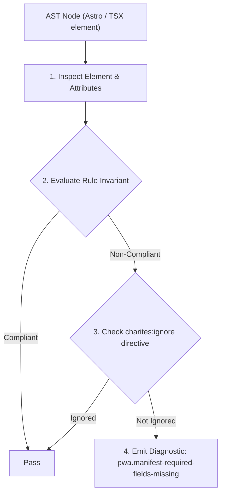
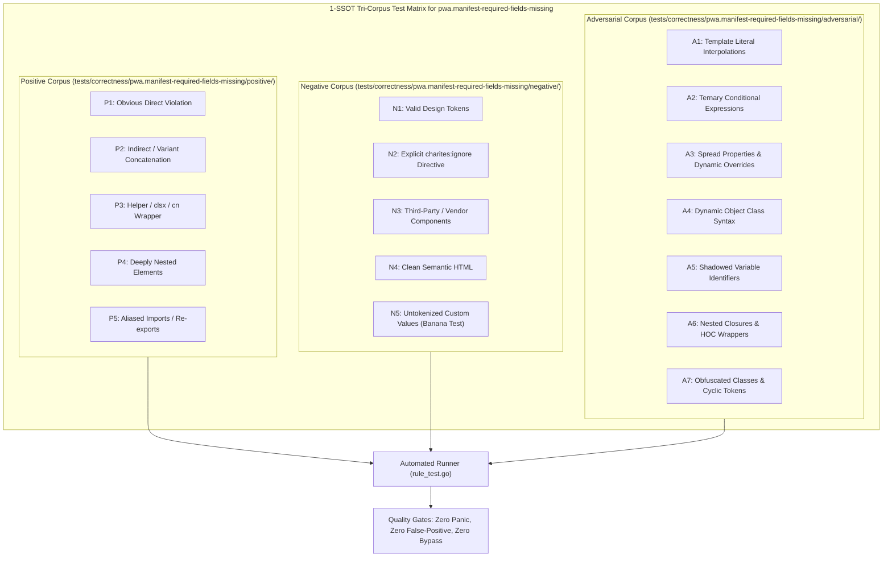

# pwa.manifest-required-fields-missing

> **Rule ID:** `pwa.manifest-required-fields-missing`
> **Severity:** `ERROR`
> **Category:** `pwa`
> **Target Standards:** W3C Web App Manifest Specification Section 5 (Manifest Members), Google Chrome Web App Installability Criteria, W3C Application Lifecycle & Installation Architecture

---

## 1. Overview & Core Invariant

Errors when a Web App Manifest definition is missing required fields (name/short_name, start_url, display, icons)

### Core Invariant:
> **"Web App Manifest declarations (<script type="application/manifest+json">) must declare required installability fields: 'name' (or 'short_name'), 'start_url', 'display', and at least one icon in 'icons'."**

---
## 2. Technical Grounding & Engine Realities

For mobile operating systems (Android, iOS) and modern web engines to recognize a website as an installable Progressive Web App, the Web App Manifest must declare minimum installability metadata.

Omitting 'name' or 'short_name' leaves the OS homescreen launcher with an empty or broken app label. Missing 'start_url' prevents the launcher from knowing which route to boot into. Omitting 'display' forces the app to open inside standard browser tabs rather than immersive standalone mode. Omitting 'icons' results in missing or broken asset icons on the user's home screen.

Declaring all four fundamental fields ensures reliable PWA install prompts and clean native OS integration.

---
## 3. Vulnerability & Risk Taxonomy

| Risk Vector | Severity | Impact |
| :--- | :---: | :--- |
| **Browser Installation Prompt Suppression** | HIGH | Mobile browsers silently suppress the 'Add to Home Screen' / install banner when manifest required fields are absent. |
| **Broken Application Branding** | MEDIUM | If installed manually, the web application displays placeholder text and fallback generic browser icons. |

---
## 4. Non-Compliant Code Patterns (Bad Examples)
### TSX (Manifest missing start_url, display, and icons):
```tsx
<script type="application/manifest+json">
  {JSON.stringify({
    name: "Desa Digital"
  })}
</script>
```

---
## 5. Compliant Implementation Patterns (Good Examples)
### TSX (Manifest declares all required installability members):
```tsx
<script type="application/manifest+json">
  {JSON.stringify({
    name: "Desa Digital",
    short_name: "Desa",
    start_url: "/",
    display: "standalone",
    icons: [
      { src: "/icon-192.png", sizes: "192x192", type: "image/png" },
      { src: "/icon-512.png", sizes: "512x512", type: "image/png", purpose: "maskable" }
    ]
  })}
</script>
```

---

## 6. Detection & Verification Pipeline (How The Rule Evaluates Code)
This rule evaluates source code through the standard AST inspection pipeline:



### Step-by-Step Evaluation:
1. **AST Traversal:** Visits normalized `ir.Node` structures during AST streaming.
2. **Invariant Check:** Compares node attributes against rule invariants.
3. **Directive Suppression Check:** Honors inline `charites:ignore pwa.manifest-required-fields-missing` directives.
4. **Diagnostic Emission:** Emits compiler-grade diagnostic on invariant violation.

---

## 7. Verification & Test Harness (How The Test Works: 1-SSOT Tri-Corpus)

This rule is rigorously tested and validated across the canonical **1-SSOT Tri-Corpus** in `tests/correctness/pwa.manifest-required-fields-missing/`:



- **Positive Fixtures (P1-P5):** Verified to trigger diagnostics at exact lines and column spans.
- **Negative Fixtures (N1-N5):** Verified to produce zero diagnostics on valid tokens and legitimate exemptions.
- **Adversarial Fixtures (A1-A7):** Verified to prevent evasion across dynamic expressions, string interpolations, and cyclic references.

---

## 8. How to Suppress (Ignore Directives)

If this pattern is required for an intentional exception, suppress the diagnostic using the canonical Charites Rule ID:

```astro
<!-- charites:ignore pwa.manifest-required-fields-missing intentional exception -->
```

```tsx
// charites:ignore pwa.manifest-required-fields-missing intentional exception
```

---

## 9. Configuration Reference (`charites.yaml`)

```yaml
rules:
  pwa.manifest-required-fields-missing:
    severity: error # error | warn | info | off
```

