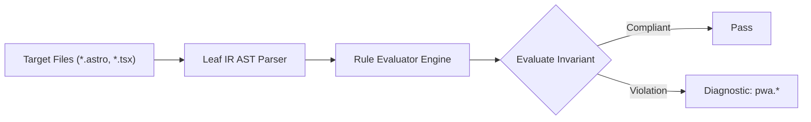

# Pwa Rules (`pwa`)

The `pwa` category contains static analysis rules for code quality, architectural constraints, and design system governance.

---

## Category Rule Index

| Rule ID | Severity | Summary | Full Specification | Status |
| :--- | :---: | :--- | :--- | :---: |
| `pwa.icon-maskable-missing` | `WARN` | Warns when a Web App Manifest defines icons but none has purpose: 'maskable' for Android adaptive launcher icons | [`pwa.icon-maskable-missing`](pwa.icon-maskable-missing) | `enabled` |
| `pwa.manifest-missing` | `WARN` | Warns when the HTML document <head> is missing a <link rel="manifest" href="..."> declaration | [`pwa.manifest-missing`](pwa.manifest-missing) | `enabled` |
| `pwa.manifest-required-fields-missing` | `ERROR` | Errors when a Web App Manifest definition is missing required fields (name/short_name, start_url, display, icons) | [`pwa.manifest-required-fields-missing`](pwa.manifest-required-fields-missing) | `enabled` |
| `pwa.start-url-inconsistency` | `ERROR` | Errors when a Web App Manifest start_url uses an insecure protocol (http://), script scheme (javascript:), or path traversal (../) | [`pwa.start-url-inconsistency`](pwa.start-url-inconsistency) | `enabled` |

---
## How the Pwa Analysis Pipeline Works

The `pwa` engine applies static analysis checks against component source code:

### Pipeline Flow:
1. **AST Node Traversal:** Scans target template files into normalized intermediate representation.
2. **Invariant Assertion:** Validates structural and semantic invariants.
3. **Diagnostic Reporting:** Emits structured diagnostics for non-compliant patterns.

---

## How Pwa Tests Work (Verification Harness)

All rules in `pwa` are verified using the canonical 1-SSOT Tri-Corpus (`tests/correctness/pwa.*/`) encompassing Positive (P1-P5), Negative (N1-N5), and Adversarial (A1-A7) fixture matrices.
