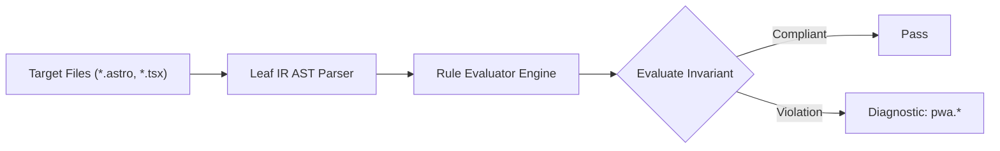

# Pwa Rules (`pwa`)

The `pwa` category contains static analysis rules for code quality, architectural constraints, and design system governance.

---

## Category Rule Index

| Rule ID | Severity | Summary | Full Specification | Status |
| :--- | :---: | :--- | :--- | :---: |
| `pwa.apple-meta-missing` | `WARN` | Warns when an HTML document head with a Web App Manifest is missing Apple WebKit standalone meta tags (apple-mobile-web-app-capable and apple-touch-icon) | [`pwa.apple-meta-missing`](pwa.apple-meta-missing) | `enabled` |
| `pwa.icon-maskable-missing` | `WARN` | Warns when a Web App Manifest defines icons but none has purpose: 'maskable' for Android adaptive launcher icons | [`pwa.icon-maskable-missing`](pwa.icon-maskable-missing) | `enabled` |
| `pwa.insecure-context-resource` | `ERROR` | Errors when a resource element loads assets over an insecure HTTP protocol (http://) in violation of W3C Secure Contexts | [`pwa.insecure-context-resource`](pwa.insecure-context-resource) | `enabled` |
| `pwa.manifest-missing` | `WARN` | Warns when the HTML document <head> is missing a <link rel="manifest" href="..."> declaration | [`pwa.manifest-missing`](pwa.manifest-missing) | `enabled` |
| `pwa.manifest-required-fields-missing` | `ERROR` | Errors when a Web App Manifest definition is missing required fields (name/short_name, start_url, display, icons) | [`pwa.manifest-required-fields-missing`](pwa.manifest-required-fields-missing) | `enabled` |
| `pwa.pwa-cache-runtime-api-risk` | `ERROR` | Prevents access to main-thread DOM and synchronous Web Storage APIs (window, document, localStorage) inside Service Worker scripts | [`pwa.pwa-cache-runtime-api-risk`](pwa.pwa-cache-runtime-api-risk) | `enabled` |
| `pwa.service-worker-missing` | `WARN` | Warns when an HTML document head links to a Web App Manifest but lacks a Service Worker registration in the document | [`pwa.service-worker-missing`](pwa.service-worker-missing) | `enabled` |
| `pwa.service-worker-no-offline-fallback` | `WARN` | Warns when a Service Worker intercepts fetch events without providing an offline cache fallback or failure handler | [`pwa.service-worker-no-offline-fallback`](pwa.service-worker-no-offline-fallback) | `enabled` |
| `pwa.service-worker-registration` | `WARN` | Warns when Service Worker registration lacks feature detection ('serviceWorker' in navigator) or error handling (.catch) | [`pwa.service-worker-registration`](pwa.service-worker-registration) | `enabled` |
| `pwa.start-url-inconsistency` | `ERROR` | Errors when a Web App Manifest start_url uses an insecure protocol (http://), script scheme (javascript:), or path traversal (../) | [`pwa.start-url-inconsistency`](pwa.start-url-inconsistency) | `enabled` |

---
## How the Pwa Analysis Pipeline Works

The `pwa` engine applies static analysis checks against component source code:

### Pipeline Flow:
1. **AST Node Traversal:** Scans target template files into normalized intermediate representation.
2. **Invariant Assertion:** Validates structural and semantic invariants.
3. **Diagnostic Reporting:** Emits structured diagnostics for non-compliant patterns.

---

## How Pwa Tests Work (Verification Harness)

All rules in `pwa` are verified using the canonical 1-SSOT Tri-Corpus (`tests/correctness/pwa.*/`) encompassing Positive (P1-P5), Negative (N1-N5), and Adversarial (A1-A7) fixture matrices.
