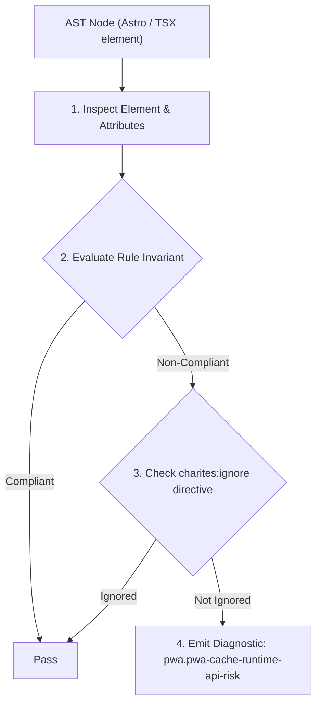
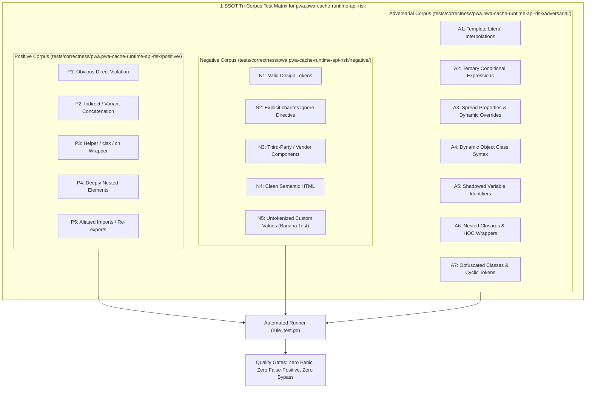

# pwa.pwa-cache-runtime-api-risk

> **Rule ID:** `pwa.pwa-cache-runtime-api-risk`
> **Severity:** `ERROR`
> **Category:** `pwa`
> **Target Standards:** W3C Service Workers (ServiceWorkerGlobalScope Execution Context), HTML Living Standard (Dedicated Worker & Web Worker Isolation), W3C Web Storage Specification (Thread Affinity Limitations)

---

## 1. Overview & Core Invariant

Prevents access to main-thread DOM and synchronous Web Storage APIs (window, document, localStorage) inside Service Worker scripts

### Core Invariant:
> **"Service Worker scripts must not access main-thread DOM or synchronous storage APIs (window, document, localStorage, sessionStorage, alert, confirm, prompt)."**

---
## 2. Technical Grounding & Engine Realities

Service Workers run in a distinct background worker thread (ServiceWorkerGlobalScope) that is entirely decoupled from the browser UI thread.

Attempting to access DOM APIs (window, document) or synchronous storage (localStorage, sessionStorage) in a Service Worker throws an immediate fatal ReferenceError at runtime, aborting worker installation and breaking all offline caching capabilities.

---
## 3. Vulnerability & Risk Taxonomy

| Risk Vector | Severity | Impact |
| :--- | :---: | :--- |
| **Immediate Service Worker Installation Crash** | HIGH | Worker script fails during parsing/evaluation with Uncaught ReferenceError: window is not defined, completely disabling offline caching. |
| **Broken Background Push/Sync Functionality** | HIGH | Background sync and push notifications fail to initialize because the worker thread crashed upon bootstrap. |

---
## 4. Non-Compliant Code Patterns (Bad Examples)
### TSX (Service Worker script attempting to access window and localStorage):
```tsx
<script>
  self.addEventListener("install", (event) => {
    const token = localStorage.getItem("token");
    window.location.reload();
  });
</script>
```

---
## 5. Compliant Implementation Patterns (Good Examples)
### TSX (Compliant Service Worker using Cache Storage and Worker primitives):
```tsx
<script>
  self.addEventListener("install", (event) => {
    event.waitUntil(
      caches.open("v1").then((cache) => cache.addAll(["/", "/offline.html"]))
    );
  });
</script>
```

---

## 6. Detection & Verification Pipeline (How The Rule Evaluates Code)
This rule evaluates source code through the standard AST inspection pipeline:



### Step-by-Step Evaluation:
1. **AST Traversal:** Visits normalized `ir.Node` structures during AST streaming.
2. **Invariant Check:** Compares node attributes against rule invariants.
3. **Directive Suppression Check:** Honors inline `charites:ignore pwa.pwa-cache-runtime-api-risk` directives.
4. **Diagnostic Emission:** Emits compiler-grade diagnostic on invariant violation.

---

## 7. Verification & Test Harness (How The Test Works: 1-SSOT Tri-Corpus)

This rule is rigorously tested and validated across the canonical **1-SSOT Tri-Corpus** in `tests/correctness/pwa.pwa-cache-runtime-api-risk/`:



- **Positive Fixtures (P1-P5):** Verified to trigger diagnostics at exact lines and column spans.
- **Negative Fixtures (N1-N5):** Verified to produce zero diagnostics on valid tokens and legitimate exemptions.
- **Adversarial Fixtures (A1-A7):** Verified to prevent evasion across dynamic expressions, string interpolations, and cyclic references.

---

## 8. How to Suppress (Ignore Directives)

If this pattern is required for an intentional exception, suppress the diagnostic using the canonical Charites Rule ID:

```astro
<!-- charites:ignore pwa.pwa-cache-runtime-api-risk intentional exception -->
```

```tsx
// charites:ignore pwa.pwa-cache-runtime-api-risk intentional exception
```

---

## 9. Configuration Reference (`charites.yaml`)

```yaml
rules:
  pwa.pwa-cache-runtime-api-risk:
    severity: error # error | warn | info | off
```

