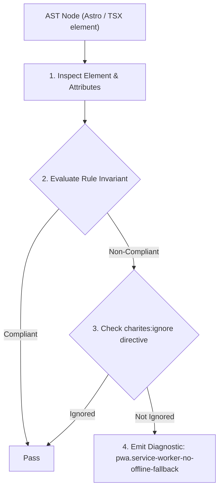
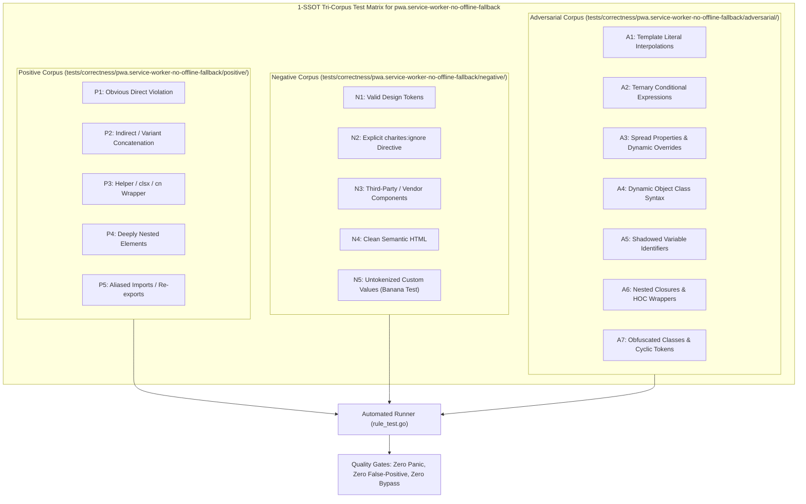

# pwa.service-worker-no-offline-fallback

> **Rule ID:** `pwa.service-worker-no-offline-fallback`
> **Severity:** `WARN`
> **Category:** `pwa`
> **Target Standards:** W3C Service Workers 1 (Offline Resilience Architecture), W3C Cache Storage Specification (Offline Asset Fallback), Google Chrome PWA Reliability Criteria (Offline Support)

---

## 1. Overview & Core Invariant

Warns when a Service Worker intercepts fetch events without providing an offline cache fallback or failure handler

### Core Invariant:
> **"Service Worker fetch event handlers must implement an offline cache fallback (e.g. caches.match) or failure catch handler instead of bare pass-through fetch interception."**

---
## 2. Technical Grounding & Engine Realities

In spotty or rural mobile network conditions (3G/4G signal drops), a Service Worker that intercepts fetch events without an offline cache strategy causes the browser to immediately display a connection-lost screen (the offline dinosaur page).

Providing a resilient cache-first or network-first fallback mechanism guarantees that the application shell and cached pages remain accessible even when completely disconnected from the Internet.

---
## 3. Vulnerability & Risk Taxonomy

| Risk Vector | Severity | Impact |
| :--- | :---: | :--- |
| **Immediate Offline Blackout** | MEDIUM | Users opening the PWA without network connectivity encounter a browser network failure screen instead of cached application content. |
| **PWA Installability Rejection** | LOW | Mobile browsers may downgrade or reject full PWA installation status due to failing offline resilience audits. |

---
## 4. Non-Compliant Code Patterns (Bad Examples)
### TSX (Pass-through fetch interception without offline cache fallback):
```tsx
<script>
  self.addEventListener("fetch", (event) => {
    event.respondWith(fetch(event.request));
  });
</script>
```

---
## 5. Compliant Implementation Patterns (Good Examples)
### TSX (Cache fallback provided via caches.match with network fallback):
```tsx
<script>
  self.addEventListener("fetch", (event) => {
    event.respondWith(
      caches.match(event.request).then((cached) => {
        return cached || fetch(event.request).catch(() => caches.match("/offline.html"));
      })
    );
  });
</script>
```

---

## 6. Detection & Verification Pipeline (How The Rule Evaluates Code)
This rule evaluates source code through the standard AST inspection pipeline:



### Step-by-Step Evaluation:
1. **AST Traversal:** Visits normalized `ir.Node` structures during AST streaming.
2. **Invariant Check:** Compares node attributes against rule invariants.
3. **Directive Suppression Check:** Honors inline `charites:ignore pwa.service-worker-no-offline-fallback` directives.
4. **Diagnostic Emission:** Emits compiler-grade diagnostic on invariant violation.

---

## 7. Verification & Test Harness (How The Test Works: 1-SSOT Tri-Corpus)

This rule is rigorously tested and validated across the canonical **1-SSOT Tri-Corpus** in `tests/correctness/pwa.service-worker-no-offline-fallback/`:



- **Positive Fixtures (P1-P5):** Verified to trigger diagnostics at exact lines and column spans.
- **Negative Fixtures (N1-N5):** Verified to produce zero diagnostics on valid tokens and legitimate exemptions.
- **Adversarial Fixtures (A1-A7):** Verified to prevent evasion across dynamic expressions, string interpolations, and cyclic references.

---

## 8. How to Suppress (Ignore Directives)

If this pattern is required for an intentional exception, suppress the diagnostic using the canonical Charites Rule ID:

```astro
<!-- charites:ignore pwa.service-worker-no-offline-fallback intentional exception -->
```

```tsx
// charites:ignore pwa.service-worker-no-offline-fallback intentional exception
```

---

## 9. Configuration Reference (`charites.yaml`)

```yaml
rules:
  pwa.service-worker-no-offline-fallback:
    severity: warn # error | warn | info | off
```

