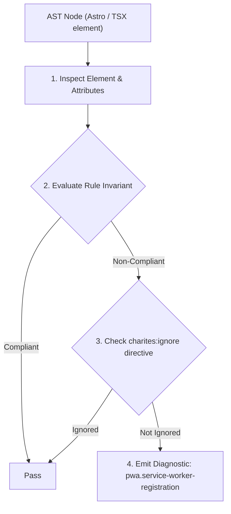
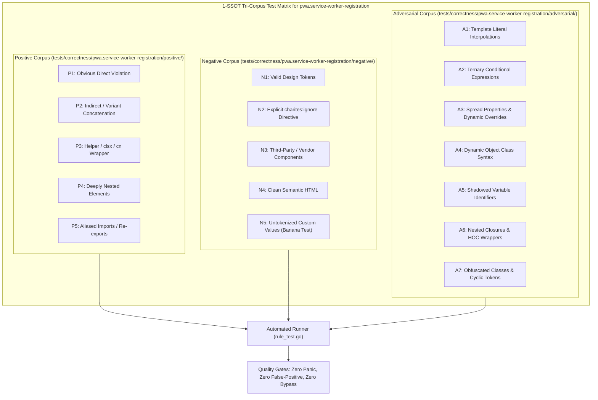

# pwa.service-worker-registration

> **Rule ID:** `pwa.service-worker-registration`
> **Severity:** `WARN`
> **Category:** `pwa`
> **Target Standards:** W3C Service Workers (Registration Lifecycle & Error Handling), MDN Progressive Web App Guides (Registering a Service Worker Safely), Google Web Fundamentals (Service Worker Reliability)

---

## 1. Overview & Core Invariant

Warns when Service Worker registration lacks feature detection ('serviceWorker' in navigator) or error handling (.catch)

### Core Invariant:
> **"Calls to navigator.serviceWorker.register must be guarded by feature detection ('serviceWorker' in navigator) and handled with error callbacks (.catch or try/catch)."**

---
## 2. Technical Grounding & Engine Realities

Calling navigator.serviceWorker.register() without feature detection triggers fatal runtime TypeErrors in legacy browsers, restricted WebViews, or non-secure HTTP contexts.

Furthermore, failing to handle registration failure (.catch or try/catch) causes unhandled promise rejections that can disrupt analytics scripts and break client-side bootstrapping.

---
## 3. Vulnerability & Risk Taxonomy

| Risk Vector | Severity | Impact |
| :--- | :---: | :--- |
| **Runtime Script Crash on Older Browsers** | MEDIUM | Browsers or WebViews lacking Service Worker support crash with Uncaught TypeError: Cannot read properties of undefined. |
| **Silent Unhandled Promise Rejections** | LOW | Registration rejections (e.g. 404 or SSL errors) pollute telemetry logs and fail to notify diagnostic listeners. |

---
## 4. Non-Compliant Code Patterns (Bad Examples)
### TSX (Unsafe registration without feature detection and error handling):
```tsx
<script>
  navigator.serviceWorker.register('/sw.js');
</script>
```

---
## 5. Compliant Implementation Patterns (Good Examples)
### TSX (Safe registration with feature detection and error handler):
```tsx
<script>
  if ('serviceWorker' in navigator) {
    navigator.serviceWorker.register('/sw.js')
      .then((reg) => console.log('SW registered:', reg.scope))
      .catch((err) => console.error('SW registration failed:', err));
  }
</script>
```

---

## 6. Detection & Verification Pipeline (How The Rule Evaluates Code)
This rule evaluates source code through the standard AST inspection pipeline:



### Step-by-Step Evaluation:
1. **AST Traversal:** Visits normalized `ir.Node` structures during AST streaming.
2. **Invariant Check:** Compares node attributes against rule invariants.
3. **Directive Suppression Check:** Honors inline `charites:ignore pwa.service-worker-registration` directives.
4. **Diagnostic Emission:** Emits compiler-grade diagnostic on invariant violation.

---

## 7. Verification & Test Harness (How The Test Works: 1-SSOT Tri-Corpus)

This rule is rigorously tested and validated across the canonical **1-SSOT Tri-Corpus** in `tests/correctness/pwa.service-worker-registration/`:



- **Positive Fixtures (P1-P5):** Verified to trigger diagnostics at exact lines and column spans.
- **Negative Fixtures (N1-N5):** Verified to produce zero diagnostics on valid tokens and legitimate exemptions.
- **Adversarial Fixtures (A1-A7):** Verified to prevent evasion across dynamic expressions, string interpolations, and cyclic references.

---

## 8. How to Suppress (Ignore Directives)

If this pattern is required for an intentional exception, suppress the diagnostic using the canonical Charites Rule ID:

```astro
<!-- charites:ignore pwa.service-worker-registration intentional exception -->
```

```tsx
// charites:ignore pwa.service-worker-registration intentional exception
```

---

## 9. Configuration Reference (`charites.yaml`)

```yaml
rules:
  pwa.service-worker-registration:
    severity: warn # error | warn | info | off
```

