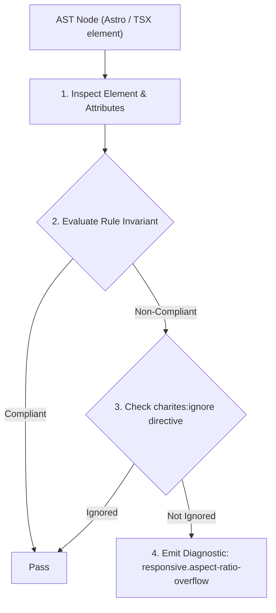
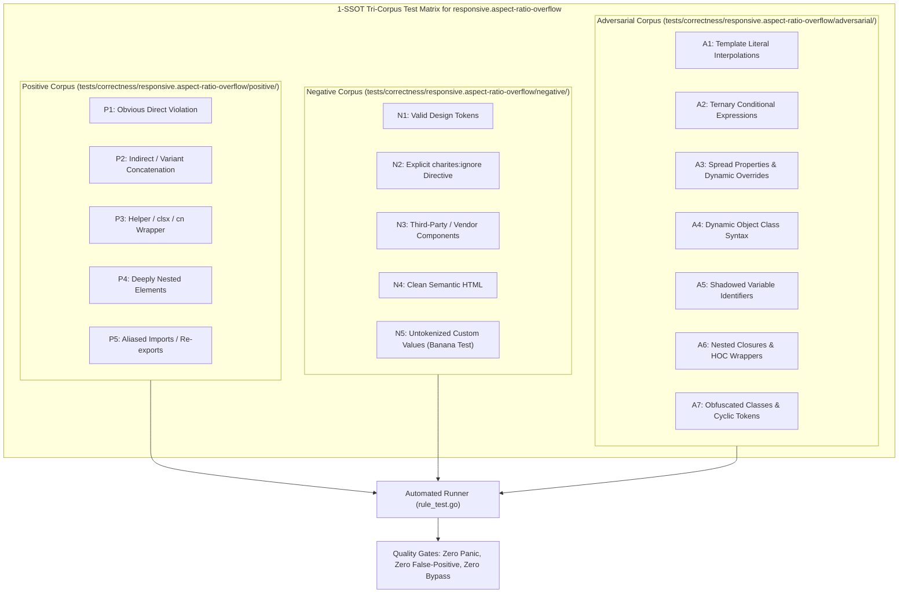

# responsive.aspect-ratio-overflow

> **Rule ID:** `responsive.aspect-ratio-overflow`
> **Severity:** `WARN`
> **Category:** `responsive`
> **Target Standards:** W3C CSS Box Sizing Module Level 4 (The aspect-ratio Property), WCAG 2.2 SC 1.4.10 (Reflow - Level AA), Responsive Media & Video Embed Best Practices

---

## 1. Overview & Core Invariant

Warns against fixed aspect-ratio combined with rigid static heights without fluid width boundaries on mobile viewports

### Core Invariant:
> **"Elements specifying an explicit 'aspect-*' ratio must not pair it with a rigid fixed height without fluid width constraints ('w-full' or 'max-w-full'), which forces width computation to expand beyond narrow mobile screens."**

---
## 2. Technical Grounding & Engine Realities

The CSS 'aspect-ratio' property computes the corresponding dimension when one dimension is defined. When an element specifies 'aspect-video' (16/9) and also sets 'h-[450px]' without a fluid width boundary ('w-full' or 'max-w-full'), the browser calculates width as 450 * (16/9) = 800px.

On a 360px mobile screen, an 800px computed width immediately blows out the layout horizontally, forcing horizontal scrolling and clipping sibling elements.

Charites detects conflicting aspect-ratio and rigid height definitions, recommending fluid widths ('w-full aspect-video') or letting height derive naturally from fluid container width.

---
## 3. Vulnerability & Risk Taxonomy

| Risk Vector | Severity | Impact |
| :--- | :---: | :--- |
| **Massive Horizontal Layout Blowout via Derived Aspect Width** | HIGH | Derived width expands to 800px+ on mobile screens when static height is combined with aspect-ratio. |
| **Conflicting Spatial Dimension Constraints** | MEDIUM | Media elements distort or overflow their parent grid/flex containers. |

---
## 4. Non-Compliant Code Patterns (Bad Examples)
### TSX (Aspect ratio paired with rigid fixed height forcing excessive computed width):
```tsx
<div className="aspect-video h-96 bg-black rounded-lg">
  <video src="/hero.mp4" controls />
</div>
```

---
## 5. Compliant Implementation Patterns (Good Examples)
### TSX (Fluid aspect ratio deriving height naturally from available width):
```tsx
<div className="w-full aspect-video bg-black rounded-lg">
  <video src="/hero.mp4" controls className="w-full h-full object-cover" />
</div>
```

---

## 6. Detection & Verification Pipeline (How The Rule Evaluates Code)
This rule evaluates source code through the standard AST inspection pipeline:



### Step-by-Step Evaluation:
1. **AST Traversal:** Visits normalized `ir.Node` structures during AST streaming.
2. **Invariant Check:** Compares node attributes against rule invariants.
3. **Directive Suppression Check:** Honors inline `charites:ignore responsive.aspect-ratio-overflow` directives.
4. **Diagnostic Emission:** Emits compiler-grade diagnostic on invariant violation.

---

## 7. Verification & Test Harness (How The Test Works: 1-SSOT Tri-Corpus)

This rule is rigorously tested and validated across the canonical **1-SSOT Tri-Corpus** in `tests/correctness/responsive.aspect-ratio-overflow/`:



- **Positive Fixtures (P1-P5):** Verified to trigger diagnostics at exact lines and column spans.
- **Negative Fixtures (N1-N5):** Verified to produce zero diagnostics on valid tokens and legitimate exemptions.
- **Adversarial Fixtures (A1-A7):** Verified to prevent evasion across dynamic expressions, string interpolations, and cyclic references.

---

## 8. How to Suppress (Ignore Directives)

If this pattern is required for an intentional exception, suppress the diagnostic using the canonical Charites Rule ID:

```astro
<!-- charites:ignore responsive.aspect-ratio-overflow intentional exception -->
```

```tsx
// charites:ignore responsive.aspect-ratio-overflow intentional exception
```

---

## 9. Configuration Reference (`charites.yaml`)

```yaml
rules:
  responsive.aspect-ratio-overflow:
    severity: warn # error | warn | info | off
```

