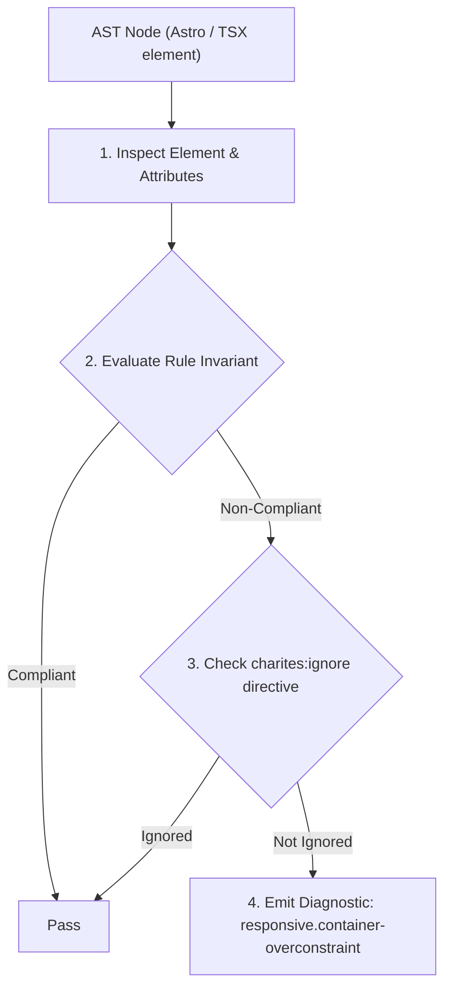
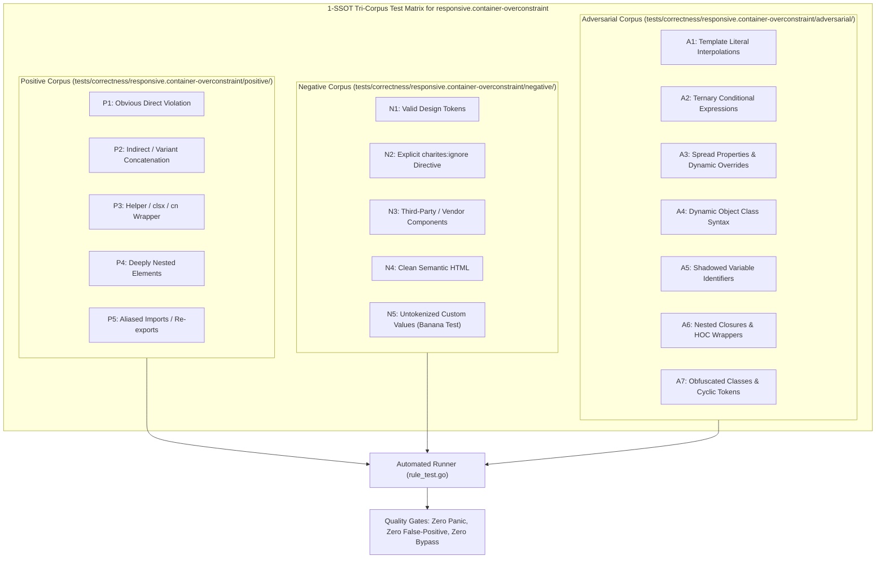

# responsive.container-overconstraint

> **Rule ID:** `responsive.container-overconstraint`
> **Severity:** `WARN`
> **Category:** `responsive`
> **Target Standards:** WCAG 2.2 SC 1.4.10 (Reflow - Level AA), Responsive Web Design Usable Width Baseline (320px - 360px), Tailwind CSS Layout Container Best Practices

---

## 1. Overview & Core Invariant

Warns against excessive mobile horizontal padding or overconstrained widths that pinch usable content width below 280px on smartphone viewports

### Core Invariant:
> **"Mobile baseline containers must not combine narrow width constraints with excessive horizontal padding (e.g. 'px-16', 'px-20', 'max-w-xs px-12') without responsive breakpoint prefixes, ensuring usable width stays above 280px."**

---
## 2. Technical Grounding & Engine Realities

On standard smartphones with a 360px wide screen (such as Galaxy A series and baseline Android devices), excessive horizontal padding like 'px-16' (64px each side = 128px total) reduces the usable reading width to just 232px.

When combined with narrow constraints like 'max-w-xs' (320px) and large padding, content gets severely cramped, forcing awkward line breaks, clipped tables, and unreadable text.

Charites flags unprefixed heavy horizontal padding on container elements, urging developers to start with compact padding on mobile (e.g. 'px-4') and scale up via responsive prefixes ('md:px-16').

---
## 3. Vulnerability & Risk Taxonomy

| Risk Vector | Severity | Impact |
| :--- | :---: | :--- |
| **Severe Content Cramping & Layout Distortion** | MEDIUM | Text blocks and interactive widgets become vertically stretched with single-word line breaks. |
| **Unnecessary Mobile Space Wastage** | LOW | More than 35% of the mobile screen width is wasted on dead whitespace padding margins. |

---
## 4. Non-Compliant Code Patterns (Bad Examples)
### TSX (Container applying desktop-sized horizontal padding on mobile baseline):
```tsx
<div className="container mx-auto px-16 py-8">
  <h1 className="text-2xl font-bold">Judul Halaman Warga</h1>
  <p>Deskripsi layanan kependudukan desa.</p>
</div>
```

---
## 5. Compliant Implementation Patterns (Good Examples)
### TSX (Fluid padding scaling smoothly from mobile to desktop):
```tsx
<div className="container mx-auto px-4 md:px-16 py-8">
  <h1 className="text-2xl font-bold">Judul Halaman Warga</h1>
  <p>Deskripsi layanan kependudukan desa.</p>
</div>
```

---

## 6. Detection & Verification Pipeline (How The Rule Evaluates Code)
This rule evaluates source code through the standard AST inspection pipeline:



### Step-by-Step Evaluation:
1. **AST Traversal:** Visits normalized `ir.Node` structures during AST streaming.
2. **Invariant Check:** Compares node attributes against rule invariants.
3. **Directive Suppression Check:** Honors inline `charites:ignore responsive.container-overconstraint` directives.
4. **Diagnostic Emission:** Emits compiler-grade diagnostic on invariant violation.

---

## 7. Verification & Test Harness (How The Test Works: 1-SSOT Tri-Corpus)

This rule is rigorously tested and validated across the canonical **1-SSOT Tri-Corpus** in `tests/correctness/responsive.container-overconstraint/`:



- **Positive Fixtures (P1-P5):** Verified to trigger diagnostics at exact lines and column spans.
- **Negative Fixtures (N1-N5):** Verified to produce zero diagnostics on valid tokens and legitimate exemptions.
- **Adversarial Fixtures (A1-A7):** Verified to prevent evasion across dynamic expressions, string interpolations, and cyclic references.

---

## 8. How to Suppress (Ignore Directives)

If this pattern is required for an intentional exception, suppress the diagnostic using the canonical Charites Rule ID:

```astro
<!-- charites:ignore responsive.container-overconstraint intentional exception -->
```

```tsx
// charites:ignore responsive.container-overconstraint intentional exception
```

---

## 9. Configuration Reference (`charites.yaml`)

```yaml
rules:
  responsive.container-overconstraint:
    severity: warn # error | warn | info | off
```

