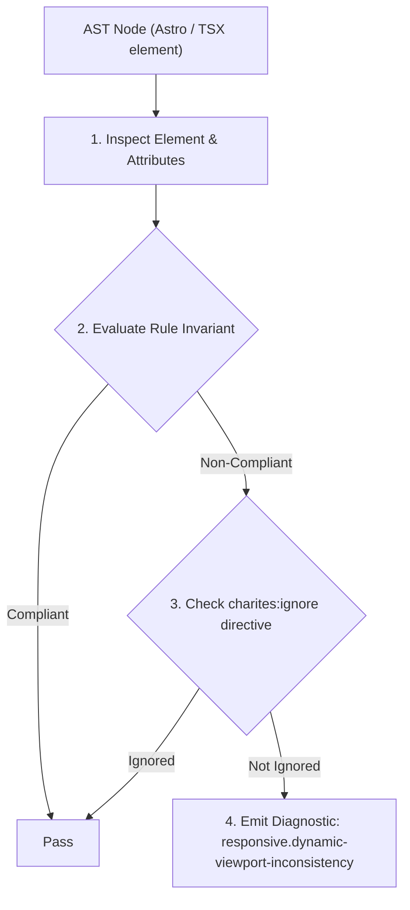
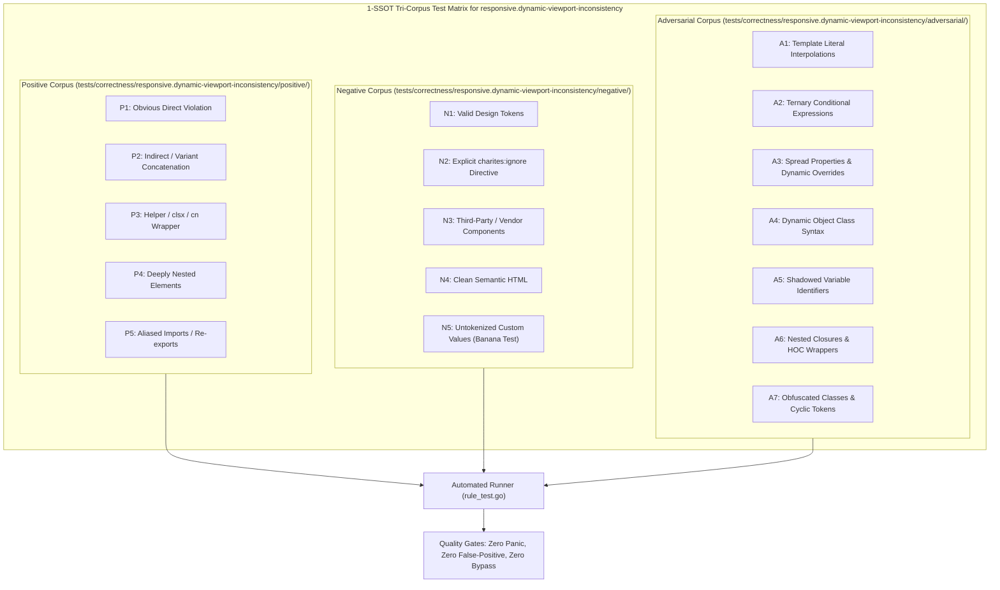

# responsive.dynamic-viewport-inconsistency

> **Rule ID:** `responsive.dynamic-viewport-inconsistency`
> **Severity:** `WARN`
> **Category:** `responsive`
> **Target Standards:** W3C CSS Values and Units Module Level 4 (Small, Large, and Dynamic Viewport Units), WebKit Dynamic Viewport Sizing Specification, Chrome for Android URL Bar Scroll Resize Guidelines

---

## 1. Overview & Core Invariant

Warns when static viewport units (100vh, h-screen) and modern dynamic units (dvh, svh) are mixed inconsistently across layout hierarchies

### Core Invariant:
> **"Components nested within a dynamic viewport container ('dvh', 'svh') must not use static viewport units ('100vh', 'h-screen'), and conflicting viewport dimensions must not be declared on the same element."**

---
## 2. Technical Grounding & Engine Realities

Modern mobile browsers (Safari iOS and Chrome Android) feature dynamic interface chrome (URL address bar and bottom navigation toolbar) that expand and collapse during user scrolling.

The dynamic viewport unit 'dvh' continuously tracks the active visible viewport height. In contrast, classical '100vh' and 'h-screen' are fixed to the Large Viewport (the maximum screen height assuming all browser chrome is collapsed).

When an outer wrapper uses 'min-h-dvh' while an inner component specifies 'h-screen' or 'h-[100vh]', the child height exceeds the visible parent area whenever the address bar is visible, causing unexpected double scrollbars, layout clipping, and jarring viewport jitter.

Charites enforces consistent viewport unit adoption across component hierarchies.

---
## 3. Vulnerability & Risk Taxonomy

| Risk Vector | Severity | Impact |
| :--- | :---: | :--- |
| **Mobile Double Scrollbar & Viewport Jitter** | MEDIUM | Inner components sized with 100vh exceed the dvh container, causing double scrollbars and layout jerking during scroll. |
| **Content Clipping Behind Browser Chrome** | LOW | Bottom actions and footers are pushed offscreen beneath mobile browser toolbars. |

---
## 4. Non-Compliant Code Patterns (Bad Examples)
### TSX (Inner child with h-screen nested inside an outer min-h-dvh container):
```tsx
<main className="min-h-dvh flex flex-col">
  <div className="h-screen bg-surface">
    <h2>Konten Terpotong di Mobile</h2>
  </div>
</main>
```

---
## 5. Compliant Implementation Patterns (Good Examples)
### TSX (Consistent dynamic viewport units across parent and child):
```tsx
<main className="min-h-dvh flex flex-col">
  <div className="h-full bg-surface">
    <h2>Konten Selaras Mengikuti Viewport</h2>
  </div>
</main>
```

---

## 6. Detection & Verification Pipeline (How The Rule Evaluates Code)
This rule evaluates source code through the standard AST inspection pipeline:



### Step-by-Step Evaluation:
1. **AST Traversal:** Visits normalized `ir.Node` structures during AST streaming.
2. **Invariant Check:** Compares node attributes against rule invariants.
3. **Directive Suppression Check:** Honors inline `charites:ignore responsive.dynamic-viewport-inconsistency` directives.
4. **Diagnostic Emission:** Emits compiler-grade diagnostic on invariant violation.

---

## 7. Verification & Test Harness (How The Test Works: 1-SSOT Tri-Corpus)

This rule is rigorously tested and validated across the canonical **1-SSOT Tri-Corpus** in `tests/correctness/responsive.dynamic-viewport-inconsistency/`:



- **Positive Fixtures (P1-P5):** Verified to trigger diagnostics at exact lines and column spans.
- **Negative Fixtures (N1-N5):** Verified to produce zero diagnostics on valid tokens and legitimate exemptions.
- **Adversarial Fixtures (A1-A7):** Verified to prevent evasion across dynamic expressions, string interpolations, and cyclic references.

---

## 8. How to Suppress (Ignore Directives)

If this pattern is required for an intentional exception, suppress the diagnostic using the canonical Charites Rule ID:

```astro
<!-- charites:ignore responsive.dynamic-viewport-inconsistency intentional exception -->
```

```tsx
// charites:ignore responsive.dynamic-viewport-inconsistency intentional exception
```

---

## 9. Configuration Reference (`charites.yaml`)

```yaml
rules:
  responsive.dynamic-viewport-inconsistency:
    severity: warn # error | warn | info | off
```

