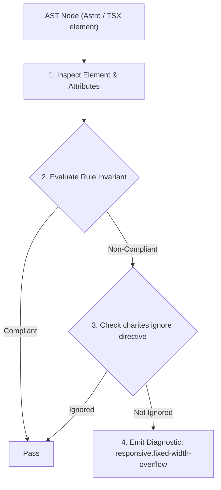
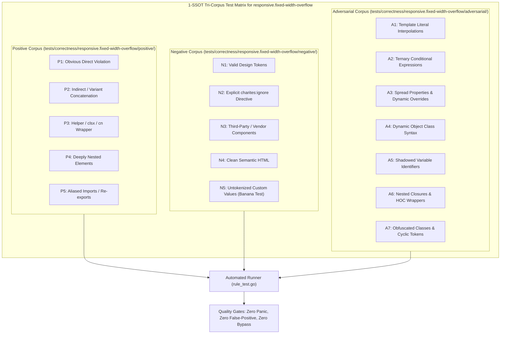

# responsive.fixed-width-overflow

> **Rule ID:** `responsive.fixed-width-overflow`
> **Severity:** `ERROR`
> **Category:** `responsive`
> **Target Standards:** W3C CSS Box Sizing & Fluid Layout Standards, Mobile-First Responsive Layout Dimensions (320px Minimum Screen Width), Tailwind CSS Arbitrary Values & Constrained Width Geometry

---

## 1. Overview & Core Invariant

Detects static fixed container widths exceeding 320px that cause horizontal overflow on mobile viewports

### Core Invariant:
> **"Static widths and min-widths exceeding 320px on mobile baseline must be bounded by fluid constraints (max-w-full) or scoped to desktop breakpoints."**

---
## 2. Technical Grounding & Engine Realities

Compact and foldable smartphones feature viewport widths starting at 320px (e.g. early iPhone SE or folded Galaxy Z Fold).

Declaring rigid static widths greater than 320px (such as w-[500px] or min-w-[400px]) directly on the mobile baseline mechanically exceeds the physical screen boundaries, causing the page to tear and creating an unwanted horizontal scrollbar.

Using fluid widths with maximum caps (w-full max-w-lg) ensures full responsiveness across all screen dimensions.

---
## 3. Vulnerability & Risk Taxonomy

| Risk Vector | Severity | Impact |
| :--- | :---: | :--- |
| **Mobile Horizontal Layout Tear** | HIGH | Container forces document width beyond screen borders, creating horizontal scrolling and broken edge-swipe gestures. |
| **Cutoff Touch Targets** | MEDIUM | Buttons on the right edge of the fixed container become inaccessible without panning horizontally. |

---
## 4. Non-Compliant Code Patterns (Bad Examples)
### TSX (Static fixed width exceeding 320px without fluid boundary):
```tsx
<div className="w-[500px] bg-card p-4">
  <p>Kartu Informasi Desa</p>
</div>
```

---
## 5. Compliant Implementation Patterns (Good Examples)
### TSX (Fluid mobile width with max-width ceiling on larger screens):
```tsx
<div className="w-full max-w-lg bg-card p-4">
  <p>Kartu Informasi Desa</p>
</div>
```

---

## 6. Detection & Verification Pipeline (How The Rule Evaluates Code)
This rule evaluates source code through the standard AST inspection pipeline:



### Step-by-Step Evaluation:
1. **AST Traversal:** Visits normalized `ir.Node` structures during AST streaming.
2. **Invariant Check:** Compares node attributes against rule invariants.
3. **Directive Suppression Check:** Honors inline `charites:ignore responsive.fixed-width-overflow` directives.
4. **Diagnostic Emission:** Emits compiler-grade diagnostic on invariant violation.

---

## 7. Verification & Test Harness (How The Test Works: 1-SSOT Tri-Corpus)

This rule is rigorously tested and validated across the canonical **1-SSOT Tri-Corpus** in `tests/correctness/responsive.fixed-width-overflow/`:



- **Positive Fixtures (P1-P5):** Verified to trigger diagnostics at exact lines and column spans.
- **Negative Fixtures (N1-N5):** Verified to produce zero diagnostics on valid tokens and legitimate exemptions.
- **Adversarial Fixtures (A1-A7):** Verified to prevent evasion across dynamic expressions, string interpolations, and cyclic references.

---

## 8. How to Suppress (Ignore Directives)

If this pattern is required for an intentional exception, suppress the diagnostic using the canonical Charites Rule ID:

```astro
<!-- charites:ignore responsive.fixed-width-overflow intentional exception -->
```

```tsx
// charites:ignore responsive.fixed-width-overflow intentional exception
```

---

## 9. Configuration Reference (`charites.yaml`)

```yaml
rules:
  responsive.fixed-width-overflow:
    severity: error # error | warn | info | off
```

