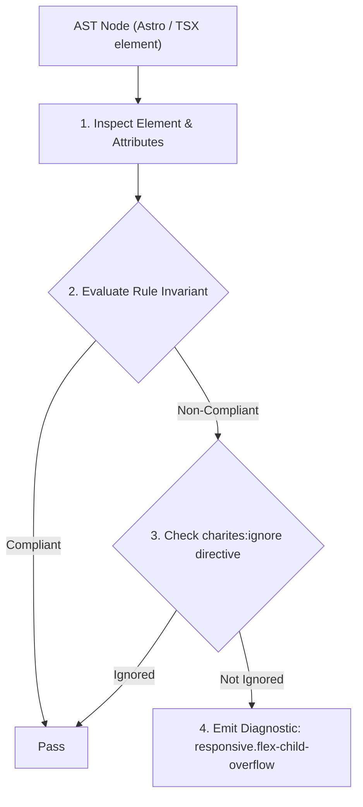
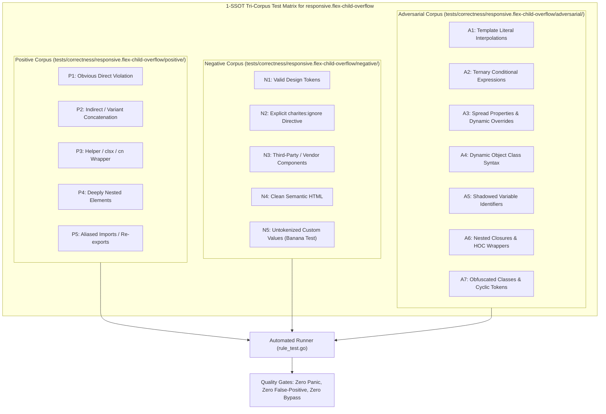

# responsive.flex-child-overflow

> **Rule ID:** `responsive.flex-child-overflow`
> **Severity:** `WARN`
> **Category:** `responsive`
> **Target Standards:** W3C CSS Flexible Box Layout Module Level 1 (Section 4.5: Implied Minimum Size of Flex Items), MDN Flexbox Gotchas: Min-Width Auto on Flex Items

---

## 1. Overview & Core Invariant

Warns when a flex child containing text or dynamic content lacks min-w-0, causing min-width: auto container blowout

### Core Invariant:
> **"Direct flex item children containing text or dynamic content must declare 'min-w-0' (or 'overflow-hidden') to override the CSS default 'min-width: auto' behavior."**

---
## 2. Technical Grounding & Engine Realities

The CSS Flexbox specification defines that flex items default to 'min-width: auto' rather than 'min-width: 0'. Consequently, a flex child will refuse to shrink below the intrinsic width of its text or content.

When a flex child encloses long paragraphs, code blocks, or dynamic strings, the flex child forces the parent container and mobile viewport to expand beyond 100vw, completely breaking text truncation ('truncate') and causing horizontal overflow.

Adding 'min-w-0' to the flex item overrides the implied minimum size, allowing text truncation and responsive shrinkage to function correctly.

---
## 3. Vulnerability & Risk Taxonomy

| Risk Vector | Severity | Impact |
| :--- | :---: | :--- |
| **Flex Container Viewport Blowout** | MEDIUM | Flex items refuse to shrink below long content strings, blowing out the parent container beyond 100vw. |
| **Broken Text Truncation** | LOW | CSS 'truncate' fails completely on nested text elements because the parent flex item has no minimum width boundary. |

---
## 4. Non-Compliant Code Patterns (Bad Examples)
### TSX (Flex child with text content lacking min-w-0):
```tsx
<div className="flex items-center gap-4">
  <div className="w-full">
    <p className="truncate">{userDescription}</p>
  </div>
</div>
```

---
## 5. Compliant Implementation Patterns (Good Examples)
### TSX (Flex child protected with min-w-0):
```tsx
<div className="flex items-center gap-4">
  <div className="min-w-0 w-full">
    <p className="truncate">{userDescription}</p>
  </div>
</div>
```

---

## 6. Detection & Verification Pipeline (How The Rule Evaluates Code)
This rule evaluates source code through the standard AST inspection pipeline:



### Step-by-Step Evaluation:
1. **AST Traversal:** Visits normalized `ir.Node` structures during AST streaming.
2. **Invariant Check:** Compares node attributes against rule invariants.
3. **Directive Suppression Check:** Honors inline `charites:ignore responsive.flex-child-overflow` directives.
4. **Diagnostic Emission:** Emits compiler-grade diagnostic on invariant violation.

---

## 7. Verification & Test Harness (How The Test Works: 1-SSOT Tri-Corpus)

This rule is rigorously tested and validated across the canonical **1-SSOT Tri-Corpus** in `tests/correctness/responsive.flex-child-overflow/`:



- **Positive Fixtures (P1-P5):** Verified to trigger diagnostics at exact lines and column spans.
- **Negative Fixtures (N1-N5):** Verified to produce zero diagnostics on valid tokens and legitimate exemptions.
- **Adversarial Fixtures (A1-A7):** Verified to prevent evasion across dynamic expressions, string interpolations, and cyclic references.

---

## 8. How to Suppress (Ignore Directives)

If this pattern is required for an intentional exception, suppress the diagnostic using the canonical Charites Rule ID:

```astro
<!-- charites:ignore responsive.flex-child-overflow intentional exception -->
```

```tsx
// charites:ignore responsive.flex-child-overflow intentional exception
```

---

## 9. Configuration Reference (`charites.yaml`)

```yaml
rules:
  responsive.flex-child-overflow:
    severity: warn # error | warn | info | off
```

