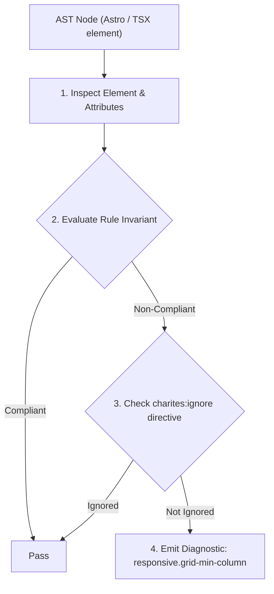
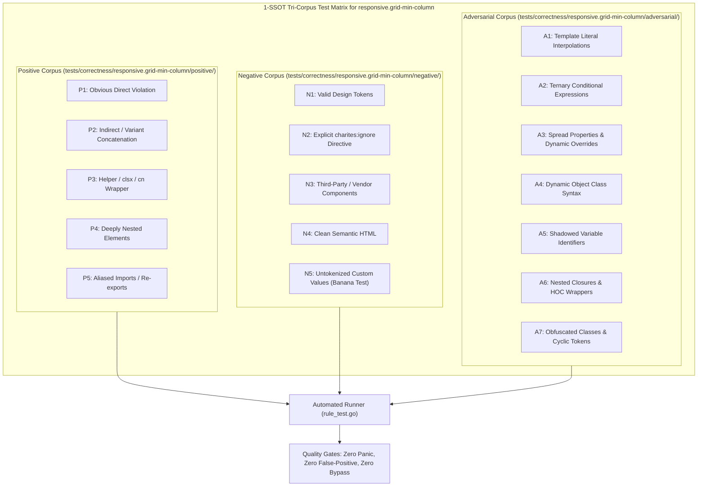

# responsive.grid-min-column

> **Rule ID:** `responsive.grid-min-column`
> **Severity:** `WARN`
> **Category:** `responsive`
> **Target Standards:** W3C CSS Grid Layout Module Level 1 (The minmax() Function), WCAG 2.2 SC 1.4.10 (Reflow - Level AA), Mobile Web Best Practices: Preventing Horizontal Viewport Blowout

---

## 1. Overview & Core Invariant

Warns against CSS grid minmax column definitions with rigid minimum sizes (> 320px) that cause horizontal overflow on mobile viewports

### Core Invariant:
> **"CSS grid column minmax tracks on mobile baseline must not enforce rigid minimum widths greater than 320px without dynamic clamping ('min(100%, <size>)') or desktop breakpoint scoping ('md:grid-cols-...')."**

---
## 2. Technical Grounding & Engine Realities

A common CSS grid pattern for auto-fit cards is 'repeat(auto-fit, minmax(350px, 1fr))' or 'repeat(auto-fill, minmax(400px, 1fr))'. While this looks great on desktop and tablet monitors, the minimum column track width of 350px or 400px exceeds the 360px physical width of most smartphones and the 320px minimum WCAG reflow baseline.

Because CSS grid does not shrink tracks below their minimum minmax threshold, the grid blows out horizontally, introducing an unintended horizontal scrollbar across the entire mobile page.

Charites detects rigid minmax tracks and suggests using the standard modern CSS clamp idiom: 'minmax(min(100%, 20rem), 1fr)' or scoping multi-column grids behind 'md:' breakpoints.

---
## 3. Vulnerability & Risk Taxonomy

| Risk Vector | Severity | Impact |
| :--- | :---: | :--- |
| **Mobile Viewport Horizontal Scrollbar Blowout** | HIGH | The entire website scrolls sideways on mobile phones because a single card grid enforces 350px+ minimum track size. |
| **Broken Touch Gestures & Visual Glitches** | MEDIUM | Accidental horizontal swiping triggers page drift instead of vertical scroll. |

---
## 4. Non-Compliant Code Patterns (Bad Examples)
### TSX (Grid specifying 400px minimum column width on mobile baseline):
```tsx
<div className="grid grid-cols-[repeat(auto-fit,minmax(400px,1fr))] gap-4">
  <div className="card">Kartu Layanan 1</div>
  <div className="card">Kartu Layanan 2</div>
</div>
```

---
## 5. Compliant Implementation Patterns (Good Examples)
### TSX (Clamped minmax ensuring column never exceeds 100% on narrow screens):
```tsx
<div className="grid grid-cols-[repeat(auto-fit,minmax(min(100%,20rem),1fr))] gap-4">
  <div className="card">Kartu Layanan 1</div>
  <div className="card">Kartu Layanan 2</div>
</div>
```
### TSX (Mobile single-column with desktop-scoped multi-column minmax):
```tsx
<div className="grid grid-cols-1 md:grid-cols-[repeat(auto-fit,minmax(350px,1fr))] gap-4">
  <div className="card">Kartu Layanan 1</div>
  <div className="card">Kartu Layanan 2</div>
</div>
```

---

## 6. Detection & Verification Pipeline (How The Rule Evaluates Code)
This rule evaluates source code through the standard AST inspection pipeline:



### Step-by-Step Evaluation:
1. **AST Traversal:** Visits normalized `ir.Node` structures during AST streaming.
2. **Invariant Check:** Compares node attributes against rule invariants.
3. **Directive Suppression Check:** Honors inline `charites:ignore responsive.grid-min-column` directives.
4. **Diagnostic Emission:** Emits compiler-grade diagnostic on invariant violation.

---

## 7. Verification & Test Harness (How The Test Works: 1-SSOT Tri-Corpus)

This rule is rigorously tested and validated across the canonical **1-SSOT Tri-Corpus** in `tests/correctness/responsive.grid-min-column/`:



- **Positive Fixtures (P1-P5):** Verified to trigger diagnostics at exact lines and column spans.
- **Negative Fixtures (N1-N5):** Verified to produce zero diagnostics on valid tokens and legitimate exemptions.
- **Adversarial Fixtures (A1-A7):** Verified to prevent evasion across dynamic expressions, string interpolations, and cyclic references.

---

## 8. How to Suppress (Ignore Directives)

If this pattern is required for an intentional exception, suppress the diagnostic using the canonical Charites Rule ID:

```astro
<!-- charites:ignore responsive.grid-min-column intentional exception -->
```

```tsx
// charites:ignore responsive.grid-min-column intentional exception
```

---

## 9. Configuration Reference (`charites.yaml`)

```yaml
rules:
  responsive.grid-min-column:
    severity: warn # error | warn | info | off
```

