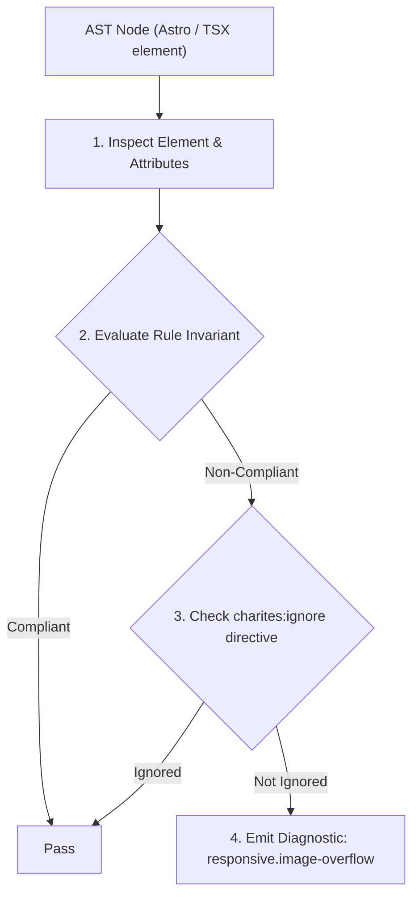
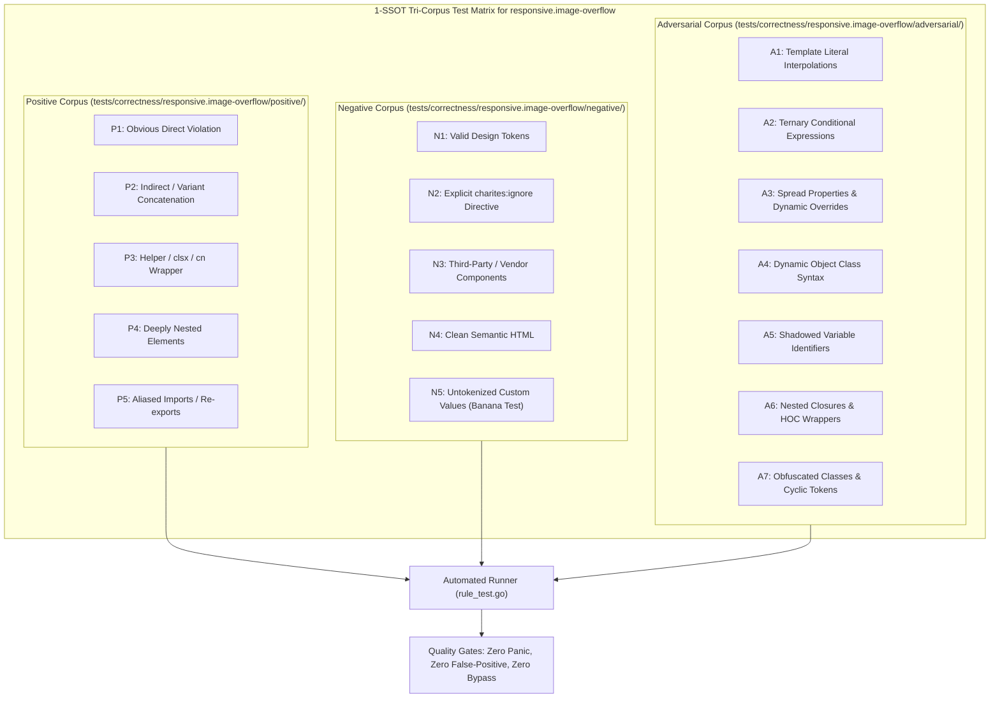

# responsive.image-overflow

> **Rule ID:** `responsive.image-overflow`
> **Severity:** `WARN`
> **Category:** `responsive`
> **Target Standards:** HTML Living Standard (Embedded Content: img, video, svg), Web.dev Responsive Media & Core Web Vitals (CLS Prevention)

---

## 1. Overview & Core Invariant

Warns when media elements with large fixed dimensions lack responsive max-w-full scaling

### Core Invariant:
> **"Media elements with explicit width dimensions exceeding 320px must declare 'max-w-full' or 'w-full' to prevent horizontal viewport tearing on mobile screens."**

---
## 2. Technical Grounding & Engine Realities

Specifying explicit 'width' and 'height' attributes on media elements is recommended for Core Web Vitals to reserve aspect ratio boxes and prevent Cumulative Layout Shift (CLS).

However, when large static dimensions (e.g. width={1200}) lack responsive CSS scaling ('max-w-full h-auto'), mobile browsers render the media at full absolute physical pixel width, breaking outside narrow 360px viewports and causing severe horizontal scrolling.

Applying 'max-w-full h-auto' preserves CLS aspect ratio benefits while ensuring the media smoothly downsizes to fit compact screens.

---
## 3. Vulnerability & Risk Taxonomy

| Risk Vector | Severity | Impact |
| :--- | :---: | :--- |
| **Mobile Viewport Tearing** | MEDIUM | Large unconstrained images expand outside mobile viewport boundaries, forcing horizontal scrollbars. |
| **Aspect Ratio Distortion** | LOW | Images constrained by height but not width stretch disproportionately on narrow viewports. |

---
## 4. Non-Compliant Code Patterns (Bad Examples)
### TSX (Media element with large width attribute lacking max-w-full):
```tsx

```

---
## 5. Compliant Implementation Patterns (Good Examples)
### TSX (Responsive media element with max-w-full and h-auto):
```tsx

```

---

## 6. Detection & Verification Pipeline (How The Rule Evaluates Code)
This rule evaluates source code through the standard AST inspection pipeline:



### Step-by-Step Evaluation:
1. **AST Traversal:** Visits normalized `ir.Node` structures during AST streaming.
2. **Invariant Check:** Compares node attributes against rule invariants.
3. **Directive Suppression Check:** Honors inline `charites:ignore responsive.image-overflow` directives.
4. **Diagnostic Emission:** Emits compiler-grade diagnostic on invariant violation.

---

## 7. Verification & Test Harness (How The Test Works: 1-SSOT Tri-Corpus)

This rule is rigorously tested and validated across the canonical **1-SSOT Tri-Corpus** in `tests/correctness/responsive.image-overflow/`:



- **Positive Fixtures (P1-P5):** Verified to trigger diagnostics at exact lines and column spans.
- **Negative Fixtures (N1-N5):** Verified to produce zero diagnostics on valid tokens and legitimate exemptions.
- **Adversarial Fixtures (A1-A7):** Verified to prevent evasion across dynamic expressions, string interpolations, and cyclic references.

---

## 8. How to Suppress (Ignore Directives)

If this pattern is required for an intentional exception, suppress the diagnostic using the canonical Charites Rule ID:

```astro
<!-- charites:ignore responsive.image-overflow intentional exception -->
```

```tsx
// charites:ignore responsive.image-overflow intentional exception
```

---

## 9. Configuration Reference (`charites.yaml`)

```yaml
rules:
  responsive.image-overflow:
    severity: warn # error | warn | info | off
```

