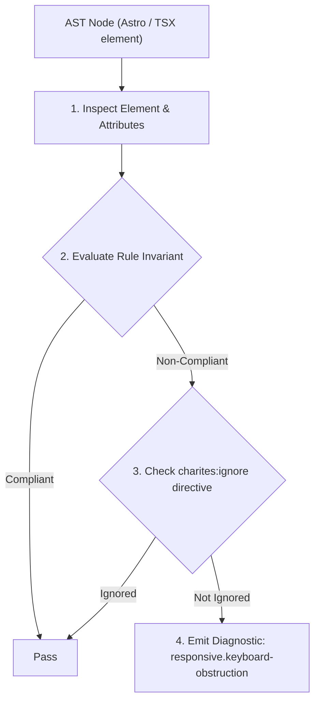
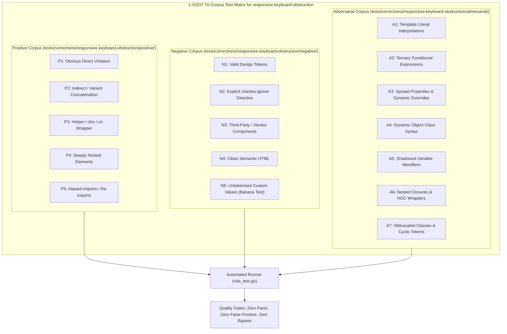

# responsive.keyboard-obstruction

> **Rule ID:** `responsive.keyboard-obstruction`
> **Severity:** `WARN`
> **Category:** `responsive`
> **Target Standards:** WCAG 2.2 Guideline 2.1 (Keyboard Accessible), Material Design 3 Mobile Form Guidelines, iOS Human Interface Guidelines (Managing the Virtual Keyboard)

---

## 1. Overview & Core Invariant

Warns against fixed bottom action bars in forms lacking vertical scroll containers, which can be obstructed by the mobile virtual keyboard

### Core Invariant:
> **"Forms containing text inputs and fixed/sticky bottom action bars must provide a scrollable container ('overflow-y-auto') so inputs and actions are never obscured when the virtual keyboard expands."**

---
## 2. Technical Grounding & Engine Realities

When a user taps an input on a smartphone, the virtual software keyboard slides up from the bottom of the screen, consuming 40% to 50% of the visible viewport.

Elements styled with 'fixed bottom-0' or 'sticky bottom-0' remain pinned above the viewport bottom or above the keyboard. If the parent form is not wrapped in a vertical scroll container ('overflow-y-auto'), the active input field gets pushed behind the keyboard or under the fixed button, leaving the user unable to view their input or complete submission.

Charites enforces scrollable viewport resilience for mobile form layouts.

---
## 3. Vulnerability & Risk Taxonomy

| Risk Vector | Severity | Impact |
| :--- | :---: | :--- |
| **Mobile Virtual Keyboard Input Obstruction** | HIGH | Users cannot see text being typed into lower form inputs because fixed bottom bars pin directly over them. |
| **Form Abandonment & Submission Blockers** | MEDIUM | When keyboard expansion pushes inputs offscreen without scroll capabilities, conversion rates drop. |

---
## 4. Non-Compliant Code Patterns (Bad Examples)
### TSX (Fixed bottom submit bar in a rigid form lacking scrollable region):
```tsx
<form className="h-screen flex flex-col justify-between">
  <div className="p-4 space-y-4">
    <input type="text" placeholder="Nama Lengkap" />
    <input type="email" placeholder="Alamat Surel" />
    <textarea placeholder="Pesan Anda" />
  </div>
  <div className="fixed bottom-0 inset-x-0 p-4 bg-surface border-t">
    <button type="submit" className="w-full bg-primary text-white py-3 rounded">Kirim</button>
  </div>
</form>
```

---
## 5. Compliant Implementation Patterns (Good Examples)
### TSX (Scrollable body with fixed bottom bar allowing smooth mobile keyboard reflow):
```tsx
<form className="h-screen flex flex-col">
  <div className="flex-1 overflow-y-auto p-4 space-y-4">
    <input type="text" placeholder="Nama Lengkap" />
    <input type="email" placeholder="Alamat Surel" />
    <textarea placeholder="Pesan Anda" />
  </div>
  <div className="p-4 bg-surface border-t">
    <button type="submit" className="w-full bg-primary text-white py-3 rounded">Kirim</button>
  </div>
</form>
```

---

## 6. Detection & Verification Pipeline (How The Rule Evaluates Code)
This rule evaluates source code through the standard AST inspection pipeline:



### Step-by-Step Evaluation:
1. **AST Traversal:** Visits normalized `ir.Node` structures during AST streaming.
2. **Invariant Check:** Compares node attributes against rule invariants.
3. **Directive Suppression Check:** Honors inline `charites:ignore responsive.keyboard-obstruction` directives.
4. **Diagnostic Emission:** Emits compiler-grade diagnostic on invariant violation.

---

## 7. Verification & Test Harness (How The Test Works: 1-SSOT Tri-Corpus)

This rule is rigorously tested and validated across the canonical **1-SSOT Tri-Corpus** in `tests/correctness/responsive.keyboard-obstruction/`:



- **Positive Fixtures (P1-P5):** Verified to trigger diagnostics at exact lines and column spans.
- **Negative Fixtures (N1-N5):** Verified to produce zero diagnostics on valid tokens and legitimate exemptions.
- **Adversarial Fixtures (A1-A7):** Verified to prevent evasion across dynamic expressions, string interpolations, and cyclic references.

---

## 8. How to Suppress (Ignore Directives)

If this pattern is required for an intentional exception, suppress the diagnostic using the canonical Charites Rule ID:

```astro
<!-- charites:ignore responsive.keyboard-obstruction intentional exception -->
```

```tsx
// charites:ignore responsive.keyboard-obstruction intentional exception
```

---

## 9. Configuration Reference (`charites.yaml`)

```yaml
rules:
  responsive.keyboard-obstruction:
    severity: warn # error | warn | info | off
```

