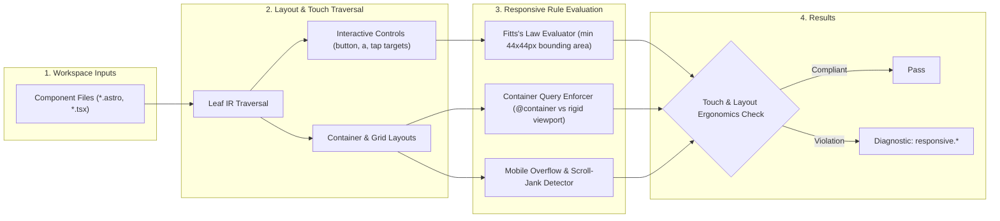

# Responsive Rules (`responsive`)

The `responsive` category contains static analysis rules for code quality, architectural constraints, and design system governance.

---

## Category Rule Index

| Rule ID | Severity | Summary | Full Specification | Status |
| :--- | :---: | :--- | :--- | :---: |
| `responsive.fixed-width-overflow` | `ERROR` | Detects static fixed container widths exceeding 320px that cause horizontal overflow on mobile viewports | [`responsive.fixed-width-overflow`](responsive.fixed-width-overflow) | `enabled` |
| `responsive.missing-breakpoint` | `WARN` | Warns when multi-column grids or giant font sizes are declared on mobile baseline without responsive breakpoint modifiers | [`responsive.missing-breakpoint`](responsive.missing-breakpoint) | `enabled` |
| `responsive.safe-area-missing` | `WARN` | Warns when bottom-docked fixed or sticky elements lack safe-area-inset-bottom padding for modern mobile home indicators | [`responsive.safe-area-missing`](responsive.safe-area-missing) | `enabled` |
| `responsive.unwrapped-table-overflow` | `WARN` | Warns when an HTML table element lacks a responsive horizontal scroll wrapper (overflow-x-auto) or responsive display transformation | [`responsive.unwrapped-table-overflow`](responsive.unwrapped-table-overflow) | `enabled` |
| `responsive.viewport-meta-missing` | `WARN` | Warns when <meta name="viewport"> is missing width=device-width or viewport-fit=cover | [`responsive.viewport-meta-missing`](responsive.viewport-meta-missing) | `enabled` |
| `responsive.viewport-unit-leak` | `WARN` | Warns when viewport height relies on static 100vh instead of modern dynamic dvh or svh units | [`responsive.viewport-unit-leak`](responsive.viewport-unit-leak) | `enabled` |

---
## How the Responsive Layout Analysis Pipeline Works

The `responsive` engine analyzes layout structures, touch target ergonomics, and modern CSS container queries:

### Pipeline Flow:
1. **Touch Target Sizing:** Evaluates interactive controls against Fitts's Law, verifying minimum tap target dimensions of 44x44px (`min-h-11 min-w-11` / `size-11`).
2. **Container Query Governance:** Enforces modular `@container` queries over fragile page-level viewport media queries (`sm:`, `md:`, `lg:`).
3. **Viewport & Overflow Analysis:** Identifies fixed-width containers that cause mobile horizontal scrollbars or layout breakage.

---

## How Responsive Tests Work (Verification Harness)

Responsive rules are verified against:
1. **1-SSOT Golden Tri-Corpus (`tests/correctness/responsive.*/`):**
   - **Positive:** Flags undersized interactive buttons, hardcoded viewport constraints, and overflowing data tables.
   - **Negative:** Confirms passes for fluid container query layouts and 44x44px compliant controls.
   - **Adversarial:** Tests nested grid layouts with responsive variant overrides.
