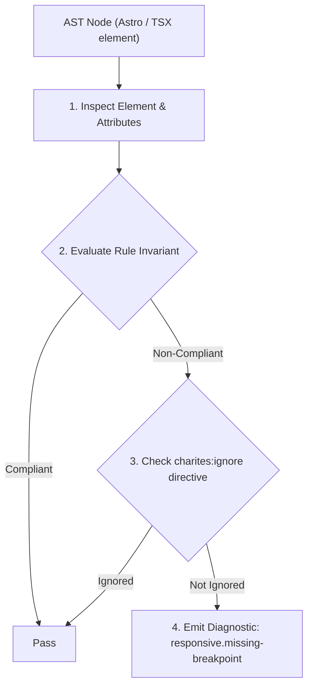
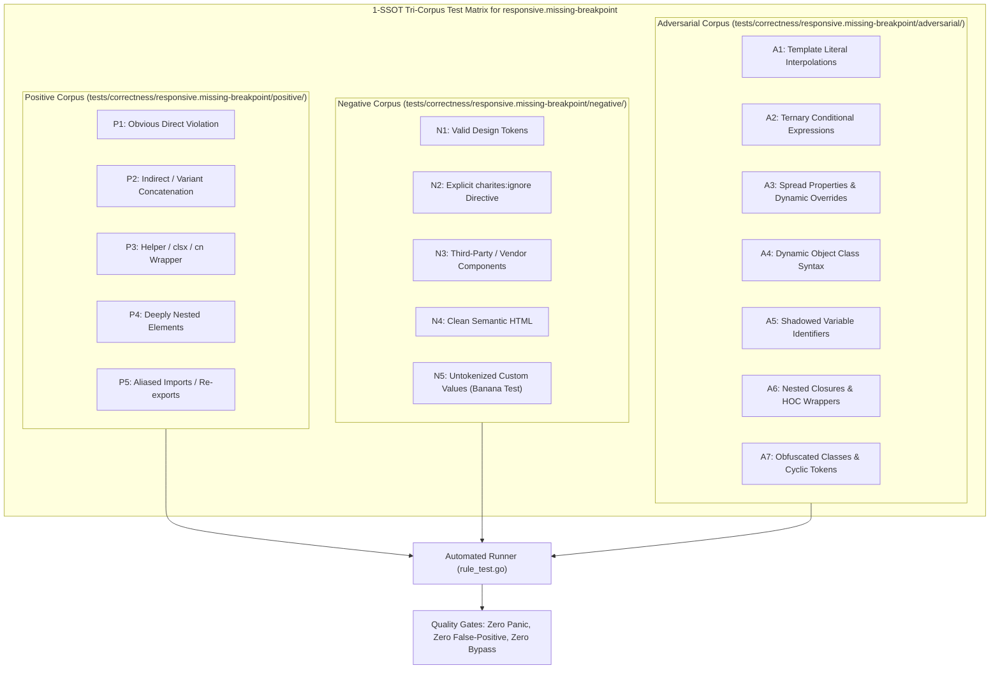

# responsive.missing-breakpoint

> **Rule ID:** `responsive.missing-breakpoint`
> **Severity:** `WARN`
> **Category:** `responsive`
> **Target Standards:** Mobile-First Responsive Web Design Principles, W3C CSS Grid Layout Module Level 2, Tailwind CSS Responsive Design Specification

---

## 1. Overview & Core Invariant

Warns when multi-column grids or giant font sizes are declared on mobile baseline without responsive breakpoint modifiers

### Core Invariant:
> **"Multi-column grids (grid-cols-[3-12]) and giant font sizes (text-[5-9]xl) must not be defined on mobile baseline without responsive breakpoint prefixes (sm:, md:, lg:)."**

---
## 2. Technical Grounding & Engine Realities

On compact smartphone screens (360px-390px), defining 3 or more columns directly on mobile baseline squeezes individual columns below 100px width, causing severe card distortion and text wrapping.

Similarly, declaring giant typography (e.g. text-6xl) on mobile baseline causes single words to span multiple vertical lines, breaking header visual balance.

Adhering to mobile-first progression requires starting from single-column baselines (grid-cols-1) and scaling up via responsive modifiers (sm:grid-cols-2 md:grid-cols-4).

---
## 3. Vulnerability & Risk Taxonomy

| Risk Vector | Severity | Impact |
| :--- | :---: | :--- |
| **Severe Column Squeeze on Mobile** | MEDIUM | Multi-column cards become unreadable and distorted when squeezed into 360px phone screens. |
| **Typography Layout Blowout** | LOW | Giant font headings wrap awkwardly into 4-5 lines on narrow mobile viewports. |

---
## 4. Non-Compliant Code Patterns (Bad Examples)
### TSX (Multi-column grid on mobile baseline without responsive modifier):
```tsx
<div className="grid grid-cols-4 gap-4">
  <div className="bg-card p-4">Item 1</div>
  <div className="bg-card p-4">Item 2</div>
</div>
```

---
## 5. Compliant Implementation Patterns (Good Examples)
### TSX (Mobile-first progression starting from 1 column to multi-column on desktop):
```tsx
<div className="grid grid-cols-1 sm:grid-cols-2 md:grid-cols-4 gap-4">
  <div className="bg-card p-4">Item 1</div>
  <div className="bg-card p-4">Item 2</div>
</div>
```

---

## 6. Detection & Verification Pipeline (How The Rule Evaluates Code)
This rule evaluates source code through the standard AST inspection pipeline:



### Step-by-Step Evaluation:
1. **AST Traversal:** Visits normalized `ir.Node` structures during AST streaming.
2. **Invariant Check:** Compares node attributes against rule invariants.
3. **Directive Suppression Check:** Honors inline `charites:ignore responsive.missing-breakpoint` directives.
4. **Diagnostic Emission:** Emits compiler-grade diagnostic on invariant violation.

---

## 7. Verification & Test Harness (How The Test Works: 1-SSOT Tri-Corpus)

This rule is rigorously tested and validated across the canonical **1-SSOT Tri-Corpus** in `tests/correctness/responsive.missing-breakpoint/`:



- **Positive Fixtures (P1-P5):** Verified to trigger diagnostics at exact lines and column spans.
- **Negative Fixtures (N1-N5):** Verified to produce zero diagnostics on valid tokens and legitimate exemptions.
- **Adversarial Fixtures (A1-A7):** Verified to prevent evasion across dynamic expressions, string interpolations, and cyclic references.

---

## 8. How to Suppress (Ignore Directives)

If this pattern is required for an intentional exception, suppress the diagnostic using the canonical Charites Rule ID:

```astro
<!-- charites:ignore responsive.missing-breakpoint intentional exception -->
```

```tsx
// charites:ignore responsive.missing-breakpoint intentional exception
```

---

## 9. Configuration Reference (`charites.yaml`)

```yaml
rules:
  responsive.missing-breakpoint:
    severity: warn # error | warn | info | off
```

