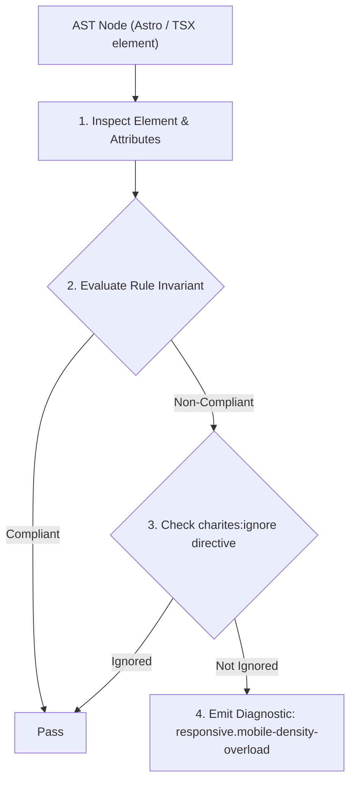
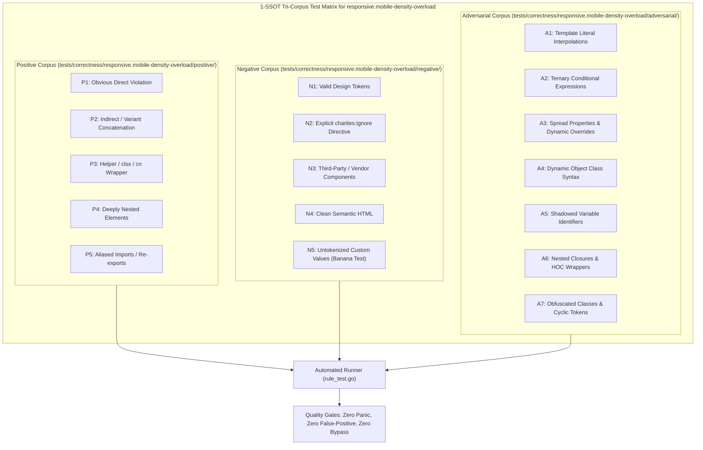

# responsive.mobile-density-overload

> **Rule ID:** `responsive.mobile-density-overload`
> **Severity:** `WARN`
> **Category:** `responsive`
> **Target Standards:** Steven Hoober (Designing for Touch - Touch Target Interference), WCAG 2.2 SC 2.5.8 (Target Size - Minimum & Spacing), Material Design 3 Mobile App Bar & Toolbar Guidelines

---

## 1. Overview & Core Invariant

Warns when toolbars or action rows cram more than 4 interactive buttons in a single unscrollable row on mobile viewports

### Core Invariant:
> **"Horizontal action toolbars on mobile viewports must not cram more than 4 interactive buttons in a single rigid row without 'overflow-x-auto', 'flex-wrap', or an overflow menu."**

---
## 2. Technical Grounding & Engine Realities

On compact smartphone screens (360px viewport width), accommodating 5 or more buttons in a single unscrollable flex row forces button widths below 48px or induces layout squishing.

This severe spatial compression leads to:
1. High Error Rate / Mis-taps: Users inadvertently trigger adjacent destructive or unwanted actions due to finger pad overlap.
2. Text/Icon Clipping: Labels are aggressively truncated, and icon hitboxes overlap.

Best practice dictates limiting direct actions to 3-4 primary controls, wrapping the toolbar in a horizontal scroll container ('overflow-x-auto'), or collapsing secondary actions into a 'More (...)' dropdown menu.

---
## 3. Vulnerability & Risk Taxonomy

| Risk Vector | Severity | Impact |
| :--- | :---: | :--- |
| **Touch Target Mis-tap Interference** | MEDIUM | Users frequently tap the wrong button because adjacent targets are compressed below safe physical spacing limits. |
| **Mobile Visual Clutter & Overflow** | LOW | Rigid toolbars cause horizontal viewport tearing or text clipping on narrow mobile devices. |

---
## 4. Non-Compliant Code Patterns (Bad Examples)
### TSX (Five buttons packed tightly into an unscrollable horizontal flex row):
```tsx
<div className="flex items-center gap-2 p-2">
  <button type="button">Edit</button>
  <button type="button">Salin</button>
  <button type="button">Cetak</button>
  <button type="button">Bagikan</button>
  <button type="button">Hapus</button>
</div>
```

---
## 5. Compliant Implementation Patterns (Good Examples)
### TSX (Scrollable horizontal action bar accommodating many actions comfortably):
```tsx
<div className="flex items-center gap-2 p-2 overflow-x-auto">
  <button type="button">Edit</button>
  <button type="button">Salin</button>
  <button type="button">Cetak</button>
  <button type="button">Bagikan</button>
  <button type="button">Hapus</button>
</div>
```

---

## 6. Detection & Verification Pipeline (How The Rule Evaluates Code)
This rule evaluates source code through the standard AST inspection pipeline:



### Step-by-Step Evaluation:
1. **AST Traversal:** Visits normalized `ir.Node` structures during AST streaming.
2. **Invariant Check:** Compares node attributes against rule invariants.
3. **Directive Suppression Check:** Honors inline `charites:ignore responsive.mobile-density-overload` directives.
4. **Diagnostic Emission:** Emits compiler-grade diagnostic on invariant violation.

---

## 7. Verification & Test Harness (How The Test Works: 1-SSOT Tri-Corpus)

This rule is rigorously tested and validated across the canonical **1-SSOT Tri-Corpus** in `tests/correctness/responsive.mobile-density-overload/`:



- **Positive Fixtures (P1-P5):** Verified to trigger diagnostics at exact lines and column spans.
- **Negative Fixtures (N1-N5):** Verified to produce zero diagnostics on valid tokens and legitimate exemptions.
- **Adversarial Fixtures (A1-A7):** Verified to prevent evasion across dynamic expressions, string interpolations, and cyclic references.

---

## 8. How to Suppress (Ignore Directives)

If this pattern is required for an intentional exception, suppress the diagnostic using the canonical Charites Rule ID:

```astro
<!-- charites:ignore responsive.mobile-density-overload intentional exception -->
```

```tsx
// charites:ignore responsive.mobile-density-overload intentional exception
```

---

## 9. Configuration Reference (`charites.yaml`)

```yaml
rules:
  responsive.mobile-density-overload:
    severity: warn # error | warn | info | off
```

