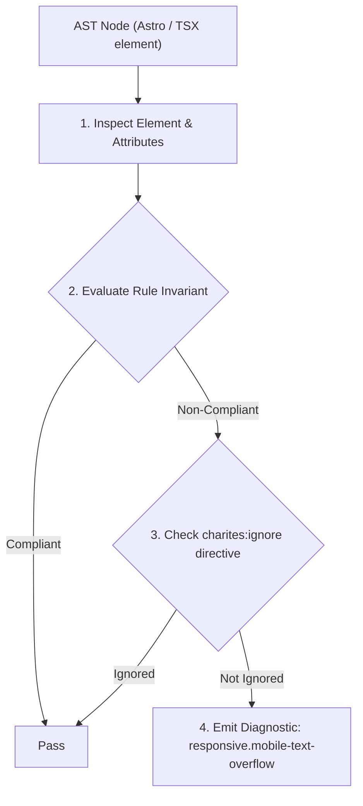
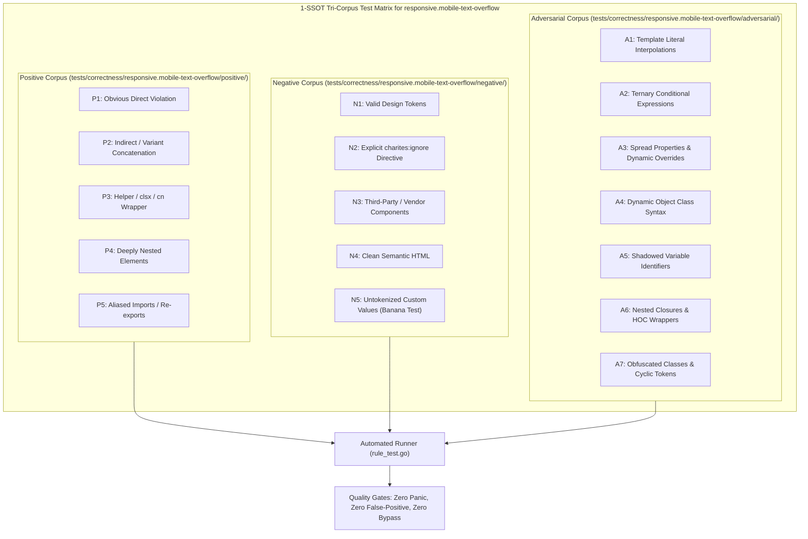

# responsive.mobile-text-overflow

> **Rule ID:** `responsive.mobile-text-overflow`
> **Severity:** `WARN`
> **Category:** `responsive`
> **Target Standards:** W3C CSS Text Module Level 3 (Wrapping and Breaking Text), WCAG 2.2 SC 1.4.10 (Reflow - Level AA)

---

## 1. Overview & Core Invariant

Warns when whitespace-nowrap text or code blocks lack truncation, word breaking, or horizontal scroll wrappers

### Core Invariant:
> **"Containers declaring 'whitespace-nowrap' must provide overflow mitigation ('truncate', 'overflow-hidden', 'overflow-x-auto'), and inline '<code>' blocks must provide word breaking ('break-all', 'break-words') or horizontal scroll ancestors."**

---
## 2. Technical Grounding & Engine Realities

Dynamic strings such as URLs, authentication tokens, UUIDs, IBANs, and email addresses contain no whitespace. When 'whitespace-nowrap' is declared on narrow smartphone screens (360px) without truncation or scroll containment, the text forces the container beyond the viewport.

Similarly, inline code elements ('<code>') default to unbreaking monospace text. Without 'break-all' or a scrollable parent, long code snippets tear mobile page layouts.

Using 'truncate', 'break-words', or enclosing code inside a scrollable wrapper maintains layout boundaries and satisfies WCAG Reflow requirements.

---
## 3. Vulnerability & Risk Taxonomy

| Risk Vector | Severity | Impact |
| :--- | :---: | :--- |
| **Mobile Layout Breakage via Long Unbroken Strings** | MEDIUM | Unbroken URLs or tokens force text containers to stretch horizontally outside the 360px mobile viewport. |
| **Loss of WCAG 2.2 Reflow Compliance** | LOW | Users must scroll both horizontally and vertically to read content at 400% zoom or compact viewports. |

---
## 4. Non-Compliant Code Patterns (Bad Examples)
### TSX (whitespace-nowrap text container without truncation or scroll containment):
```tsx
<div className="whitespace-nowrap text-sm text-foreground">
  <span>Token Transaksi: {transactionHash}</span>
</div>
```

---
## 5. Compliant Implementation Patterns (Good Examples)
### TSX (Protected text container with truncate):
```tsx
<div className="whitespace-nowrap truncate text-sm text-foreground">
  <span>Token Transaksi: {transactionHash}</span>
</div>
```

---

## 6. Detection & Verification Pipeline (How The Rule Evaluates Code)
This rule evaluates source code through the standard AST inspection pipeline:



### Step-by-Step Evaluation:
1. **AST Traversal:** Visits normalized `ir.Node` structures during AST streaming.
2. **Invariant Check:** Compares node attributes against rule invariants.
3. **Directive Suppression Check:** Honors inline `charites:ignore responsive.mobile-text-overflow` directives.
4. **Diagnostic Emission:** Emits compiler-grade diagnostic on invariant violation.

---

## 7. Verification & Test Harness (How The Test Works: 1-SSOT Tri-Corpus)

This rule is rigorously tested and validated across the canonical **1-SSOT Tri-Corpus** in `tests/correctness/responsive.mobile-text-overflow/`:



- **Positive Fixtures (P1-P5):** Verified to trigger diagnostics at exact lines and column spans.
- **Negative Fixtures (N1-N5):** Verified to produce zero diagnostics on valid tokens and legitimate exemptions.
- **Adversarial Fixtures (A1-A7):** Verified to prevent evasion across dynamic expressions, string interpolations, and cyclic references.

---

## 8. How to Suppress (Ignore Directives)

If this pattern is required for an intentional exception, suppress the diagnostic using the canonical Charites Rule ID:

```astro
<!-- charites:ignore responsive.mobile-text-overflow intentional exception -->
```

```tsx
// charites:ignore responsive.mobile-text-overflow intentional exception
```

---

## 9. Configuration Reference (`charites.yaml`)

```yaml
rules:
  responsive.mobile-text-overflow:
    severity: warn # error | warn | info | off
```

