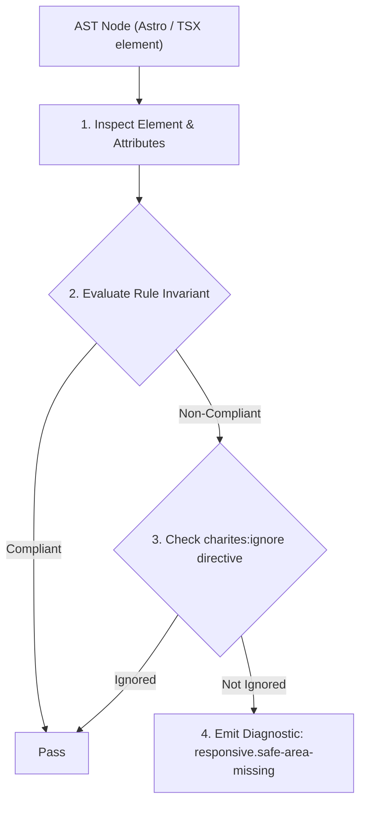
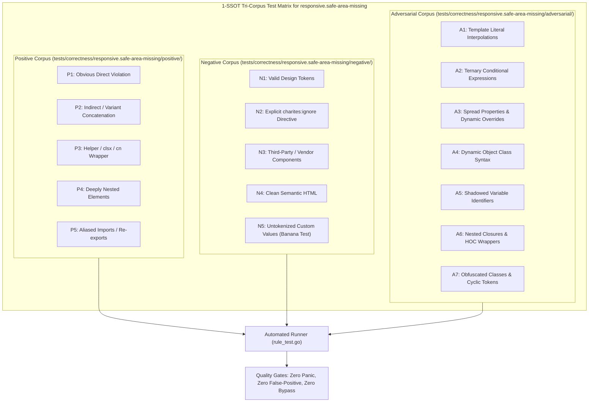

# responsive.safe-area-missing

> **Rule ID:** `responsive.safe-area-missing`
> **Severity:** `WARN`
> **Category:** `responsive`
> **Target Standards:** W3C CSS Mobile Safe Area Insets (env(safe-area-inset-bottom)), Apple Human Interface Guidelines (Display Cutouts & Home Indicator), Android Full-Screen Gesture Navigation Guidelines

---

## 1. Overview & Core Invariant

Warns when bottom-docked fixed or sticky elements lack safe-area-inset-bottom padding for modern mobile home indicators

### Core Invariant:
> **"Elements docked to the bottom of the viewport (fixed bottom-0 or sticky bottom-0) must include safe-area bottom padding (pb-[env(safe-area-inset-bottom)] or pb-safe)."**

---
## 2. Technical Grounding & Engine Realities

Modern smartphones without physical home buttons utilize system-level gesture bars (the iPhone Home Indicator and Android gesture pill) at the bottom edge of the screen.

Positioning bottom navigation bars or action buttons flush against the bottom edge (bottom-0) without safe-area padding causes controls to collide directly with the operating system navigation bar.

Providing safe-area bottom padding ensures interactive controls are elevated cleanly above system navigation indicators.

---
## 3. Vulnerability & Risk Taxonomy

| Risk Vector | Severity | Impact |
| :--- | :---: | :--- |
| **Home Indicator Collision & Mis-Taps** | MEDIUM | Users attempting to tap bottom navigation items accidentally trigger the OS home swipe gesture instead. |
| **Visual Element Occlusion** | LOW | Bottom buttons and labels appear partially obscured behind the white/black system gesture bar. |

---
## 4. Non-Compliant Code Patterns (Bad Examples)
### TSX (Bottom fixed navigation bar lacking safe-area padding):
```tsx
<nav className="fixed bottom-0 left-0 right-0 h-16 bg-surface flex items-center justify-around">
  <a href="/home">Beranda</a>
  <a href="/layanan">Layanan</a>
</nav>
```

---
## 5. Compliant Implementation Patterns (Good Examples)
### TSX (Bottom fixed navigation with safe-area padding lifting content above home indicator):
```tsx
<nav className="fixed bottom-0 left-0 right-0 pb-[env(safe-area-inset-bottom)] bg-surface flex items-center justify-around">
  <a href="/home">Beranda</a>
  <a href="/layanan">Layanan</a>
</nav>
```

---

## 6. Detection & Verification Pipeline (How The Rule Evaluates Code)
This rule evaluates source code through the standard AST inspection pipeline:



### Step-by-Step Evaluation:
1. **AST Traversal:** Visits normalized `ir.Node` structures during AST streaming.
2. **Invariant Check:** Compares node attributes against rule invariants.
3. **Directive Suppression Check:** Honors inline `charites:ignore responsive.safe-area-missing` directives.
4. **Diagnostic Emission:** Emits compiler-grade diagnostic on invariant violation.

---

## 7. Verification & Test Harness (How The Test Works: 1-SSOT Tri-Corpus)

This rule is rigorously tested and validated across the canonical **1-SSOT Tri-Corpus** in `tests/correctness/responsive.safe-area-missing/`:



- **Positive Fixtures (P1-P5):** Verified to trigger diagnostics at exact lines and column spans.
- **Negative Fixtures (N1-N5):** Verified to produce zero diagnostics on valid tokens and legitimate exemptions.
- **Adversarial Fixtures (A1-A7):** Verified to prevent evasion across dynamic expressions, string interpolations, and cyclic references.

---

## 8. How to Suppress (Ignore Directives)

If this pattern is required for an intentional exception, suppress the diagnostic using the canonical Charites Rule ID:

```astro
<!-- charites:ignore responsive.safe-area-missing intentional exception -->
```

```tsx
// charites:ignore responsive.safe-area-missing intentional exception
```

---

## 9. Configuration Reference (`charites.yaml`)

```yaml
rules:
  responsive.safe-area-missing:
    severity: warn # error | warn | info | off
```

