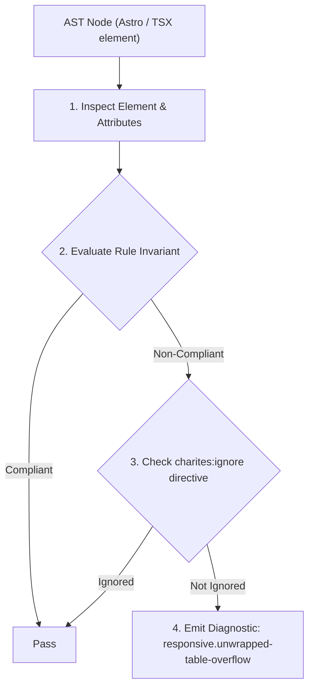
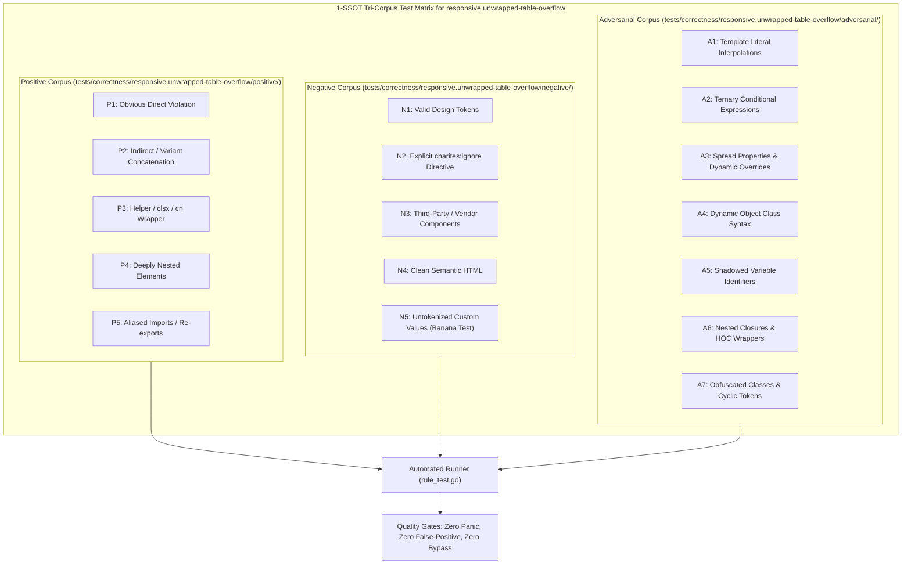

# responsive.unwrapped-table-overflow

> **Rule ID:** `responsive.unwrapped-table-overflow`
> **Severity:** `WARN`
> **Category:** `responsive`
> **Target Standards:** W3C HTML Living Standard (Table Rendering & Intrinsic Sizing), Responsive Web Design Data Table Patterns, Mobile Touch Usability Guidelines (Scroll Container Isolation)

---

## 1. Overview & Core Invariant

Warns when an HTML table element lacks a responsive horizontal scroll wrapper (overflow-x-auto) or responsive display transformation

### Core Invariant:
> **"HTML <table> elements must be enclosed within an ancestor container providing horizontal scrolling (overflow-x-auto) or declared with responsive display styling (hidden md:table)."**

---
## 2. Technical Grounding & Engine Realities

On compact smartphone viewports (360px-390px), data tables possess an intrinsic min-content sizing model (table-layout: auto) that prevents columns from shrinking beyond their widest words.

Placing a naked <table> element directly into normal document flow forces the entire webpage to blow out horizontally, inducing unwanted page-level horizontal sway and breaking swipe navigation.

Wrapping data tables in a dedicated scroll container (<div class="overflow-x-auto">) isolates horizontal scrolling to the table boundaries without disrupting page flow.

---
## 3. Vulnerability & Risk Taxonomy

| Risk Vector | Severity | Impact |
| :--- | :---: | :--- |
| **Document-Wide Horizontal Blowout** | MEDIUM | Entire mobile page wobbles horizontally during scrolling because intrinsic table width exceeds screen boundary. |
| **Hidden Data Columns Without Scroll Affordance** | MEDIUM | Users on compact devices cannot view right-hand table columns without an explicit horizontal scroll container. |

---
## 4. Non-Compliant Code Patterns (Bad Examples)
### TSX (Unwrapped data table directly inside layout causing mobile horizontal overflow):
```tsx
<table className="w-full border">
  <thead>
    <tr><th>Nama</th><th>NIK</th><th>Alamat</th><th>Status</th></tr>
  </thead>
  <tbody>...</tbody>
</table>
```

---
## 5. Compliant Implementation Patterns (Good Examples)
### TSX (Table enclosed within an overflow-x-auto scroll container):
```tsx
<div className="w-full overflow-x-auto">
  <table className="w-full border">
    <thead>
      <tr><th>Nama</th><th>NIK</th><th>Alamat</th><th>Status</th></tr>
    </thead>
    <tbody>...</tbody>
  </table>
</div>
```

---

## 6. Detection & Verification Pipeline (How The Rule Evaluates Code)
This rule evaluates source code through the standard AST inspection pipeline:



### Step-by-Step Evaluation:
1. **AST Traversal:** Visits normalized `ir.Node` structures during AST streaming.
2. **Invariant Check:** Compares node attributes against rule invariants.
3. **Directive Suppression Check:** Honors inline `charites:ignore responsive.unwrapped-table-overflow` directives.
4. **Diagnostic Emission:** Emits compiler-grade diagnostic on invariant violation.

---

## 7. Verification & Test Harness (How The Test Works: 1-SSOT Tri-Corpus)

This rule is rigorously tested and validated across the canonical **1-SSOT Tri-Corpus** in `tests/correctness/responsive.unwrapped-table-overflow/`:



- **Positive Fixtures (P1-P5):** Verified to trigger diagnostics at exact lines and column spans.
- **Negative Fixtures (N1-N5):** Verified to produce zero diagnostics on valid tokens and legitimate exemptions.
- **Adversarial Fixtures (A1-A7):** Verified to prevent evasion across dynamic expressions, string interpolations, and cyclic references.

---

## 8. How to Suppress (Ignore Directives)

If this pattern is required for an intentional exception, suppress the diagnostic using the canonical Charites Rule ID:

```astro
<!-- charites:ignore responsive.unwrapped-table-overflow intentional exception -->
```

```tsx
// charites:ignore responsive.unwrapped-table-overflow intentional exception
```

---

## 9. Configuration Reference (`charites.yaml`)

```yaml
rules:
  responsive.unwrapped-table-overflow:
    severity: warn # error | warn | info | off
```

