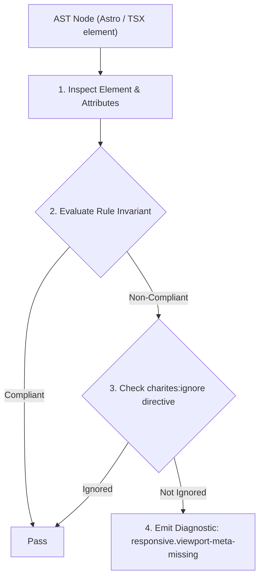
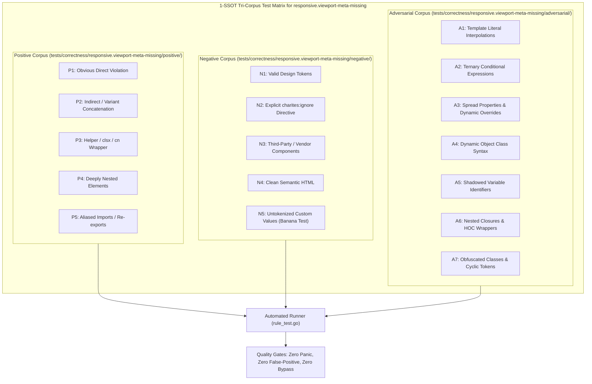

# responsive.viewport-meta-missing

> **Rule ID:** `responsive.viewport-meta-missing`
> **Severity:** `WARN`
> **Category:** `responsive`
> **Target Standards:** HTML Living Standard (Viewport Meta Element), Apple WebKit Safe Area Viewport Expansion Guidelines, W3C CSS Device Adaptation Module Level 1

---

## 1. Overview & Core Invariant

Warns when <meta name="viewport"> is missing width=device-width or viewport-fit=cover

### Core Invariant:
> **"<meta name="viewport"> elements must declare both 'width=device-width' (preventing 980px virtual desktop zoom fallback) and 'viewport-fit=cover' (enabling safe area inset expansion on notched displays)."**

---
## 2. Technical Grounding & Engine Realities

Omitting 'width=device-width' causes mobile browsers (WebKit and Chromium) to fall back to a 980px virtual desktop viewport, forcing users to pinch-zoom and rendering responsive media queries ineffective.

Omitting 'viewport-fit=cover' causes CSS safe area variables (env(safe-area-inset-*)) to evaluate to 0px on iOS devices, resulting in white letterboxing around sensor cutouts and disabling hardware-safe bottom docks.

Declaring both parameters ensures proportionate rendering across all smartphone screen densities and full hardware edge-to-edge layout immersion.

---
## 3. Vulnerability & Risk Taxonomy

| Risk Vector | Severity | Impact |
| :--- | :---: | :--- |
| **980px Virtual Desktop Zoom Fallback** | HIGH | Mobile browsers scale down pages to fit a 980px virtual width, making text unreadable and disabling responsive layouts. |
| **Safe Area Inset Failure and Letterboxing** | MEDIUM | CSS env(safe-area-inset-bottom) evaluates to 0px, causing bottom bars to be obscured by hardware home indicators and displaying letterbox bars. |

---
## 4. Non-Compliant Code Patterns (Bad Examples)
### TSX (Viewport meta tag missing viewport-fit=cover):
```tsx
<meta name="viewport" content="width=device-width, initial-scale=1.0" />
```

---
## 5. Compliant Implementation Patterns (Good Examples)
### TSX (Complete mobile viewport configuration with device width and safe-area expansion):
```tsx
<meta name="viewport" content="width=device-width, initial-scale=1.0, viewport-fit=cover" />
```

---

## 6. Detection & Verification Pipeline (How The Rule Evaluates Code)
This rule evaluates source code through the standard AST inspection pipeline:



### Step-by-Step Evaluation:
1. **AST Traversal:** Visits normalized `ir.Node` structures during AST streaming.
2. **Invariant Check:** Compares node attributes against rule invariants.
3. **Directive Suppression Check:** Honors inline `charites:ignore responsive.viewport-meta-missing` directives.
4. **Diagnostic Emission:** Emits compiler-grade diagnostic on invariant violation.

---

## 7. Verification & Test Harness (How The Test Works: 1-SSOT Tri-Corpus)

This rule is rigorously tested and validated across the canonical **1-SSOT Tri-Corpus** in `tests/correctness/responsive.viewport-meta-missing/`:



- **Positive Fixtures (P1-P5):** Verified to trigger diagnostics at exact lines and column spans.
- **Negative Fixtures (N1-N5):** Verified to produce zero diagnostics on valid tokens and legitimate exemptions.
- **Adversarial Fixtures (A1-A7):** Verified to prevent evasion across dynamic expressions, string interpolations, and cyclic references.

---

## 8. How to Suppress (Ignore Directives)

If this pattern is required for an intentional exception, suppress the diagnostic using the canonical Charites Rule ID:

```astro
<!-- charites:ignore responsive.viewport-meta-missing intentional exception -->
```

```tsx
// charites:ignore responsive.viewport-meta-missing intentional exception
```

---

## 9. Configuration Reference (`charites.yaml`)

```yaml
rules:
  responsive.viewport-meta-missing:
    severity: warn # error | warn | info | off
```

