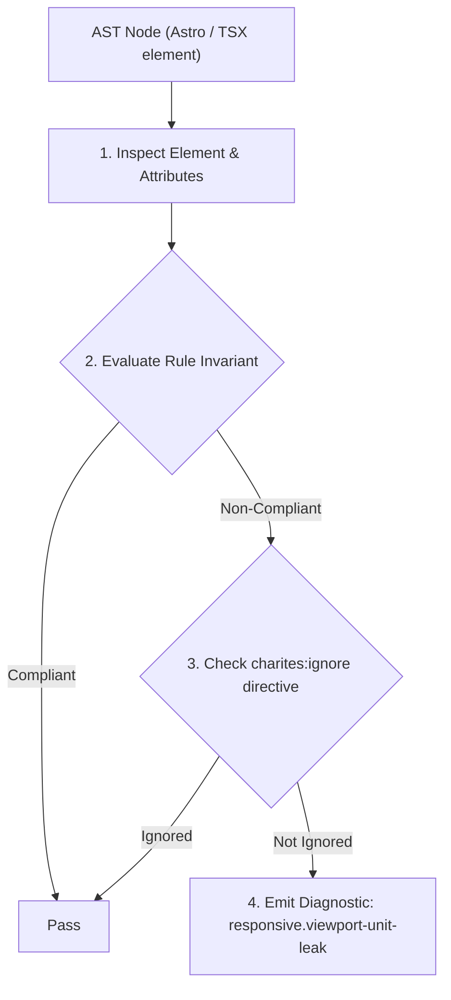
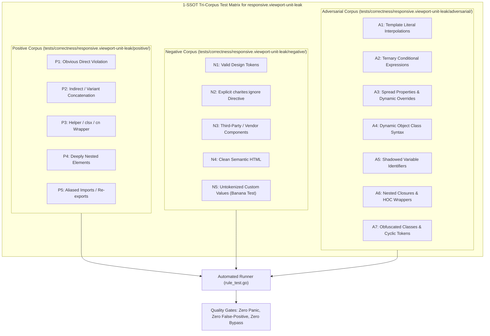

# responsive.viewport-unit-leak

> **Rule ID:** `responsive.viewport-unit-leak`
> **Severity:** `WARN`
> **Category:** `responsive`
> **Target Standards:** W3C CSS Values and Units Module Level 4 (Small, Large, and Dynamic Viewport Units), WebKit Safari iOS Dynamic Viewport Sizing Specification, Core Web Vitals Cumulative Layout Shift (CLS) Mitigation

---

## 1. Overview & Core Invariant

Warns when viewport height relies on static 100vh instead of modern dynamic dvh or svh units

### Core Invariant:
> **"Viewport height declarations should use CSS Level 4 dynamic units (dvh, svh) rather than static 100vh (h-screen, min-h-screen) to eliminate mobile layout shifts."**

---
## 2. Technical Grounding & Engine Realities

On mobile browsers (Safari iOS and Chrome Android), the browser address bar and bottom toolbar dynamically expand and collapse during vertical scrolling.

The classic 100vh unit uses the Large Viewport Height, which does not account for the visible URL bar. This causes bottom-anchored content to be covered by browser chrome and leads to disruptive layout jumps when the address bar toggles.

Utilizing dynamic viewport units (min-h-dvh or h-dvh) ensures the layout adapts smoothly to the actual visible viewport height.

---
## 3. Vulnerability & Risk Taxonomy

| Risk Vector | Severity | Impact |
| :--- | :---: | :--- |
| **Mobile Browser Layout Jumps (CLS)** | MEDIUM | Content suddenly shifts when mobile address bar hides or appears during scroll. |
| **Occluded Bottom CTA Buttons** | LOW | Bottom buttons in a 100vh container are partially covered beneath Safari's bottom navigation bar. |

---
## 4. Non-Compliant Code Patterns (Bad Examples)
### TSX (Static 100vh height causing layout jumps on mobile browsers):
```tsx
<main className="min-h-screen bg-background flex flex-col justify-between">
  <h1>Beranda Desa</h1>
  <button className="h-11 px-4 bg-primary text-primary-foreground">Lanjutkan</button>
</main>
```

---
## 5. Compliant Implementation Patterns (Good Examples)
### TSX (Dynamic viewport height unit adapting smoothly to mobile address bar):
```tsx
<main className="min-h-dvh bg-background flex flex-col justify-between">
  <h1>Beranda Desa</h1>
  <button className="h-11 px-4 bg-primary text-primary-foreground">Lanjutkan</button>
</main>
```

---

## 6. Detection & Verification Pipeline (How The Rule Evaluates Code)
This rule evaluates source code through the standard AST inspection pipeline:



### Step-by-Step Evaluation:
1. **AST Traversal:** Visits normalized `ir.Node` structures during AST streaming.
2. **Invariant Check:** Compares node attributes against rule invariants.
3. **Directive Suppression Check:** Honors inline `charites:ignore responsive.viewport-unit-leak` directives.
4. **Diagnostic Emission:** Emits compiler-grade diagnostic on invariant violation.

---

## 7. Verification & Test Harness (How The Test Works: 1-SSOT Tri-Corpus)

This rule is rigorously tested and validated across the canonical **1-SSOT Tri-Corpus** in `tests/correctness/responsive.viewport-unit-leak/`:



- **Positive Fixtures (P1-P5):** Verified to trigger diagnostics at exact lines and column spans.
- **Negative Fixtures (N1-N5):** Verified to produce zero diagnostics on valid tokens and legitimate exemptions.
- **Adversarial Fixtures (A1-A7):** Verified to prevent evasion across dynamic expressions, string interpolations, and cyclic references.

---

## 8. How to Suppress (Ignore Directives)

If this pattern is required for an intentional exception, suppress the diagnostic using the canonical Charites Rule ID:

```astro
<!-- charites:ignore responsive.viewport-unit-leak intentional exception -->
```

```tsx
// charites:ignore responsive.viewport-unit-leak intentional exception
```

---

## 9. Configuration Reference (`charites.yaml`)

```yaml
rules:
  responsive.viewport-unit-leak:
    severity: warn # error | warn | info | off
```

