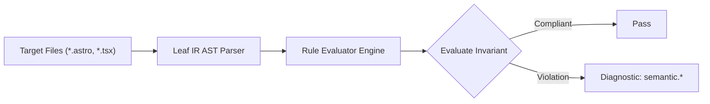

# Semantic Rules (`semantic`)

The `semantic` category contains static analysis rules for code quality, architectural constraints, and design system governance.

---

## Category Rule Index

| Rule ID | Severity | Summary | Full Specification | Status |
| :--- | :---: | :--- | :--- | :---: |
| `semantic.consecutive-br-spacing` | `WARN` | Flags consecutive   tags used for paragraph spacing violating WCAG 1.3.1 (Technique F34) | [`semantic.consecutive-br-spacing`](semantic.consecutive-br-spacing) | `enabled` |

---
## How the Semantic Analysis Pipeline Works

The `semantic` engine applies static analysis checks against component source code:

### Pipeline Flow:
1. **AST Node Traversal:** Scans target template files into normalized intermediate representation.
2. **Invariant Assertion:** Validates structural and semantic invariants.
3. **Diagnostic Reporting:** Emits structured diagnostics for non-compliant patterns.

---

## How Semantic Tests Work (Verification Harness)

All rules in `semantic` are verified using the canonical 1-SSOT Tri-Corpus (`tests/correctness/semantic.*/`) encompassing Positive (P1-P5), Negative (N1-N5), and Adversarial (A1-A7) fixture matrices.
