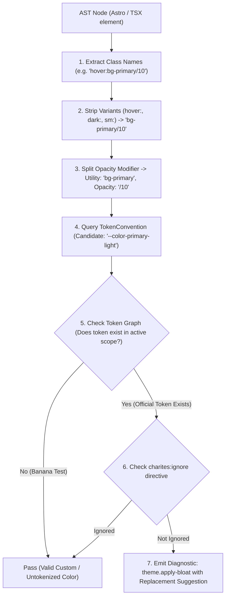
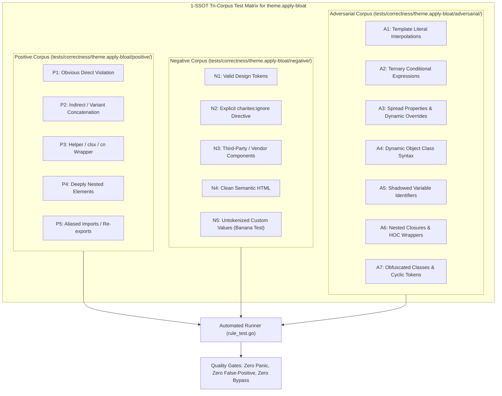

# theme.apply-bloat

> **Rule ID:** `theme.apply-bloat`
> **Severity:** `WARN`
> **Category:** `theme`
> **Target Standards:** Tailwind CSS v3/v4 Architectural Best Practices, W3C Web Performance & CSS Bundle Size Guidelines

---

## 1. Overview & Core Invariant

Detects excessive use of @apply with more than 8 utility classes in CSS or style blocks

### Core Invariant:
> **"The @apply directive must not aggregate more than 8 utility classes in a single declaration to prevent CSS bloat and abstraction decay."**

---
## 2. Technical Grounding & Engine Realities

The @apply directive in Tailwind CSS was designed for small semantic abstractions (such as buttons or form inputs). Overusing @apply by stacking dozens of utility classes recreates the worst aspects of monolithic CSS.

When developers write @apply flex items-center justify-between p-4 bg-white rounded-lg shadow-md border border-gray-200 text-sm font-medium:
1. Bundle Size Inflation: Utility classes are duplicated into individual CSS selectors, negating Tailwind's atomic deduplication benefits.
2. Loss of Utility Ergonomics: Developers lose the ability to override individual styles via props or conditional classes.
3. Maintenance Decay: Giant @apply strings become unreadable 'css-in-css' dumping grounds.

Charites enforces a maximum threshold of 8 utility classes per @apply directive.

---
## 3. Vulnerability & Risk Taxonomy

| Risk Vector | Severity | Impact |
| :--- | :---: | :--- |
| **CSS Bundle Bloat** | MEDIUM | Overloaded @apply directives balloon production stylesheet size and defeat atomic CSS compression. |
| **Component Maintainability Decay** | LOW | Massive CSS helper blocks reduce readability and make conditional variant overrides difficult. |

---
## 4. Non-Compliant Code Patterns (Bad Examples)
### ASTRO (Overloaded @apply declaration with 11 utility classes):
```astro
<style>
  .card {
    @apply flex items-center justify-between p-4 bg-white rounded-lg shadow-md border border-gray-200 text-sm font-medium;
  }
</style>
```
### TSX (Bloated @apply inside TSX style tag):
```tsx
export function Widget() {
  return (
    <style>{`
      .btn-primary {
        @apply inline-flex items-center justify-center px-4 py-2 text-sm font-semibold rounded-md shadow-sm text-white bg-primary hover:bg-primary/90;
      }
    `}</style>
  );
}
```

---
## 5. Compliant Implementation Patterns (Good Examples)
### ASTRO (Concise @apply declaration with 4 utility classes):
```astro
<style>
  .card {
    @apply flex items-center justify-between p-4;
  }
</style>
```
### TSX (Utilities applied directly to JSX markup):
```tsx
export function Card() {
  return <div className="flex items-center justify-between p-4 bg-white rounded-lg shadow-md">Markup Utilities</div>;
}
```

---

## 6. Detection & Verification Pipeline (How The Rule Evaluates Code)
This `theme` rule evaluates source templates against the project's design token graph:



### Step-by-Step Evaluation:
1. **AST Node Traversal:** `internal/analyzer` streams JSX/Astro AST elements to the rule's `Evaluate` visitor.
2. **Variant Normalization:** Strips responsive (`sm:`, `md:`), interaction state (`hover:`, `focus:`), and theme (`dark:`) prefixes to isolate the core utility class.
3. **Modifier Extraction:** Parses utility segments and extracts slash opacity modifiers.
4. **Token Convention Resolution:** Consults the `TokenConvention` adapter to determine the official semantic design token replacement candidate.
5. **Token Graph Verification (Banana Test):** Queries `token.Context` to verify that the candidate token is declared in `global.css` or `tokens.json` within the element's scope. If not declared, the custom value is permitted without a false-positive diagnostic.
6. **Directive Suppression Check:** Inspects preceding AST comments for `charites:ignore theme.apply-bloat`.
7. **Diagnostic Emission:** Produces a structured diagnostic with line number, column span, and actionable replacement suggestion.

---

## 7. Verification & Test Harness (How The Test Works: 1-SSOT Tri-Corpus)

This rule is rigorously tested and validated across the canonical **1-SSOT Tri-Corpus** in `tests/correctness/theme.apply-bloat/`:



- **Positive Fixtures (P1-P5):** Verified to trigger diagnostics at exact lines and column spans.
- **Negative Fixtures (N1-N5):** Verified to produce zero diagnostics on valid tokens and legitimate exemptions.
- **Adversarial Fixtures (A1-A7):** Verified to prevent evasion across dynamic expressions, string interpolations, and cyclic references.

---

## 8. How to Suppress (Ignore Directives)

If this pattern is required for an intentional exception, suppress the diagnostic using the canonical Charites Rule ID:

```astro
<!-- charites:ignore theme.apply-bloat intentional exception -->
```

```tsx
// charites:ignore theme.apply-bloat intentional exception
```

---

## 9. Configuration Reference (`charites.yaml`)

```yaml
rules:
  theme.apply-bloat:
    severity: warn # error | warn | info | off
```

