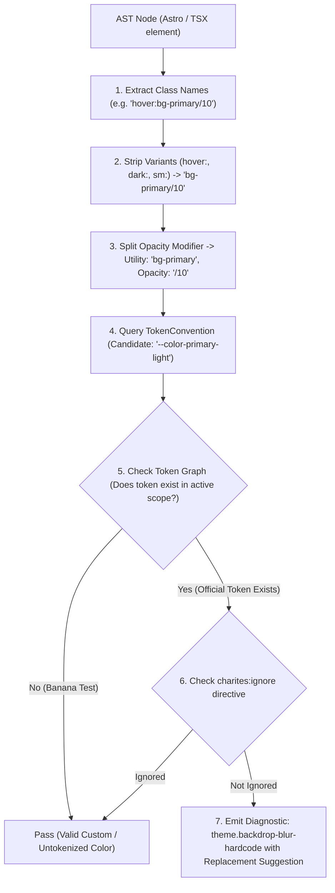
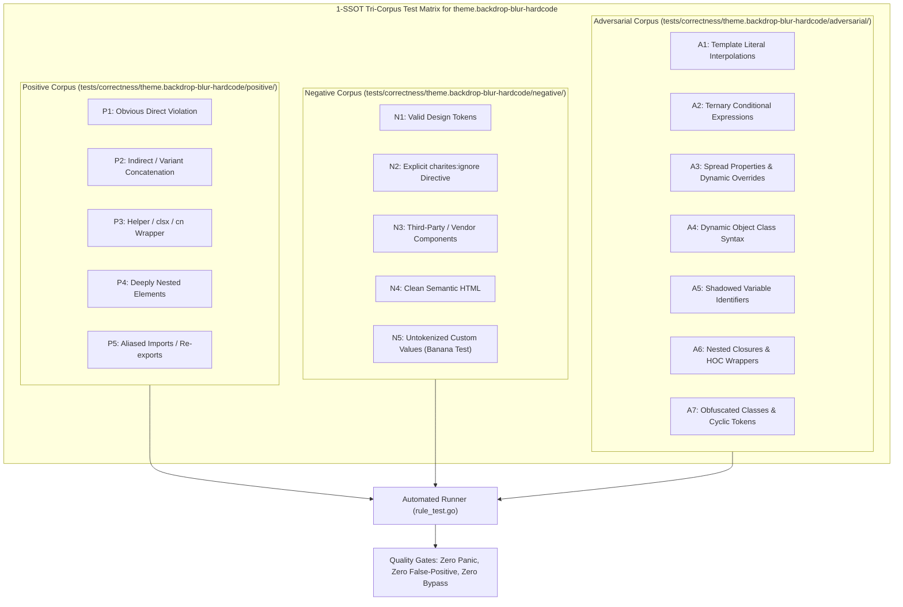

# theme.backdrop-blur-hardcode

> **Rule ID:** `theme.backdrop-blur-hardcode`
> **Severity:** `WARN`
> **Category:** `theme`
> **Target Standards:** W3C Filter & Backdrop Filter Specification, Design System Glassmorphism Standards, Hardware-Accelerated Compositing Guidelines

---

## 1. Overview & Core Invariant

Detects hardcoded arbitrary blur and backdrop-blur scalars in Tailwind utility classes

### Core Invariant:
> **"Glassmorphism and surface blur effects must adhere to standardized blur tokens, never arbitrary scalar lengths."**

---
## 2. Technical Grounding & Engine Realities

Using arbitrary blur values (e.g. backdrop-blur-[5px] or blur-[12px]) produces inconsistent glassmorphism and performance bottlenecks:

1. GPU Overdraw Fragility: Arbitrary blur radii bypass optimized compositor layer pooling, causing unnecessary GPU rasterization penalties on mobile devices.
2. Glassmorphism Fragmentation: Slightly differing blur radii (e.g. 5px vs 8px vs 10px) across headers, dialogs, and drawer sheets ruin visual polish.
3. Inflexible Accessibility Adjustments: Standard tokens allow globally disabling or tuning blurs for users requesting reduced motion or low-power modes.

Charites enforces utilizing standard blur scale tokens (e.g. backdrop-blur-sm, backdrop-blur-md, backdrop-blur-lg) or CSS variables.

---
## 3. Vulnerability & Risk Taxonomy

| Risk Vector | Severity | Impact |
| :--- | :---: | :--- |
| **Glassmorphism Visual Discordance** | MEDIUM | Irregular blur intensity breaks cohesive layering and depth hierarchy across interface overlays. |
| **Mobile GPU Performance Stutter** | HIGH | Unstandardized backdrop-filter passes induce dropped frames during touch scrolling and bottom sheet gestures. |

---
## 4. Non-Compliant Code Patterns (Bad Examples)
### TSX (Arbitrary backdrop-blur on navigation header):
```tsx
<header className="backdrop-blur-[5px] bg-background/80">Sticky Nav</header>
```
### ASTRO (Arbitrary filter blur in Astro component):
```astro
<div class="blur-[12px] [backdrop-filter:blur(7px)]">Frosted Panel</div>
```

---
## 5. Compliant Implementation Patterns (Good Examples)
### TSX (Using standard backdrop blur token):
```tsx
<header className="backdrop-blur-md bg-background/80">Sticky Nav</header>
```
### ASTRO (Standard filter blur token):
```astro
<div class="blur-md backdrop-blur-sm">Frosted Panel</div>
```

---

## 6. Detection & Verification Pipeline (How The Rule Evaluates Code)
This `theme` rule evaluates source templates against the project's design token graph:



### Step-by-Step Evaluation:
1. **AST Node Traversal:** `internal/analyzer` streams JSX/Astro AST elements to the rule's `Evaluate` visitor.
2. **Variant Normalization:** Strips responsive (`sm:`, `md:`), interaction state (`hover:`, `focus:`), and theme (`dark:`) prefixes to isolate the core utility class.
3. **Modifier Extraction:** Parses utility segments and extracts slash opacity modifiers.
4. **Token Convention Resolution:** Consults the `TokenConvention` adapter to determine the official semantic design token replacement candidate.
5. **Token Graph Verification (Banana Test):** Queries `token.Context` to verify that the candidate token is declared in `global.css` or `tokens.json` within the element's scope. If not declared, the custom value is permitted without a false-positive diagnostic.
6. **Directive Suppression Check:** Inspects preceding AST comments for `charites:ignore theme.backdrop-blur-hardcode`.
7. **Diagnostic Emission:** Produces a structured diagnostic with line number, column span, and actionable replacement suggestion.

---

## 7. Verification & Test Harness (How The Test Works: 1-SSOT Tri-Corpus)

This rule is rigorously tested and validated across the canonical **1-SSOT Tri-Corpus** in `tests/correctness/theme.backdrop-blur-hardcode/`:



- **Positive Fixtures (P1-P5):** Verified to trigger diagnostics at exact lines and column spans.
- **Negative Fixtures (N1-N5):** Verified to produce zero diagnostics on valid tokens and legitimate exemptions.
- **Adversarial Fixtures (A1-A7):** Verified to prevent evasion across dynamic expressions, string interpolations, and cyclic references.

---

## 8. How to Suppress (Ignore Directives)

If this pattern is required for an intentional exception, suppress the diagnostic using the canonical Charites Rule ID:

```astro
<!-- charites:ignore theme.backdrop-blur-hardcode intentional exception -->
```

```tsx
// charites:ignore theme.backdrop-blur-hardcode intentional exception
```

---

## 9. Configuration Reference (`charites.yaml`)

```yaml
rules:
  theme.backdrop-blur-hardcode:
    severity: warn # error | warn | info | off
```

