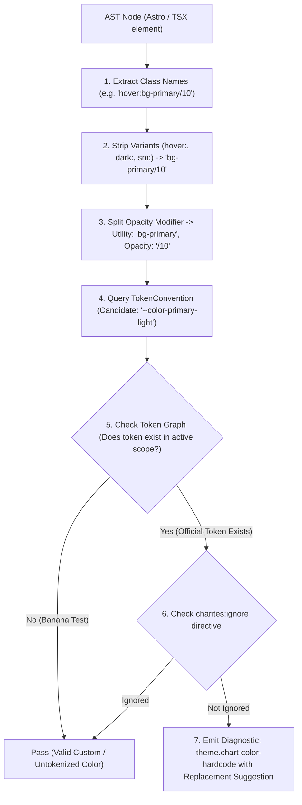
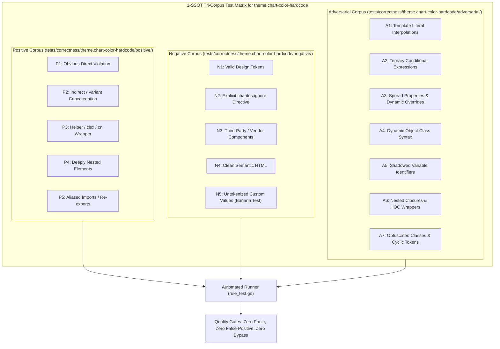

# theme.chart-color-hardcode

> **Rule ID:** `theme.chart-color-hardcode`
> **Severity:** `ERROR`
> **Category:** `theme`
> **Target Standards:** WCAG 2.2 Success Criterion 1.4.3 (Contrast Minimum), WCAG 2.2 Success Criterion 1.4.11 (Non-text Contrast), Accessible Data Visualization Design Tokens

---

## 1. Overview & Core Invariant

Detects hardcoded color values on chart visualization components

### Core Invariant:
> **"Chart components must reference semantic theme tokens (e.g. var(--chart-1)) rather than hardcoded hex or color literals."**

---
## 2. Technical Grounding & Engine Realities

Data visualization libraries (such as Recharts, Chart.js, or Nivo) rely on SVG fill and stroke attributes to render bars, lines, and areas.

When developers hardcode hex colors onto chart elements (e.g. <Bar dataKey="sales" fill="#3b82f6" />):
1. Dark Mode Contrast Inversion: The hardcoded colors clash with dark card backgrounds, failing accessibility contrast minimums.
2. Theme Blindness: Visualizations fail to adapt when switching between light, dark, or high-contrast themes.
3. Fragmented Visual Identity: Brand colors drift between charts and surrounding interface tokens.

Charites enforces using CSS custom properties (fill="var(--chart-1)") or dynamic theme mappings.

---
## 3. Vulnerability & Risk Taxonomy

| Risk Vector | Severity | Impact |
| :--- | :---: | :--- |
| **Chart Contrast Invalidation** | HIGH | Chart bars and lines become illegible against inverted dark backgrounds, obscuring critical analytics. |
| **Theme Desynchronization** | MEDIUM | Data visualizations remain locked to legacy colors while the rest of the application adapts dynamically. |

---
## 4. Non-Compliant Code Patterns (Bad Examples)
### TSX (Hardcoded hex fill and stroke on Recharts Bar and Line):
```tsx
<>
  <Bar dataKey="revenue" fill="#3b82f6" />
  <Line dataKey="profit" stroke="#10b981" />
</>
```
### ASTRO (Hardcoded color on Area and Cell components):
```astro
<Area dataKey="uv" fill="#8884d8" stroke="#82ca9d" />
<Cell fill="#f43f5e" />
```

---
## 5. Compliant Implementation Patterns (Good Examples)
### TSX (Semantic chart tokens from design system):
```tsx
<>
  <Bar dataKey="revenue" fill="var(--chart-1)" />
  <Line dataKey="profit" stroke="var(--chart-2)" />
</>
```
### ASTRO (CSS variable references on Area and Cell):
```astro
<Area dataKey="uv" fill="var(--chart-1)" stroke="var(--chart-2)" />
<Cell fill="var(--chart-destructive)" />
```

---

## 6. Detection & Verification Pipeline (How The Rule Evaluates Code)
This `theme` rule evaluates source templates against the project's design token graph:



### Step-by-Step Evaluation:
1. **AST Node Traversal:** `internal/analyzer` streams JSX/Astro AST elements to the rule's `Evaluate` visitor.
2. **Variant Normalization:** Strips responsive (`sm:`, `md:`), interaction state (`hover:`, `focus:`), and theme (`dark:`) prefixes to isolate the core utility class.
3. **Modifier Extraction:** Parses utility segments and extracts slash opacity modifiers.
4. **Token Convention Resolution:** Consults the `TokenConvention` adapter to determine the official semantic design token replacement candidate.
5. **Token Graph Verification (Banana Test):** Queries `token.Context` to verify that the candidate token is declared in `global.css` or `tokens.json` within the element's scope. If not declared, the custom value is permitted without a false-positive diagnostic.
6. **Directive Suppression Check:** Inspects preceding AST comments for `charites:ignore theme.chart-color-hardcode`.
7. **Diagnostic Emission:** Produces a structured diagnostic with line number, column span, and actionable replacement suggestion.

---

## 7. Verification & Test Harness (How The Test Works: 1-SSOT Tri-Corpus)

This rule is rigorously tested and validated across the canonical **1-SSOT Tri-Corpus** in `tests/correctness/theme.chart-color-hardcode/`:



- **Positive Fixtures (P1-P5):** Verified to trigger diagnostics at exact lines and column spans.
- **Negative Fixtures (N1-N5):** Verified to produce zero diagnostics on valid tokens and legitimate exemptions.
- **Adversarial Fixtures (A1-A7):** Verified to prevent evasion across dynamic expressions, string interpolations, and cyclic references.

---

## 8. How to Suppress (Ignore Directives)

If this pattern is required for an intentional exception, suppress the diagnostic using the canonical Charites Rule ID:

```astro
<!-- charites:ignore theme.chart-color-hardcode intentional exception -->
```

```tsx
// charites:ignore theme.chart-color-hardcode intentional exception
```

---

## 9. Configuration Reference (`charites.yaml`)

```yaml
rules:
  theme.chart-color-hardcode:
    severity: error # error | warn | info | off
```

