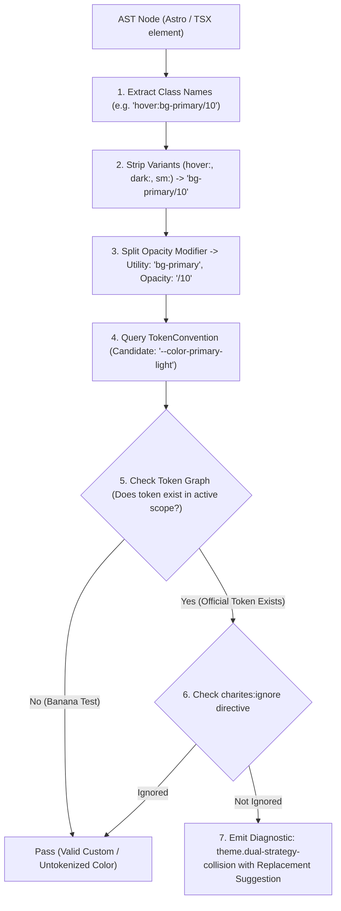
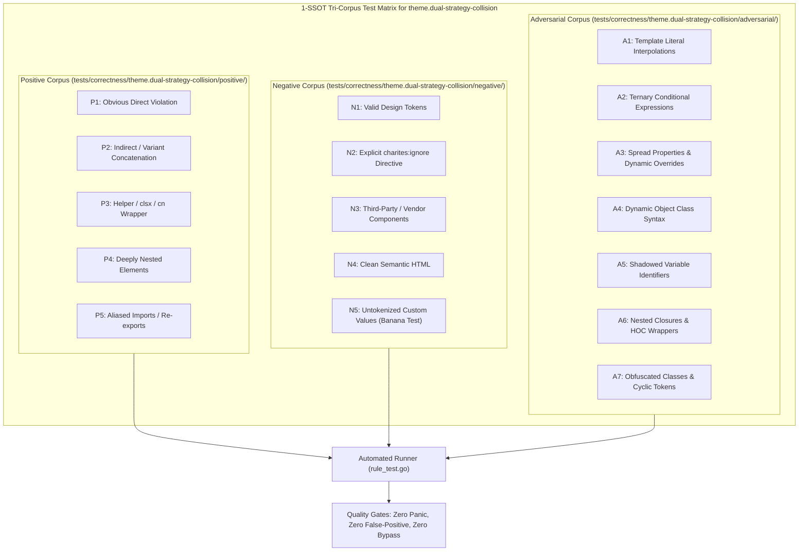

# theme.dual-strategy-collision

> **Rule ID:** `theme.dual-strategy-collision`
> **Severity:** `WARN`
> **Category:** `theme`
> **Target Standards:** W3C CSS Cascading and Inheritance Level 5, Design System Theming Strategy Alignment, Tailwind CSS Dark Mode Strategy Selector vs Media

---

## 1. Overview & Core Invariant

Detects conflicting dark mode strategies (@media vs .dark/[data-theme]) in the same style scope

### Core Invariant:
> **"Stylesheets must adhere to a single unified dark mode strategy (either media query or selector-based), avoiding contradictory cascade conflicts."**

---
## 2. Technical Grounding & Engine Realities

When developers mix @media (prefers-color-scheme: dark) with class (.dark) or attribute ([data-theme="dark"]) selectors within the same scope:

1. Frankenstein Interface: System dark mode triggers media queries while manual theme toggles toggle classes, producing a fractured, half-dark layout.
2. Specificity Inversion: Class selectors have higher specificity than unnested media query elements, creating unpredictable styling overrides.
3. State Desynchronization: Manual UI theme switches fail to override hardcoded @media rules.

Charites enforces choosing a single, coherent dark mode switching strategy across each style scope.

---
## 3. Vulnerability & Risk Taxonomy

| Risk Vector | Severity | Impact |
| :--- | :---: | :--- |
| **Frankenstein UI Collision** | HIGH | System dark mode and application theme toggles conflict, resulting in partially inverted and illegible components. |
| **Cascade Specificity Wars** | MEDIUM | Rules under @media cannot be overridden by user-selected theme classes without high-specificity hacks. |

---
## 4. Non-Compliant Code Patterns (Bad Examples)
### ASTRO (Mixing prefers-color-scheme media query with .dark class selector):
```astro
<style>
  @media (prefers-color-scheme: dark) {
    body {
      background: #121212;
    }
  }
  .dark {
    --bg-main: #000000;
  }
</style>
```
### TSX (Mixing media query with data-theme attribute in TSX style):
```tsx
<style>{`
  @media (prefers-color-scheme: dark) {
    :root { --card: #18181b; }
  }
  [data-theme="dark"] {
    --card: #09090b;
  }
`}</style>
```

---
## 5. Compliant Implementation Patterns (Good Examples)
### ASTRO (Single coherent class-based strategy):
```astro
<style>
  :root {
    --bg-main: #ffffff;
  }
  .dark {
    color-scheme: dark;
    --bg-main: #09090b;
  }
</style>
```
### TSX (Single coherent media-query-based strategy):
```tsx
<style>{`
  :root {
    --bg-main: #ffffff;
  }
  @media (prefers-color-scheme: dark) {
    :root {
      color-scheme: dark;
      --bg-main: #09090b;
    }
  }
`}</style>
```

---

## 6. Detection & Verification Pipeline (How The Rule Evaluates Code)
This `theme` rule evaluates source templates against the project's design token graph:



### Step-by-Step Evaluation:
1. **AST Node Traversal:** `internal/analyzer` streams JSX/Astro AST elements to the rule's `Evaluate` visitor.
2. **Variant Normalization:** Strips responsive (`sm:`, `md:`), interaction state (`hover:`, `focus:`), and theme (`dark:`) prefixes to isolate the core utility class.
3. **Modifier Extraction:** Parses utility segments and extracts slash opacity modifiers.
4. **Token Convention Resolution:** Consults the `TokenConvention` adapter to determine the official semantic design token replacement candidate.
5. **Token Graph Verification (Banana Test):** Queries `token.Context` to verify that the candidate token is declared in `global.css` or `tokens.json` within the element's scope. If not declared, the custom value is permitted without a false-positive diagnostic.
6. **Directive Suppression Check:** Inspects preceding AST comments for `charites:ignore theme.dual-strategy-collision`.
7. **Diagnostic Emission:** Produces a structured diagnostic with line number, column span, and actionable replacement suggestion.

---

## 7. Verification & Test Harness (How The Test Works: 1-SSOT Tri-Corpus)

This rule is rigorously tested and validated across the canonical **1-SSOT Tri-Corpus** in `tests/correctness/theme.dual-strategy-collision/`:



- **Positive Fixtures (P1-P5):** Verified to trigger diagnostics at exact lines and column spans.
- **Negative Fixtures (N1-N5):** Verified to produce zero diagnostics on valid tokens and legitimate exemptions.
- **Adversarial Fixtures (A1-A7):** Verified to prevent evasion across dynamic expressions, string interpolations, and cyclic references.

---

## 8. How to Suppress (Ignore Directives)

If this pattern is required for an intentional exception, suppress the diagnostic using the canonical Charites Rule ID:

```astro
<!-- charites:ignore theme.dual-strategy-collision intentional exception -->
```

```tsx
// charites:ignore theme.dual-strategy-collision intentional exception
```

---

## 9. Configuration Reference (`charites.yaml`)

```yaml
rules:
  theme.dual-strategy-collision:
    severity: warn # error | warn | info | off
```

