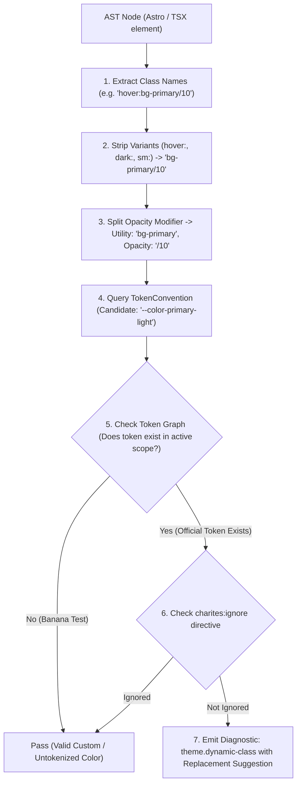
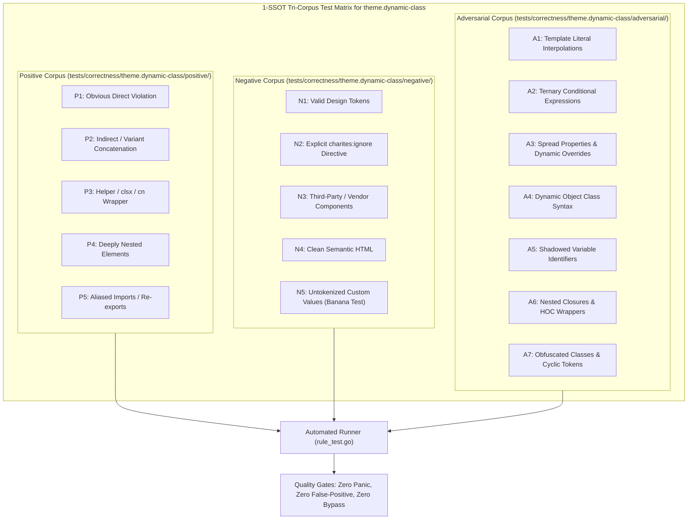

# theme.dynamic-class

> **Rule ID:** `theme.dynamic-class`
> **Severity:** `ERROR`
> **Category:** `theme`
> **Target Standards:** Tailwind CSS JIT Static Analysis & Extraction Guidelines, Build-Time CSS Zero-Runtime Architecture, W3C Web Performance & Production Reliability

---

## 1. Overview & Core Invariant

Detects unpadded dynamic template strings breaking Tailwind JIT class generation

### Core Invariant:
> **"Utility classes must be written as complete static string literals so the Tailwind build compiler can reliably extract and generate them."**

---
## 2. Technical Grounding & Engine Realities

Tailwind CSS searches source files using regular expressions looking for complete class strings at build time. It does not evaluate JavaScript at runtime.

When developers dynamically construct utility classes using template literal slicing (e.g. className={`text-${color}-500`} or `bg-${variant}`):
1. Missing Production CSS: The Tailwind compiler never matches the interpolated string, leaving the utility completely absent from the production stylesheet.
2. Silent Visual Degradation: The component appears broken or unstyled in production while appearing to work intermittently in dev if another component imported that class.
3. Inscrutable Debugging: Developers struggle to trace why specific color variants intermittently fail to render.

Charites enforces using static class maps or complete utility strings within conditional expressions.

---
## 3. Vulnerability & Risk Taxonomy

| Risk Vector | Severity | Impact |
| :--- | :---: | :--- |
| **Missing Production Styles** | CRITICAL | Tailwind JIT engine strips un-scanned utility classes from production bundles, breaking layout and colors. |
| **Heisenbug UI Regressions** | HIGH | Styles intermittently vanish or break depending on which other files are compiled in the same build chunk. |

---
## 4. Non-Compliant Code Patterns (Bad Examples)
### TSX (Dynamic class string splicing in JSX className):
```tsx
<div className={`text-${color}-500 font-bold`}>Status</div>
```
### ASTRO (Dynamic background variant splicing in Astro):
```astro
<button class={`px-4 py-2 bg-${variant}`}>Action</button>
```

---
## 5. Compliant Implementation Patterns (Good Examples)
### TSX (Static class lookup map for dynamic variants):
```tsx
const colorMap: Record<string, string> = {
  red: "text-red-500",
  blue: "text-blue-500",
  green: "text-green-500",
};
<div className={`${colorMap[color]} font-bold`}>Status</div>
```
### TSX (Complete utility class strings in ternary expression):
```tsx
<button className={`px-4 py-2 ${isActive ? "bg-primary text-primary-foreground" : "bg-muted"}`}>Action</button>
```

---

## 6. Detection & Verification Pipeline (How The Rule Evaluates Code)
This `theme` rule evaluates source templates against the project's design token graph:



### Step-by-Step Evaluation:
1. **AST Node Traversal:** `internal/analyzer` streams JSX/Astro AST elements to the rule's `Evaluate` visitor.
2. **Variant Normalization:** Strips responsive (`sm:`, `md:`), interaction state (`hover:`, `focus:`), and theme (`dark:`) prefixes to isolate the core utility class.
3. **Modifier Extraction:** Parses utility segments and extracts slash opacity modifiers.
4. **Token Convention Resolution:** Consults the `TokenConvention` adapter to determine the official semantic design token replacement candidate.
5. **Token Graph Verification (Banana Test):** Queries `token.Context` to verify that the candidate token is declared in `global.css` or `tokens.json` within the element's scope. If not declared, the custom value is permitted without a false-positive diagnostic.
6. **Directive Suppression Check:** Inspects preceding AST comments for `charites:ignore theme.dynamic-class`.
7. **Diagnostic Emission:** Produces a structured diagnostic with line number, column span, and actionable replacement suggestion.

---

## 7. Verification & Test Harness (How The Test Works: 1-SSOT Tri-Corpus)

This rule is rigorously tested and validated across the canonical **1-SSOT Tri-Corpus** in `tests/correctness/theme.dynamic-class/`:



- **Positive Fixtures (P1-P5):** Verified to trigger diagnostics at exact lines and column spans.
- **Negative Fixtures (N1-N5):** Verified to produce zero diagnostics on valid tokens and legitimate exemptions.
- **Adversarial Fixtures (A1-A7):** Verified to prevent evasion across dynamic expressions, string interpolations, and cyclic references.

---

## 8. How to Suppress (Ignore Directives)

If this pattern is required for an intentional exception, suppress the diagnostic using the canonical Charites Rule ID:

```astro
<!-- charites:ignore theme.dynamic-class intentional exception -->
```

```tsx
// charites:ignore theme.dynamic-class intentional exception
```

---

## 9. Configuration Reference (`charites.yaml`)

```yaml
rules:
  theme.dynamic-class:
    severity: error # error | warn | info | off
```

