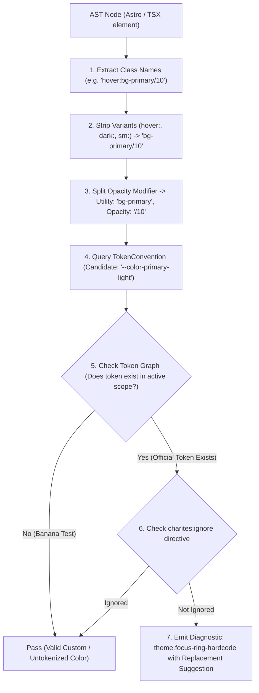
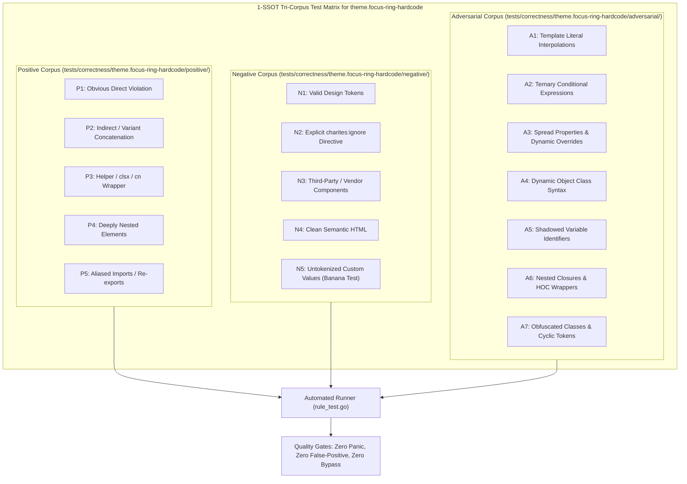

# theme.focus-ring-hardcode

> **Rule ID:** `theme.focus-ring-hardcode`
> **Severity:** `WARN`
> **Category:** `theme`
> **Target Standards:** WCAG 2.2 Success Criterion 2.4.11 (Focus Not Obscured), WCAG 2.2 Success Criterion 2.4.13 (Focus Appearance), W3C DTCG State & Focus Tokens

---

## 1. Overview & Core Invariant

Detects hardcoded primitive palette or arbitrary hex colors on focus rings and outlines

### Core Invariant:
> **"Keyboard focus indicator colors must be driven by semantic ring design tokens (e.g. ring-ring), never primitive palette or hardcoded hex colors."**

---
## 2. Technical Grounding & Engine Realities

Specifying raw hex literals or primitive colors on focus rings (e.g. focus:ring-[#3b82f6] or ring-blue-500) creates severe accessibility and theme regressions:

1. WCAG Contrast Failures: Static blue or hex rings fail the minimum 3:1 contrast ratio against dark or tinted component backgrounds.
2. Theme Blindness: A ring-offset-white class flashes a glaring white halo when tabbed in dark mode.
3. Fragmented Keyboard Affordance: Keyboard navigation users experience jarringly different focus indicators across distinct views.

Charites enforces using semantic focus tokens (e.g. focus-visible:ring-ring or ring-ring) and token-driven offsets (ring-offset-background).

---
## 3. Vulnerability & Risk Taxonomy

| Risk Vector | Severity | Impact |
| :--- | :---: | :--- |
| **WCAG 2.4.13 Non-Compliance** | HIGH | Low-vision and keyboard users cannot perceive the active focus indicator due to inadequate contrast ratios. |
| **Dark Mode Halo Inversion** | MEDIUM | Hardcoded light offsets create blinding light borders around active inputs on dark surfaces. |

---
## 4. Non-Compliant Code Patterns (Bad Examples)
### TSX (Arbitrary hex and primitive focus ring in JSX):
```tsx
<button className="focus:ring-[#3b82f6] focus:ring-2">Sign in</button>
```
### ASTRO (Primitive ring and static offset in Astro):
```astro
<input class="ring-blue-500 ring-offset-white focus:outline-blue-500" />
```

---
## 5. Compliant Implementation Patterns (Good Examples)
### TSX (Using semantic focus ring token):
```tsx
<button className="focus-visible:ring-2 focus-visible:ring-ring focus-visible:ring-offset-2">Sign in</button>
```
### ASTRO (Semantic ring and background-adaptive offset):
```astro
<input class="focus:ring-2 focus:ring-ring ring-offset-background" />
```

---

## 6. Detection & Verification Pipeline (How The Rule Evaluates Code)
This `theme` rule evaluates source templates against the project's design token graph:



### Step-by-Step Evaluation:
1. **AST Node Traversal:** `internal/analyzer` streams JSX/Astro AST elements to the rule's `Evaluate` visitor.
2. **Variant Normalization:** Strips responsive (`sm:`, `md:`), interaction state (`hover:`, `focus:`), and theme (`dark:`) prefixes to isolate the core utility class.
3. **Modifier Extraction:** Parses utility segments and extracts slash opacity modifiers.
4. **Token Convention Resolution:** Consults the `TokenConvention` adapter to determine the official semantic design token replacement candidate.
5. **Token Graph Verification (Banana Test):** Queries `token.Context` to verify that the candidate token is declared in `global.css` or `tokens.json` within the element's scope. If not declared, the custom value is permitted without a false-positive diagnostic.
6. **Directive Suppression Check:** Inspects preceding AST comments for `charites:ignore theme.focus-ring-hardcode`.
7. **Diagnostic Emission:** Produces a structured diagnostic with line number, column span, and actionable replacement suggestion.

---

## 7. Verification & Test Harness (How The Test Works: 1-SSOT Tri-Corpus)

This rule is rigorously tested and validated across the canonical **1-SSOT Tri-Corpus** in `tests/correctness/theme.focus-ring-hardcode/`:



- **Positive Fixtures (P1-P5):** Verified to trigger diagnostics at exact lines and column spans.
- **Negative Fixtures (N1-N5):** Verified to produce zero diagnostics on valid tokens and legitimate exemptions.
- **Adversarial Fixtures (A1-A7):** Verified to prevent evasion across dynamic expressions, string interpolations, and cyclic references.

---

## 8. How to Suppress (Ignore Directives)

If this pattern is required for an intentional exception, suppress the diagnostic using the canonical Charites Rule ID:

```astro
<!-- charites:ignore theme.focus-ring-hardcode intentional exception -->
```

```tsx
// charites:ignore theme.focus-ring-hardcode intentional exception
```

---

## 9. Configuration Reference (`charites.yaml`)

```yaml
rules:
  theme.focus-ring-hardcode:
    severity: warn # error | warn | info | off
```

