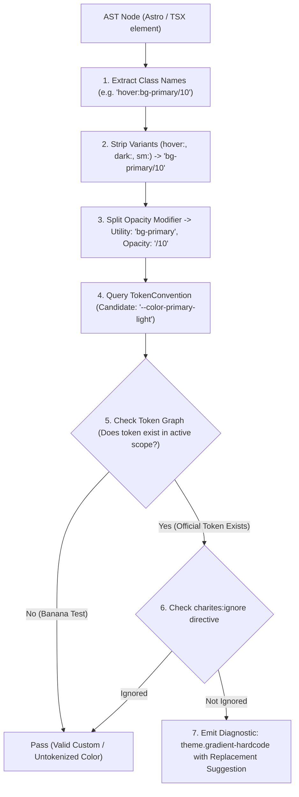
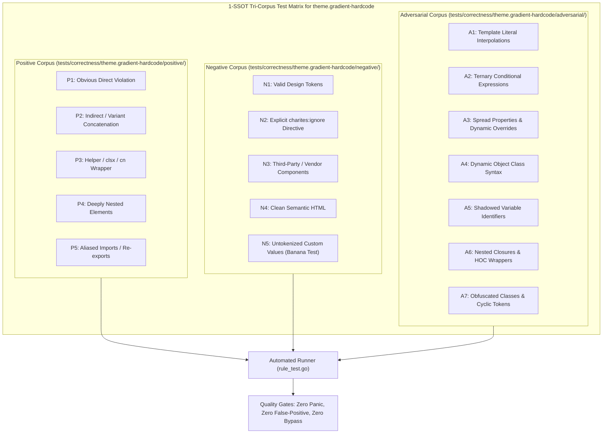

# theme.gradient-hardcode

> **Rule ID:** `theme.gradient-hardcode`
> **Severity:** `WARN`
> **Category:** `theme`
> **Target Standards:** W3C Design Tokens Community Group (DTCG), Tailwind CSS Gradient Token Architecture

---

## 1. Overview & Core Invariant

Detects hardcoded primitive, arbitrary hex, or monochrome colors in gradient stops

### Core Invariant:
> **"Gradient color stops must use semantic tokens (from-primary, to-accent), never primitive palette or arbitrary hex stops."**

---
## 2. Technical Grounding & Engine Realities

Gradients often span large hero sections or callout backgrounds. When color stops use primitive or arbitrary values (e.g. from-[#3b82f6] to-blue-500):

1. Inverted Muddy Colors: Light mode gradients rendered in dark mode produce muddy, low-contrast, or unreadable backgrounds behind text.
2. Theme Decoupling: Rebranding or dynamic tenant themes cannot adjust the stops without manually updating every gradient class.
3. Accessibility Violations: Static gradient stops cannot guarantee compliance with WCAG 2.2 text contrast across all screen areas.

Charites enforces gradient stops constructed from semantic tokens (from-primary, to-secondary, via-accent, from-transparent).

---
## 3. Vulnerability & Risk Taxonomy

| Risk Vector | Severity | Impact |
| :--- | :---: | :--- |
| **Dark Mode Breakage** | HIGH | Hardcoded gradient stops destroy text legibility and brand alignment in dark themes. |
| **Design Token Fragmentation** | MEDIUM | Gradients drift out of sync with established design system tokens. |

---
## 4. Non-Compliant Code Patterns (Bad Examples)
### ASTRO (Gradient stops using arbitrary hex and primitive colors):
```astro
<div class="bg-gradient-to-r from-[#3b82f6] to-blue-500">Banner</div>
```
### TSX (Gradient stops using monochrome white and primitive red):
```tsx
export function Hero() {
  return <div className="bg-gradient-to-b from-white via-rose-500 to-black">Hero</div>;
}
```

---
## 5. Compliant Implementation Patterns (Good Examples)
### ASTRO (Semantic tokens for gradient stops):
```astro
<div class="bg-gradient-to-r from-primary to-accent">Banner</div>
```
### TSX (Semantic tokens adapting cleanly to dark mode):
```tsx
export function Hero() {
  return <div className="bg-gradient-to-b from-card via-primary to-background">Hero</div>;
}
```

---

## 6. Detection & Verification Pipeline (How The Rule Evaluates Code)
This `theme` rule evaluates source templates against the project's design token graph:



### Step-by-Step Evaluation:
1. **AST Node Traversal:** `internal/analyzer` streams JSX/Astro AST elements to the rule's `Evaluate` visitor.
2. **Variant Normalization:** Strips responsive (`sm:`, `md:`), interaction state (`hover:`, `focus:`), and theme (`dark:`) prefixes to isolate the core utility class.
3. **Modifier Extraction:** Parses utility segments and extracts slash opacity modifiers.
4. **Token Convention Resolution:** Consults the `TokenConvention` adapter to determine the official semantic design token replacement candidate.
5. **Token Graph Verification (Banana Test):** Queries `token.Context` to verify that the candidate token is declared in `global.css` or `tokens.json` within the element's scope. If not declared, the custom value is permitted without a false-positive diagnostic.
6. **Directive Suppression Check:** Inspects preceding AST comments for `charites:ignore theme.gradient-hardcode`.
7. **Diagnostic Emission:** Produces a structured diagnostic with line number, column span, and actionable replacement suggestion.

---

## 7. Verification & Test Harness (How The Test Works: 1-SSOT Tri-Corpus)

This rule is rigorously tested and validated across the canonical **1-SSOT Tri-Corpus** in `tests/correctness/theme.gradient-hardcode/`:



- **Positive Fixtures (P1-P5):** Verified to trigger diagnostics at exact lines and column spans.
- **Negative Fixtures (N1-N5):** Verified to produce zero diagnostics on valid tokens and legitimate exemptions.
- **Adversarial Fixtures (A1-A7):** Verified to prevent evasion across dynamic expressions, string interpolations, and cyclic references.

---

## 8. How to Suppress (Ignore Directives)

If this pattern is required for an intentional exception, suppress the diagnostic using the canonical Charites Rule ID:

```astro
<!-- charites:ignore theme.gradient-hardcode intentional exception -->
```

```tsx
// charites:ignore theme.gradient-hardcode intentional exception
```

---

## 9. Configuration Reference (`charites.yaml`)

```yaml
rules:
  theme.gradient-hardcode:
    severity: warn # error | warn | info | off
```

