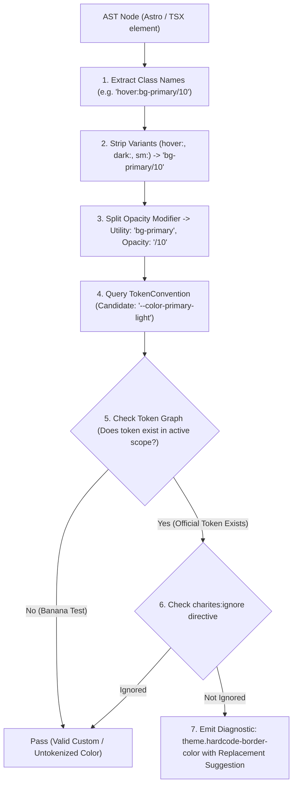
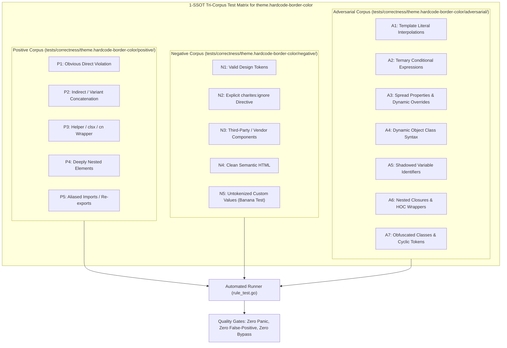

# theme.hardcode-border-color

> **Rule ID:** `theme.hardcode-border-color`
> **Severity:** `WARN`
> **Category:** `theme`
> **Target Standards:** W3C Design Tokens Community Group (DTCG), Tailwind CSS Border Token Architecture

---

## 1. Overview & Core Invariant

Detects hardcoded border and divider colors using primitive palettes, raw hex literals, or static monochrome

### Core Invariant:
> **"Component borders and dividers must use semantic tokens (border-border, border-input), never primitive palette or arbitrary hex colors."**

---
## 2. Technical Grounding & Engine Realities

Border lines define container elevation, separation, and affordance. When border colors are hardcoded (e.g. border-gray-200, border-[#e5e5e5]):

1. Invisibility in Dark Mode: A light gray border (#e5e5e5) provides zero contrast or turns into an inverted stark line in dark themes.
2. Theme Disconnect: When the primary or brand palette changes, borders remain pinned to legacy gray scales.
3. Inconsistent Boundaries: Disparate components end up using gray-200, slate-200, zinc-300 arbitrarily for identical UI dividers.

Charites enforces using centralized border tokens (border-border, border-input, divide-border).

---
## 3. Vulnerability & Risk Taxonomy

| Risk Vector | Severity | Impact |
| :--- | :---: | :--- |
| **Dark Mode Invisibility** | HIGH | Hardcoded light borders vanish or glow unnaturally on dark theme backgrounds. |
| **Visual Fragmentation** | MEDIUM | Different shades of gray borders destroy cohesive surface elevation hierarchy. |

---
## 4. Non-Compliant Code Patterns (Bad Examples)
### ASTRO (Hardcoded border primitive and arbitrary hex):
```astro
<div class="border border-gray-200 divide-y divide-[#e5e5e5]">List</div>
```
### TSX (Primitive directional border in JSX):
```tsx
export function Card() {
  return <div className="border-t-slate-300 border-x-[#cccccc]">Content</div>;
}
```

---
## 5. Compliant Implementation Patterns (Good Examples)
### ASTRO (Using semantic border and divider tokens):
```astro
<div class="border border-border divide-y divide-border">List</div>
```
### TSX (Semantic border tokens with dark mode adaptability):
```tsx
export function Card() {
  return <div className="border-t border-border">Content</div>;
}
```

---

## 6. Detection & Verification Pipeline (How The Rule Evaluates Code)
This `theme` rule evaluates source templates against the project's design token graph:



### Step-by-Step Evaluation:
1. **AST Node Traversal:** `internal/analyzer` streams JSX/Astro AST elements to the rule's `Evaluate` visitor.
2. **Variant Normalization:** Strips responsive (`sm:`, `md:`), interaction state (`hover:`, `focus:`), and theme (`dark:`) prefixes to isolate the core utility class.
3. **Modifier Extraction:** Parses utility segments and extracts slash opacity modifiers.
4. **Token Convention Resolution:** Consults the `TokenConvention` adapter to determine the official semantic design token replacement candidate.
5. **Token Graph Verification (Banana Test):** Queries `token.Context` to verify that the candidate token is declared in `global.css` or `tokens.json` within the element's scope. If not declared, the custom value is permitted without a false-positive diagnostic.
6. **Directive Suppression Check:** Inspects preceding AST comments for `charites:ignore theme.hardcode-border-color`.
7. **Diagnostic Emission:** Produces a structured diagnostic with line number, column span, and actionable replacement suggestion.

---

## 7. Verification & Test Harness (How The Test Works: 1-SSOT Tri-Corpus)

This rule is rigorously tested and validated across the canonical **1-SSOT Tri-Corpus** in `tests/correctness/theme.hardcode-border-color/`:



- **Positive Fixtures (P1-P5):** Verified to trigger diagnostics at exact lines and column spans.
- **Negative Fixtures (N1-N5):** Verified to produce zero diagnostics on valid tokens and legitimate exemptions.
- **Adversarial Fixtures (A1-A7):** Verified to prevent evasion across dynamic expressions, string interpolations, and cyclic references.

---

## 8. How to Suppress (Ignore Directives)

If this pattern is required for an intentional exception, suppress the diagnostic using the canonical Charites Rule ID:

```astro
<!-- charites:ignore theme.hardcode-border-color intentional exception -->
```

```tsx
// charites:ignore theme.hardcode-border-color intentional exception
```

---

## 9. Configuration Reference (`charites.yaml`)

```yaml
rules:
  theme.hardcode-border-color:
    severity: warn # error | warn | info | off
```

