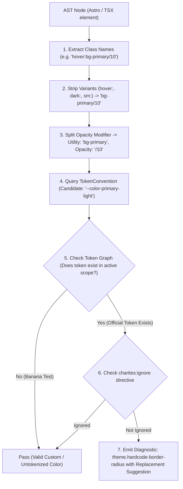
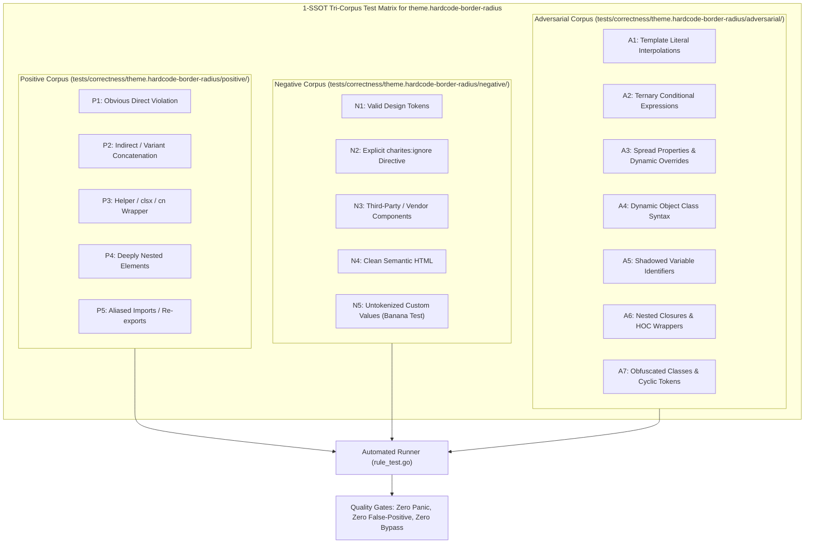

# theme.hardcode-border-radius

> **Rule ID:** `theme.hardcode-border-radius`
> **Severity:** `WARN`
> **Category:** `theme`
> **Target Standards:** W3C DTCG Shape & Radius Tokens, Design System Shape Hierarchy, Nested Curvature Optics Standard

---

## 1. Overview & Core Invariant

Detects hardcoded arbitrary border-radius scalars in Tailwind utility classes

### Core Invariant:
> **"Corner rounding and shape curvature must use standardized shape tokens or CSS variables, never arbitrary raw radius scalars."**

---
## 2. Technical Grounding & Engine Realities

Specifying arbitrary border-radius values (e.g. rounded-[7px] or rounded-t-[14px]) harms UI consistency:

1. Geometric Discordance: Components with off-scale radii look disjointed when nested or placed side-by-side.
2. Outer/Inner Radius Mismatch: Nested cards require deliberate radius proportion calculations (R_inner = R_outer - padding) defined by the shape system.
3. Rebranding Vulnerability: Global shape system updates (e.g. switching from square to rounded theme) cannot adapt arbitrary bracket classes.

Charites enforces using standard shape tokens (e.g. rounded-sm, rounded-md, rounded-xl) or token variables (e.g. rounded-[var(--radius)]).

---
## 3. Vulnerability & Risk Taxonomy

| Risk Vector | Severity | Impact |
| :--- | :---: | :--- |
| **Geometric Incoherence** | MEDIUM | Arbitrary corner radii make cards, buttons, and inputs clash visually across user interfaces. |
| **Theme Rigidity** | HIGH | Hardcoded radius prevents sweeping design system theme modernizations or brand shape adjustments. |

---
## 4. Non-Compliant Code Patterns (Bad Examples)
### TSX (Arbitrary border radius on button and card):
```tsx
<button className="rounded-[7px] p-3">Submit</button>
```
### ASTRO (Directional arbitrary radius in Astro component):
```astro
<div class="rounded-t-[14px] [border-radius:9px]">Modal Header</div>
```

---
## 5. Compliant Implementation Patterns (Good Examples)
### TSX (Using design system shape tokens):
```tsx
<button className="rounded-md p-3">Submit</button>
```
### ASTRO (Standard directional rounded tokens):
```astro
<div class="rounded-t-xl rounded-b-none">Modal Header</div>
```

---

## 6. Detection & Verification Pipeline (How The Rule Evaluates Code)
This `theme` rule evaluates source templates against the project's design token graph:



### Step-by-Step Evaluation:
1. **AST Node Traversal:** `internal/analyzer` streams JSX/Astro AST elements to the rule's `Evaluate` visitor.
2. **Variant Normalization:** Strips responsive (`sm:`, `md:`), interaction state (`hover:`, `focus:`), and theme (`dark:`) prefixes to isolate the core utility class.
3. **Modifier Extraction:** Parses utility segments and extracts slash opacity modifiers.
4. **Token Convention Resolution:** Consults the `TokenConvention` adapter to determine the official semantic design token replacement candidate.
5. **Token Graph Verification (Banana Test):** Queries `token.Context` to verify that the candidate token is declared in `global.css` or `tokens.json` within the element's scope. If not declared, the custom value is permitted without a false-positive diagnostic.
6. **Directive Suppression Check:** Inspects preceding AST comments for `charites:ignore theme.hardcode-border-radius`.
7. **Diagnostic Emission:** Produces a structured diagnostic with line number, column span, and actionable replacement suggestion.

---

## 7. Verification & Test Harness (How The Test Works: 1-SSOT Tri-Corpus)

This rule is rigorously tested and validated across the canonical **1-SSOT Tri-Corpus** in `tests/correctness/theme.hardcode-border-radius/`:



- **Positive Fixtures (P1-P5):** Verified to trigger diagnostics at exact lines and column spans.
- **Negative Fixtures (N1-N5):** Verified to produce zero diagnostics on valid tokens and legitimate exemptions.
- **Adversarial Fixtures (A1-A7):** Verified to prevent evasion across dynamic expressions, string interpolations, and cyclic references.

---

## 8. How to Suppress (Ignore Directives)

If this pattern is required for an intentional exception, suppress the diagnostic using the canonical Charites Rule ID:

```astro
<!-- charites:ignore theme.hardcode-border-radius intentional exception -->
```

```tsx
// charites:ignore theme.hardcode-border-radius intentional exception
```

---

## 9. Configuration Reference (`charites.yaml`)

```yaml
rules:
  theme.hardcode-border-radius:
    severity: warn # error | warn | info | off
```

