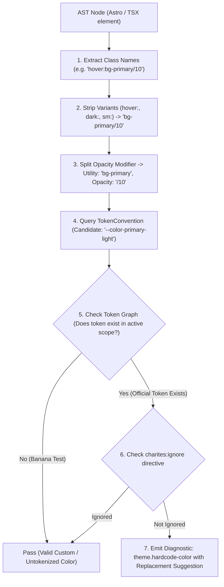
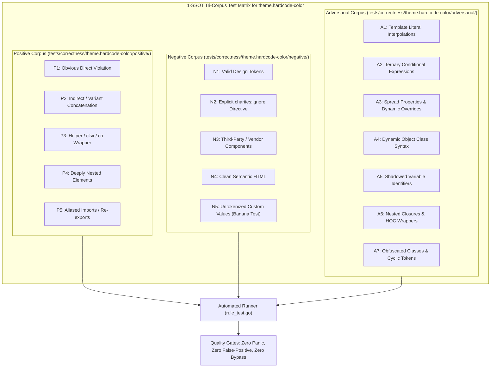

# theme.hardcode-color

> **Rule ID:** `theme.hardcode-color`
> **Severity:** `WARN`
> **Category:** `theme`
> **Target Standards:** W3C Design Tokens Community Group (DTCG), Tailwind CSS Design Token Architecture, WCAG 2.2 Contrast Predictability

---

## 1. Overview & Core Invariant

Detects hardcoded arbitrary hex or rgb color literals in Tailwind utility classes and arbitrary properties

### Core Invariant:
> **"Color declarations in markup must use centralized semantic design tokens or CSS variables, never arbitrary raw hex or color function literals."**

---
## 2. Technical Grounding & Engine Realities

Directly embedding raw hex or rgb colors (e.g. bg-[#2563eb] or [color:#fff]) inside UI components creates serious maintenance barriers:

1. Theme Blindness: Arbitrary color values cannot respond to dark mode, high-contrast, or tenant theme switching.
2. Design Drift: Slight variations in hex codes (e.g. #2563eb vs #2564ea) fracture visual consistency.
3. Inflexible Rebranding: Global style updates require searching and replacing thousands of isolated class strings.

Charites enforces migrating arbitrary color literals to semantic tokens defined in global.css (e.g. bg-primary, text-card-foreground).

---
## 3. Vulnerability & Risk Taxonomy

| Risk Vector | Severity | Impact |
| :--- | :---: | :--- |
| **Theme Inflexibility** | HIGH | Hardcoded hex values remain static during dark mode toggle, causing illegible text and broken contrast. |
| **Maintenance Bloat** | MEDIUM | Scattered arbitrary colors prevent centralized palette changes and design system updates. |

---
## 4. Non-Compliant Code Patterns (Bad Examples)
### ASTRO (Arbitrary hex color in class attribute):
```astro
<div class="bg-[#1e293b] text-[#f8fafc] [color:#fff]">Un-tokenized Card</div>
```
### TSX (Arbitrary rgb and hex literals in JSX):
```tsx
export function Badge() {
  return <span className="hover:bg-[#2563eb] text-[rgb(255,0,0)]">Status</span>;
}
```

---
## 5. Compliant Implementation Patterns (Good Examples)
### ASTRO (Using semantic tokens and CSS variables):
```astro
<div class="bg-card text-card-foreground">Tokenized Card</div>
```
### TSX (Semantic token utility with dark mode support):
```tsx
export function Badge() {
  return <span className="hover:bg-primary text-destructive">Status</span>;
}
```

---

## 6. Detection & Verification Pipeline (How The Rule Evaluates Code)
This `theme` rule evaluates source templates against the project's design token graph:



### Step-by-Step Evaluation:
1. **AST Node Traversal:** `internal/analyzer` streams JSX/Astro AST elements to the rule's `Evaluate` visitor.
2. **Variant Normalization:** Strips responsive (`sm:`, `md:`), interaction state (`hover:`, `focus:`), and theme (`dark:`) prefixes to isolate the core utility class.
3. **Modifier Extraction:** Parses utility segments and extracts slash opacity modifiers.
4. **Token Convention Resolution:** Consults the `TokenConvention` adapter to determine the official semantic design token replacement candidate.
5. **Token Graph Verification (Banana Test):** Queries `token.Context` to verify that the candidate token is declared in `global.css` or `tokens.json` within the element's scope. If not declared, the custom value is permitted without a false-positive diagnostic.
6. **Directive Suppression Check:** Inspects preceding AST comments for `charites:ignore theme.hardcode-color`.
7. **Diagnostic Emission:** Produces a structured diagnostic with line number, column span, and actionable replacement suggestion.

---

## 7. Verification & Test Harness (How The Test Works: 1-SSOT Tri-Corpus)

This rule is rigorously tested and validated across the canonical **1-SSOT Tri-Corpus** in `tests/correctness/theme.hardcode-color/`:



- **Positive Fixtures (P1-P5):** Verified to trigger diagnostics at exact lines and column spans.
- **Negative Fixtures (N1-N5):** Verified to produce zero diagnostics on valid tokens and legitimate exemptions.
- **Adversarial Fixtures (A1-A7):** Verified to prevent evasion across dynamic expressions, string interpolations, and cyclic references.

---

## 8. How to Suppress (Ignore Directives)

If this pattern is required for an intentional exception, suppress the diagnostic using the canonical Charites Rule ID:

```astro
<!-- charites:ignore theme.hardcode-color intentional exception -->
```

```tsx
// charites:ignore theme.hardcode-color intentional exception
```

---

## 9. Configuration Reference (`charites.yaml`)

```yaml
rules:
  theme.hardcode-color:
    severity: warn # error | warn | info | off
```

