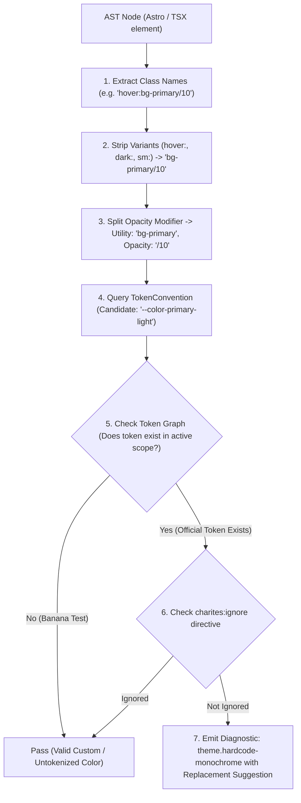
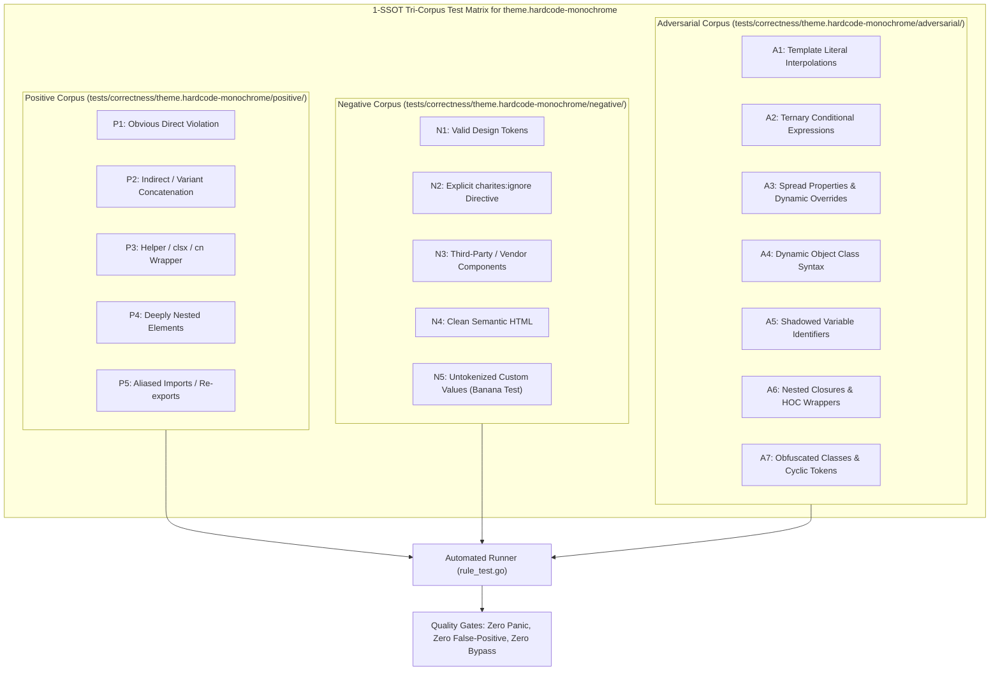

# theme.hardcode-monochrome

> **Rule ID:** `theme.hardcode-monochrome`
> **Severity:** `WARN`
> **Category:** `theme`
> **Target Standards:** W3C Design Tokens Community Group (DTCG), WCAG 2.2 Relative Contrast (SC 1.4.3), Tailwind CSS Dark Mode Architecture

---

## 1. Overview & Core Invariant

Detects hardcoded monochrome utilities (white/black) that fail to adapt across light and dark themes

### Core Invariant:
> **"Surfaces and text must use adaptive semantic tokens (background, foreground, card, popover) rather than hardcoded static white or black."**

---
## 2. Technical Grounding & Engine Realities

Hardcoding white or black (e.g. bg-white, text-black, bg-black/50) creates glaring dark mode regressions:

1. Inverted Blindness: A container styled with bg-white turns into a blinding light box inside dark mode.
2. Invisible Text: Pairing bg-background with text-black causes black-on-black illegible text when the theme switches to dark.
3. Alpha Washout: Static text-white/[0.06] loses contrast completely on lighter surfaces.

Charites enforces replacing static monochrome utilities with semantic surface and typography tokens (bg-background, text-foreground, bg-card, text-muted-foreground).

---
## 3. Vulnerability & Risk Taxonomy

| Risk Vector | Severity | Impact |
| :--- | :---: | :--- |
| **Contrast Failure** | HIGH | Black text on dark background drops contrast ratio to 1:1, completely hiding content. |
| **Visual Jarring** | MEDIUM | Pure white cards jarringly clash against dark mode UI aesthetics. |

---
## 4. Non-Compliant Code Patterns (Bad Examples)
### ASTRO (Hardcoded static white background and black text):
```astro
<div class="bg-white text-black p-6 shadow-md">Un-themed Box</div>
```
### TSX (Static monochrome utilities with alpha modifiers):
```tsx
export function Overlay() {
  return <div className="bg-black/50 text-white/[0.06] border-white">Backdrop</div>;
}
```

---
## 5. Compliant Implementation Patterns (Good Examples)
### ASTRO (Adaptive semantic tokens for cards and text):
```astro
<div class="bg-card text-card-foreground p-6 shadow-md border border-border">Themed Box</div>
```
### TSX (Semantic tokens adapting automatically to theme state):
```tsx
export function Overlay() {
  return <div className="bg-background/80 text-muted-foreground border-border">Backdrop</div>;
}
```

---

## 6. Detection & Verification Pipeline (How The Rule Evaluates Code)
This `theme` rule evaluates source templates against the project's design token graph:



### Step-by-Step Evaluation:
1. **AST Node Traversal:** `internal/analyzer` streams JSX/Astro AST elements to the rule's `Evaluate` visitor.
2. **Variant Normalization:** Strips responsive (`sm:`, `md:`), interaction state (`hover:`, `focus:`), and theme (`dark:`) prefixes to isolate the core utility class.
3. **Modifier Extraction:** Parses utility segments and extracts slash opacity modifiers.
4. **Token Convention Resolution:** Consults the `TokenConvention` adapter to determine the official semantic design token replacement candidate.
5. **Token Graph Verification (Banana Test):** Queries `token.Context` to verify that the candidate token is declared in `global.css` or `tokens.json` within the element's scope. If not declared, the custom value is permitted without a false-positive diagnostic.
6. **Directive Suppression Check:** Inspects preceding AST comments for `charites:ignore theme.hardcode-monochrome`.
7. **Diagnostic Emission:** Produces a structured diagnostic with line number, column span, and actionable replacement suggestion.

---

## 7. Verification & Test Harness (How The Test Works: 1-SSOT Tri-Corpus)

This rule is rigorously tested and validated across the canonical **1-SSOT Tri-Corpus** in `tests/correctness/theme.hardcode-monochrome/`:



- **Positive Fixtures (P1-P5):** Verified to trigger diagnostics at exact lines and column spans.
- **Negative Fixtures (N1-N5):** Verified to produce zero diagnostics on valid tokens and legitimate exemptions.
- **Adversarial Fixtures (A1-A7):** Verified to prevent evasion across dynamic expressions, string interpolations, and cyclic references.

---

## 8. How to Suppress (Ignore Directives)

If this pattern is required for an intentional exception, suppress the diagnostic using the canonical Charites Rule ID:

```astro
<!-- charites:ignore theme.hardcode-monochrome intentional exception -->
```

```tsx
// charites:ignore theme.hardcode-monochrome intentional exception
```

---

## 9. Configuration Reference (`charites.yaml`)

```yaml
rules:
  theme.hardcode-monochrome:
    severity: warn # error | warn | info | off
```

