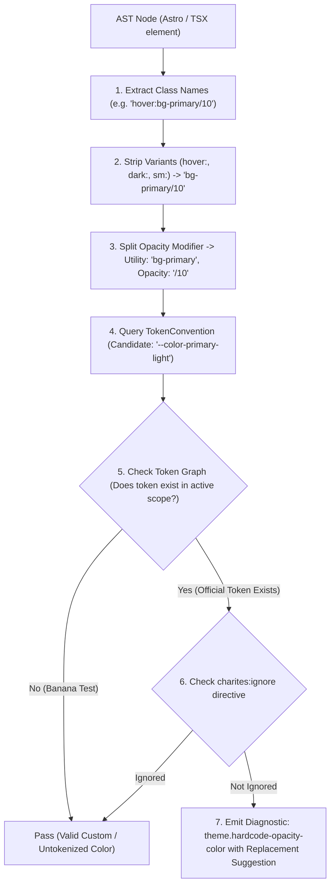
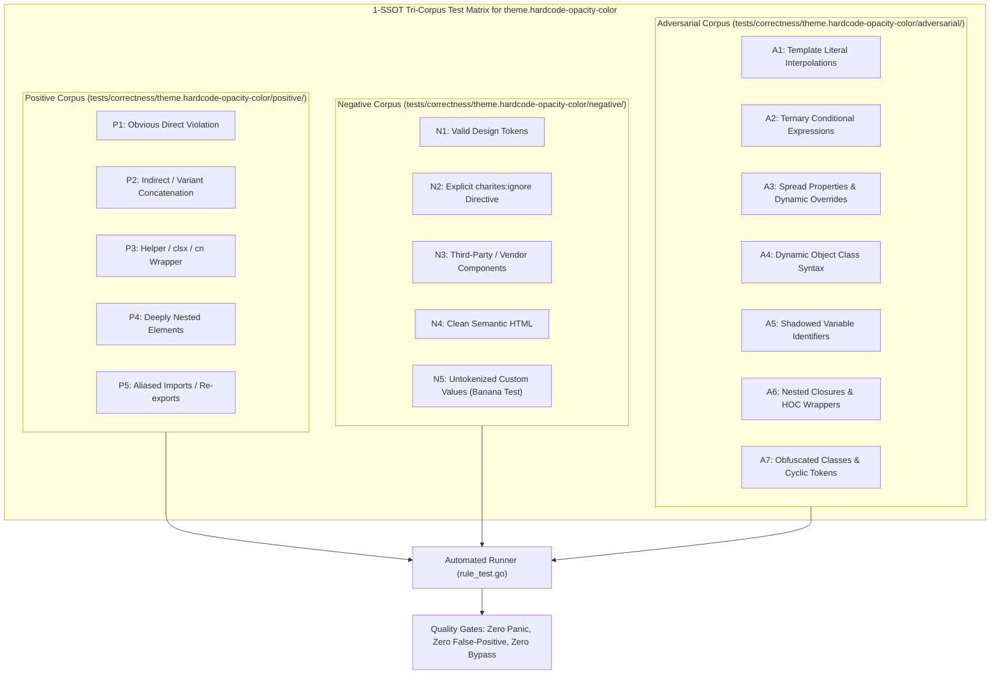

# theme.hardcode-opacity-color

> **Rule ID:** `theme.hardcode-opacity-color`
> **Severity:** `ERROR`
> **Category:** `theme`
> **Target Standards:** W3C Design Tokens Community Group (DTCG), Tailwind CSS Design Token Architecture, WCAG 2.2 Relative Contrast

---

## 1. Overview & Core Invariant

Detects utility classes with hardcoded slash opacity modifiers that have official semantic token replacements

### Core Invariant:
> **"Every color opacity variation that represents a semantic state or visual elevation must use a centralized semantic design token rather than an arbitrary slash modifier."**

---
## 2. Technical Grounding & Engine Realities

In modern design token architecture (such as Tailwind CSS with CSS Variables or OKLCH color spaces), semantic colors like primary and destructive are calibrated for foreground/background contrast against explicit color stops.

When developers append arbitrary slash modifiers (e.g. bg-primary/10), the resulting alpha-blended color:
1. Destroys WCAG 2.2 Contrast Predictability: Transparent alpha layers depend on whatever background color sits underneath. In dark mode or high-contrast themes, 10% opacity can drop contrast ratios below the 4.5:1 WCAG AA minimum.
2. Breaks Theme Export & Reusability: When exporting design tokens to mobile apps, Figma, or print styles, runtime alpha calculations cannot be resolved statically.
3. Creates Aesthetic Inconsistency: Different developers use varying opacities (/5, /10, /15, /20) for the same intended visual state (such as subtle hover backgrounds or tinted badge pills).

Charites enforces pre-calibrated semantic tokens (e.g. primary-light, primary-subtle, muted-light, destructive-light) that are mathematically verified for contrast and consistent across themes.

---
## 3. Vulnerability & Risk Taxonomy

| Risk Vector | Severity | Impact |
| :--- | :---: | :--- |
| **Accessibility Degradation** | HIGH | Contrast ratio drops below 4.5:1 under dark mode themes due to uncalibrated alpha blending. |
| **Visual Debt & Inconsistency** | MEDIUM | Proliferation of slightly different opacities (/5, /10, /20) degrades product polish. |
| **Theme Portability Failure** | MEDIUM | External design token exporters cannot map hardcoded alpha values to standalone color systems. |

---
## 4. Non-Compliant Code Patterns (Bad Examples)
### ASTRO (Direct slash opacity modifiers on semantic colors):
```astro
<div class="card p-6 rounded-xl bg-primary/10 border border-destructive/20">
  <h2 class="text-xl font-bold text-primary/20">Card Title</h2>
  <span class="badge ring-1 ring-warning/10 bg-primary/5">Warning</span>
</div>
```
### TSX (Chained and single variants with hardcoded opacity):
```tsx
export function ActionCard() {
  return (
    <div className="p-4 rounded-lg hover:bg-primary/10 dark:bg-primary/10 md:hover:bg-primary/10">
      <button className="px-3 py-2 text-sm dark:border-destructive/20 sm:dark:hover:border-destructive/20">
        Delete
      </button>
    </div>
  );
}
```

---
## 5. Compliant Implementation Patterns (Good Examples)
### ASTRO (Using official semantic tokens from global.css):
```astro
<div class="card p-6 rounded-xl bg-primary-light border border-destructive-light">
  <h2 class="text-xl font-bold text-primary">{Astro.props.title}</h2>
  <span class="badge ring-1 ring-warning-light bg-primary-subtle">Warning</span>
</div>
```
### TSX (Using semantic tokens with variants):
```tsx
export function ActionCard() {
  return (
    <div className="p-4 rounded-lg hover:bg-primary-light dark:bg-primary-light md:hover:bg-primary-light">
      <button className="px-3 py-2 text-sm dark:border-destructive-light">
        Delete
      </button>
    </div>
  );
}
```

---

## 6. Detection & Verification Pipeline (How The Rule Evaluates Code)
This `theme` rule evaluates source templates against the project's design token graph:



### Step-by-Step Evaluation:
1. **AST Node Traversal:** `internal/analyzer` streams JSX/Astro AST elements to the rule's `Evaluate` visitor.
2. **Variant Normalization:** Strips responsive (`sm:`, `md:`), interaction state (`hover:`, `focus:`), and theme (`dark:`) prefixes to isolate the core utility class.
3. **Modifier Extraction:** Parses utility segments and extracts slash opacity modifiers.
4. **Token Convention Resolution:** Consults the `TokenConvention` adapter to determine the official semantic design token replacement candidate.
5. **Token Graph Verification (Banana Test):** Queries `token.Context` to verify that the candidate token is declared in `global.css` or `tokens.json` within the element's scope. If not declared, the custom value is permitted without a false-positive diagnostic.
6. **Directive Suppression Check:** Inspects preceding AST comments for `charites:ignore theme.hardcode-opacity-color`.
7. **Diagnostic Emission:** Produces a structured diagnostic with line number, column span, and actionable replacement suggestion.

---

## 7. Verification & Test Harness (How The Test Works: 1-SSOT Tri-Corpus)

This rule is rigorously tested and validated across the canonical **1-SSOT Tri-Corpus** in `tests/correctness/theme.hardcode-opacity-color/`:



- **Positive Fixtures (P1-P5):** Verified to trigger diagnostics at exact lines and column spans.
- **Negative Fixtures (N1-N5):** Verified to produce zero diagnostics on valid tokens and legitimate exemptions.
- **Adversarial Fixtures (A1-A7):** Verified to prevent evasion across dynamic expressions, string interpolations, and cyclic references.

---

## 8. How to Suppress (Ignore Directives)

If this pattern is required for an intentional exception, suppress the diagnostic using the canonical Charites Rule ID:

```astro
<!-- charites:ignore theme.hardcode-opacity-color intentional exception -->
```

```tsx
// charites:ignore theme.hardcode-opacity-color intentional exception
```

---

## 9. Configuration Reference (`charites.yaml`)

```yaml
rules:
  theme.hardcode-opacity-color:
    severity: error # error | warn | info | off
```

