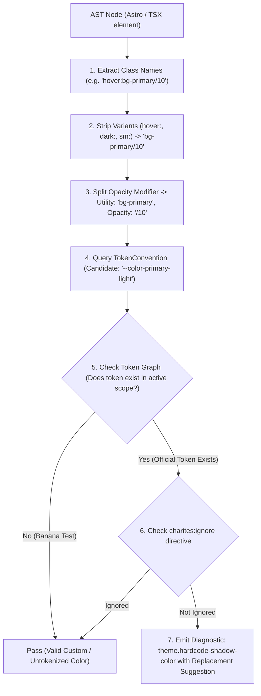
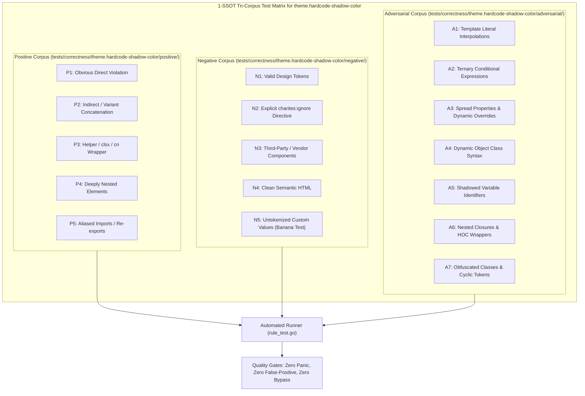

# theme.hardcode-shadow-color

> **Rule ID:** `theme.hardcode-shadow-color`
> **Severity:** `WARN`
> **Category:** `theme`
> **Target Standards:** W3C DTCG Elevation Tokens, Tailwind CSS Box Shadow Specification, Dark Mode Optical Physics & Contrast

---

## 1. Overview & Core Invariant

Detects hardcoded color literals embedded in box-shadow declarations

### Core Invariant:
> **"Elevation shadows must not embed raw hex or arbitrary color literals; shadow tints must adapt dynamically across light and dark modes via semantic tokens."**

---
## 2. Technical Grounding & Engine Realities

Embedding raw color literals inside arbitrary shadow brackets (e.g. shadow-[0_4px_10px_#00000040]) introduces major theme defects:

1. Dark Mode Disappearance: Dark shadows (black/gray with alpha) disappear completely when rendered over dark backgrounds (e.g. #09090b), leaving elevated cards looking flat.
2. Unadaptive Tints: Brand theme colors cannot tint shadows realistically when hardcoded hex codes are baked into individual classes.
3. Specificity Collisions: Overriding arbitrary shadow strings requires higher specificity or duplicate classes.

Charites enforces using standard shadow scale tokens (e.g. shadow-sm, shadow-md, shadow-lg) or semantic elevation tokens defined in global.css.

---
## 3. Vulnerability & Risk Taxonomy

| Risk Vector | Severity | Impact |
| :--- | :---: | :--- |
| **Dark Mode Elevation Invisibility** | HIGH | Hardcoded dark shadows become completely invisible against dark canvases, collapsing visual depth. |
| **Inconsistent Ambient Occlusion** | MEDIUM | Disparate shadow colors across components destroy uniform light-source perception in the design system. |

---
## 4. Non-Compliant Code Patterns (Bad Examples)
### TSX (Arbitrary shadow with embedded hex color):
```tsx
<div className="shadow-[0_4px_10px_#00000040] p-6">Floating Card</div>
```
### ASTRO (Arbitrary property box-shadow with rgb):
```astro
<section class="[box-shadow:0_10px_15px_rgba(0,0,0,0.1)]">Elevated Panel</section>
```

---
## 5. Compliant Implementation Patterns (Good Examples)
### TSX (Using standard elevation shadow tokens):
```tsx
<div className="shadow-md p-6">Adaptive Floating Card</div>
```
### ASTRO (CSS variable shadow color):
```astro
<section class="shadow-[0_4px_6px_var(--shadow-color)]">Elevated Panel</section>
```

---

## 6. Detection & Verification Pipeline (How The Rule Evaluates Code)
This `theme` rule evaluates source templates against the project's design token graph:



### Step-by-Step Evaluation:
1. **AST Node Traversal:** `internal/analyzer` streams JSX/Astro AST elements to the rule's `Evaluate` visitor.
2. **Variant Normalization:** Strips responsive (`sm:`, `md:`), interaction state (`hover:`, `focus:`), and theme (`dark:`) prefixes to isolate the core utility class.
3. **Modifier Extraction:** Parses utility segments and extracts slash opacity modifiers.
4. **Token Convention Resolution:** Consults the `TokenConvention` adapter to determine the official semantic design token replacement candidate.
5. **Token Graph Verification (Banana Test):** Queries `token.Context` to verify that the candidate token is declared in `global.css` or `tokens.json` within the element's scope. If not declared, the custom value is permitted without a false-positive diagnostic.
6. **Directive Suppression Check:** Inspects preceding AST comments for `charites:ignore theme.hardcode-shadow-color`.
7. **Diagnostic Emission:** Produces a structured diagnostic with line number, column span, and actionable replacement suggestion.

---

## 7. Verification & Test Harness (How The Test Works: 1-SSOT Tri-Corpus)

This rule is rigorously tested and validated across the canonical **1-SSOT Tri-Corpus** in `tests/correctness/theme.hardcode-shadow-color/`:



- **Positive Fixtures (P1-P5):** Verified to trigger diagnostics at exact lines and column spans.
- **Negative Fixtures (N1-N5):** Verified to produce zero diagnostics on valid tokens and legitimate exemptions.
- **Adversarial Fixtures (A1-A7):** Verified to prevent evasion across dynamic expressions, string interpolations, and cyclic references.

---

## 8. How to Suppress (Ignore Directives)

If this pattern is required for an intentional exception, suppress the diagnostic using the canonical Charites Rule ID:

```astro
<!-- charites:ignore theme.hardcode-shadow-color intentional exception -->
```

```tsx
// charites:ignore theme.hardcode-shadow-color intentional exception
```

---

## 9. Configuration Reference (`charites.yaml`)

```yaml
rules:
  theme.hardcode-shadow-color:
    severity: warn # error | warn | info | off
```

