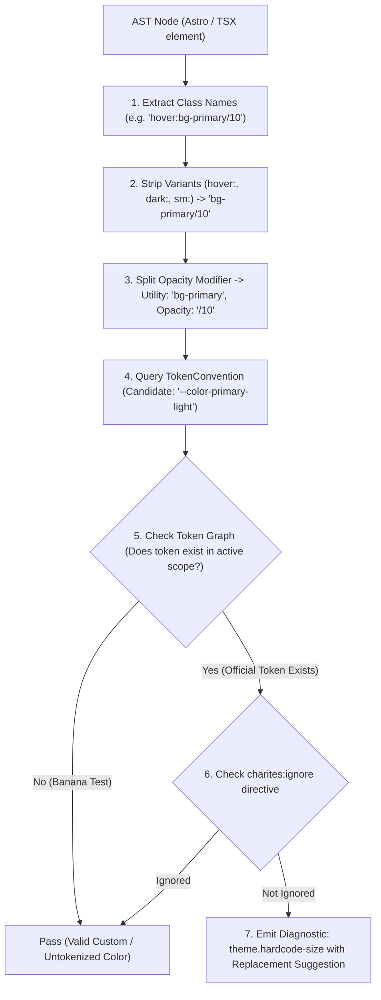
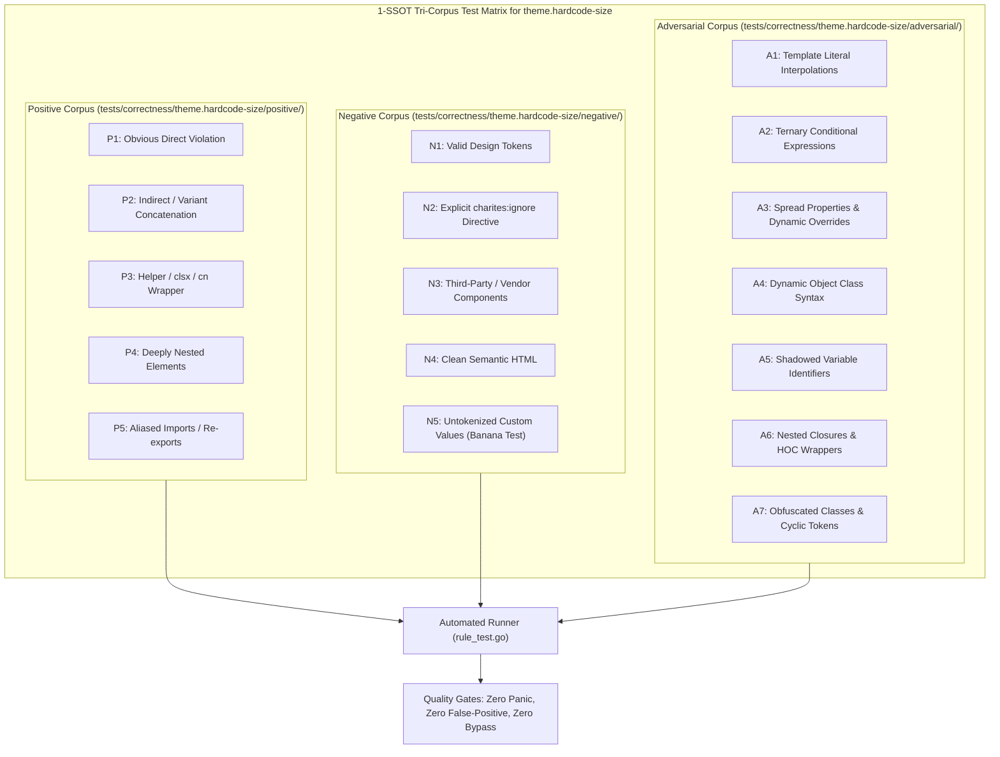

# theme.hardcode-size

> **Rule ID:** `theme.hardcode-size`
> **Severity:** `WARN`
> **Category:** `theme`
> **Target Standards:** W3C DTCG Spatial Scale Standard, 8pt Modular Grid Rhythm, Tailwind CSS Spacing Architecture

---

## 1. Overview & Core Invariant

Detects hardcoded arbitrary size, spacing, or typography scalars in Tailwind utility classes

### Core Invariant:
> **"Spatial dimensions, spacing intervals, and typography sizes must use standardized modular scale tokens or CSS variables, never arbitrary raw scalar values."**

---
## 2. Technical Grounding & Engine Realities

Embedding arbitrary scalar dimensions (e.g. p-[19px], w-[320px], or text-[15px]) introduces severe UI design regressions:

1. Spatial Rhythm Degradation: Arbitrary pixel/rem values shatter the visual harmony of 4px/8px modular grid systems.
2. Typography Drift: Off-scale text sizes break proportional line-height and vertical rhythm standards across viewports.
3. Maintenance Overhead: Dispersed magic numbers make global layout scaling and device adaptations cumbersome.

Charites enforces migrating arbitrary sizing and spacing utilities to standard token steps (e.g. p-5, w-80, text-base) or token variables.

---
## 3. Vulnerability & Risk Taxonomy

| Risk Vector | Severity | Impact |
| :--- | :---: | :--- |
| **Visual Rhythm Breakdown** | MEDIUM | Inconsistent micro-spacing across components causes fragmented alignment and sloppy UI rendering. |
| **Typography Scale Drift** | HIGH | Unchecked font sizes degrade readability, leading calculation, and accessibility scaling. |

---
## 4. Non-Compliant Code Patterns (Bad Examples)
### TSX (Arbitrary padding, width, and text size in JSX):
```tsx
<div className="p-[19px] w-[320px] text-[15px]">Hardcoded container</div>
```
### ASTRO (Arbitrary spacing and margin in Astro component):
```astro
<section class="gap-[13px] mt-[27px] [padding:19px]">Arbitrary layout</section>
```

---
## 5. Compliant Implementation Patterns (Good Examples)
### TSX (Standard modular scale tokens):
```tsx
<div className="p-5 w-80 text-base">Standard modular container</div>
```
### ASTRO (System tokens and CSS variables):
```astro
<section class="gap-3 mt-6 p-5">Standard layout</section>
```

---

## 6. Detection & Verification Pipeline (How The Rule Evaluates Code)
This `theme` rule evaluates source templates against the project's design token graph:



### Step-by-Step Evaluation:
1. **AST Node Traversal:** `internal/analyzer` streams JSX/Astro AST elements to the rule's `Evaluate` visitor.
2. **Variant Normalization:** Strips responsive (`sm:`, `md:`), interaction state (`hover:`, `focus:`), and theme (`dark:`) prefixes to isolate the core utility class.
3. **Modifier Extraction:** Parses utility segments and extracts slash opacity modifiers.
4. **Token Convention Resolution:** Consults the `TokenConvention` adapter to determine the official semantic design token replacement candidate.
5. **Token Graph Verification (Banana Test):** Queries `token.Context` to verify that the candidate token is declared in `global.css` or `tokens.json` within the element's scope. If not declared, the custom value is permitted without a false-positive diagnostic.
6. **Directive Suppression Check:** Inspects preceding AST comments for `charites:ignore theme.hardcode-size`.
7. **Diagnostic Emission:** Produces a structured diagnostic with line number, column span, and actionable replacement suggestion.

---

## 7. Verification & Test Harness (How The Test Works: 1-SSOT Tri-Corpus)

This rule is rigorously tested and validated across the canonical **1-SSOT Tri-Corpus** in `tests/correctness/theme.hardcode-size/`:



- **Positive Fixtures (P1-P5):** Verified to trigger diagnostics at exact lines and column spans.
- **Negative Fixtures (N1-N5):** Verified to produce zero diagnostics on valid tokens and legitimate exemptions.
- **Adversarial Fixtures (A1-A7):** Verified to prevent evasion across dynamic expressions, string interpolations, and cyclic references.

---

## 8. How to Suppress (Ignore Directives)

If this pattern is required for an intentional exception, suppress the diagnostic using the canonical Charites Rule ID:

```astro
<!-- charites:ignore theme.hardcode-size intentional exception -->
```

```tsx
// charites:ignore theme.hardcode-size intentional exception
```

---

## 9. Configuration Reference (`charites.yaml`)

```yaml
rules:
  theme.hardcode-size:
    severity: warn # error | warn | info | off
```

