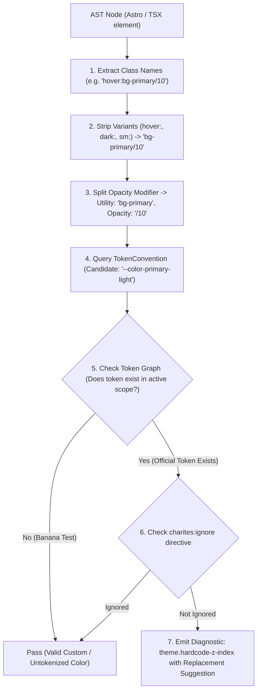
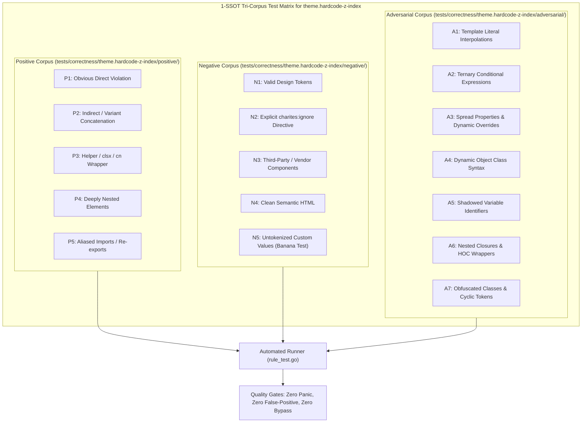

# theme.hardcode-z-index

> **Rule ID:** `theme.hardcode-z-index`
> **Severity:** `WARN`
> **Category:** `theme`
> **Target Standards:** CSS Stacking Context Specification, Design System Elevation Hierarchy, Modal & Overlay Governance Standards

---

## 1. Overview & Core Invariant

Detects hardcoded arbitrary z-index scalars that trigger stacking context wars

### Core Invariant:
> **"Element stacking context elevation must be declared using semantic elevation tokens or CSS variables, never arbitrary numerical z-index scalars."**

---
## 2. Technical Grounding & Engine Realities

Using arbitrary z-index values (e.g. z-[9999] or [z-index:1000]) triggers destructive 'z-index wars':

1. Stacking Context Escalation: When engineers pick arbitrary large numbers (999, 9999, 99999) to force elements to the top, other elements inevitably get occluded.
2. Overlay Clashes: Modals, tooltips, dropdown menus, toast notifications, and sticky navigation headers collide unpredictably.
3. Unmaintainable Layering: Without a centralized hierarchy, debugging stacking context bugs requires inspecting the entire DOM tree.

Charites enforces utilizing structured elevation tokens (e.g. z-dropdown, z-modal, z-toast) or CSS custom properties (e.g. z-[var(--z-modal)]).

---
## 3. Vulnerability & Risk Taxonomy

| Risk Vector | Severity | Impact |
| :--- | :---: | :--- |
| **Z-Index Escalation Wars** | HIGH | Engineers continually increase z-index numbers, eventually breaking native select popovers and dialogs. |
| **Overlay Occlusion** | HIGH | Tooltips and toasts become permanently trapped behind sticky navigations or dropdown menus. |

---
## 4. Non-Compliant Code Patterns (Bad Examples)
### TSX (Arbitrary runaway z-index in fixed modal):
```tsx
<div className="fixed top-0 z-[9999]">Escalated Modal</div>
```
### ASTRO (Arbitrary property z-index):
```astro
<nav class="sticky top-0 [z-index:1000]">Sticky Header</nav>
```

---
## 5. Compliant Implementation Patterns (Good Examples)
### TSX (Semantic elevation token or standard scale):
```tsx
<div className="fixed top-0 z-50">Controlled Modal</div>
```
### ASTRO (Token variable elevation):
```astro
<nav class="sticky top-0 z-[var(--z-sticky)]">Sticky Header</nav>
```

---

## 6. Detection & Verification Pipeline (How The Rule Evaluates Code)
This `theme` rule evaluates source templates against the project's design token graph:



### Step-by-Step Evaluation:
1. **AST Node Traversal:** `internal/analyzer` streams JSX/Astro AST elements to the rule's `Evaluate` visitor.
2. **Variant Normalization:** Strips responsive (`sm:`, `md:`), interaction state (`hover:`, `focus:`), and theme (`dark:`) prefixes to isolate the core utility class.
3. **Modifier Extraction:** Parses utility segments and extracts slash opacity modifiers.
4. **Token Convention Resolution:** Consults the `TokenConvention` adapter to determine the official semantic design token replacement candidate.
5. **Token Graph Verification (Banana Test):** Queries `token.Context` to verify that the candidate token is declared in `global.css` or `tokens.json` within the element's scope. If not declared, the custom value is permitted without a false-positive diagnostic.
6. **Directive Suppression Check:** Inspects preceding AST comments for `charites:ignore theme.hardcode-z-index`.
7. **Diagnostic Emission:** Produces a structured diagnostic with line number, column span, and actionable replacement suggestion.

---

## 7. Verification & Test Harness (How The Test Works: 1-SSOT Tri-Corpus)

This rule is rigorously tested and validated across the canonical **1-SSOT Tri-Corpus** in `tests/correctness/theme.hardcode-z-index/`:



- **Positive Fixtures (P1-P5):** Verified to trigger diagnostics at exact lines and column spans.
- **Negative Fixtures (N1-N5):** Verified to produce zero diagnostics on valid tokens and legitimate exemptions.
- **Adversarial Fixtures (A1-A7):** Verified to prevent evasion across dynamic expressions, string interpolations, and cyclic references.

---

## 8. How to Suppress (Ignore Directives)

If this pattern is required for an intentional exception, suppress the diagnostic using the canonical Charites Rule ID:

```astro
<!-- charites:ignore theme.hardcode-z-index intentional exception -->
```

```tsx
// charites:ignore theme.hardcode-z-index intentional exception
```

---

## 9. Configuration Reference (`charites.yaml`)

```yaml
rules:
  theme.hardcode-z-index:
    severity: warn # error | warn | info | off
```

