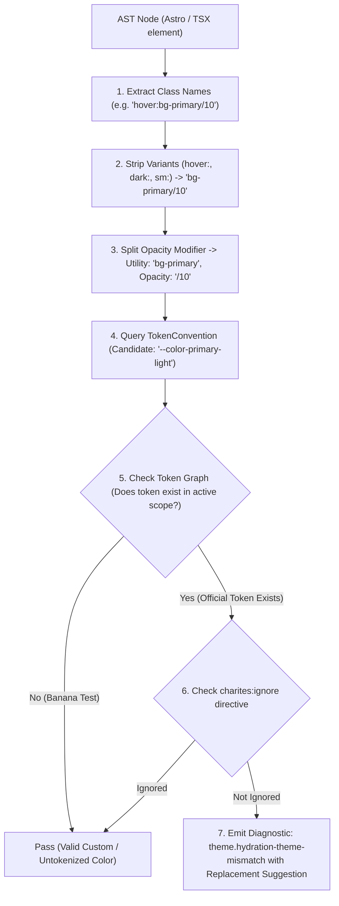
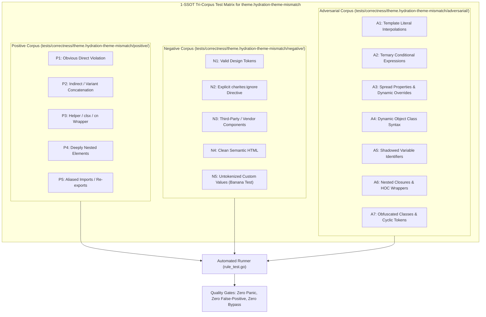

# theme.hydration-theme-mismatch

> **Rule ID:** `theme.hydration-theme-mismatch`
> **Severity:** `WARN`
> **Category:** `theme`
> **Target Standards:** W3C Web Performance Working Group (Core Web Vitals FOUC Prevention), React 18/19 Hydration Boundary Specification, Astro SSR Zero-JS Script Tag Standards

---

## 1. Overview & Core Invariant

Detects SSR root layouts lacking blocking inline script for theme initialization

### Core Invariant:
> **"Root SSR document layouts (<head>) must include a render-blocking inline theme script to resolve theme state before first paint and prevent theme FOUC."**

---
## 2. Technical Grounding & Engine Realities

In Server-Side Rendered (SSR) architectures (such as Astro, Next.js, or Remix):

1. Flash of Unstyled Theme (FOUC): If theme detection runs only after deferred client hydration (e.g. inside useEffect), the browser paints a blinding white default page before snapping jarringly to dark mode.
2. React Hydration Mismatch: Inconsistent theme attributes between server-rendered HTML and client hydration trigger React warning cascades and forced DOM re-mounts.
3. Cumulative Layout Shift (CLS): Font, border, or icon shifts caused by late theme flipping harm Core Web Vitals.

Charites enforces placing an inline render-blocking theme initialization script directly in the SSR root <head>.

---
## 3. Vulnerability & Risk Taxonomy

| Risk Vector | Severity | Impact |
| :--- | :---: | :--- |
| **Theme FOUC Glare** | HIGH | Users in dark environments experience a painful full-screen white flash on every page navigation. |
| **Hydration Error Cascade** | MEDIUM | React discards server-rendered DOM nodes upon encountering mismatched class attributes, increasing TTI. |

---
## 4. Non-Compliant Code Patterns (Bad Examples)
### ASTRO (SSR root head in Astro without inline theme script):
```astro
<html>
  <head>
    <meta charset="utf-8" />
    <title>Application</title>
  </head>
  <body>
    <slot />
  </body>
</html>
```
### TSX (Root head in TSX missing blocking theme initializer):
```tsx
<head>
  <meta charSet="utf-8" />
  <title>Dashboard</title>
</head>
```

---
## 5. Compliant Implementation Patterns (Good Examples)
### ASTRO (Blocking inline theme script in Astro head):
```astro
<head>
  <meta charset="utf-8" />
  <script is:inline>
    const theme = localStorage.getItem('theme') || (window.matchMedia('(prefers-color-scheme: dark)').matches ? 'dark' : 'light');
    document.documentElement.classList.toggle('dark', theme === 'dark');
  </script>
</head>
```
### TSX (Blocking dangerouslySetInnerHTML theme script in TSX head):
```tsx
<head>
  <script
    dangerouslySetInnerHTML={{
      __html: "document.documentElement.classList.add(localStorage.getItem('theme') || 'light');",
    }}
  />
</head>
```

---

## 6. Detection & Verification Pipeline (How The Rule Evaluates Code)
This `theme` rule evaluates source templates against the project's design token graph:



### Step-by-Step Evaluation:
1. **AST Node Traversal:** `internal/analyzer` streams JSX/Astro AST elements to the rule's `Evaluate` visitor.
2. **Variant Normalization:** Strips responsive (`sm:`, `md:`), interaction state (`hover:`, `focus:`), and theme (`dark:`) prefixes to isolate the core utility class.
3. **Modifier Extraction:** Parses utility segments and extracts slash opacity modifiers.
4. **Token Convention Resolution:** Consults the `TokenConvention` adapter to determine the official semantic design token replacement candidate.
5. **Token Graph Verification (Banana Test):** Queries `token.Context` to verify that the candidate token is declared in `global.css` or `tokens.json` within the element's scope. If not declared, the custom value is permitted without a false-positive diagnostic.
6. **Directive Suppression Check:** Inspects preceding AST comments for `charites:ignore theme.hydration-theme-mismatch`.
7. **Diagnostic Emission:** Produces a structured diagnostic with line number, column span, and actionable replacement suggestion.

---

## 7. Verification & Test Harness (How The Test Works: 1-SSOT Tri-Corpus)

This rule is rigorously tested and validated across the canonical **1-SSOT Tri-Corpus** in `tests/correctness/theme.hydration-theme-mismatch/`:



- **Positive Fixtures (P1-P5):** Verified to trigger diagnostics at exact lines and column spans.
- **Negative Fixtures (N1-N5):** Verified to produce zero diagnostics on valid tokens and legitimate exemptions.
- **Adversarial Fixtures (A1-A7):** Verified to prevent evasion across dynamic expressions, string interpolations, and cyclic references.

---

## 8. How to Suppress (Ignore Directives)

If this pattern is required for an intentional exception, suppress the diagnostic using the canonical Charites Rule ID:

```astro
<!-- charites:ignore theme.hydration-theme-mismatch intentional exception -->
```

```tsx
// charites:ignore theme.hydration-theme-mismatch intentional exception
```

---

## 9. Configuration Reference (`charites.yaml`)

```yaml
rules:
  theme.hydration-theme-mismatch:
    severity: warn # error | warn | info | off
```

