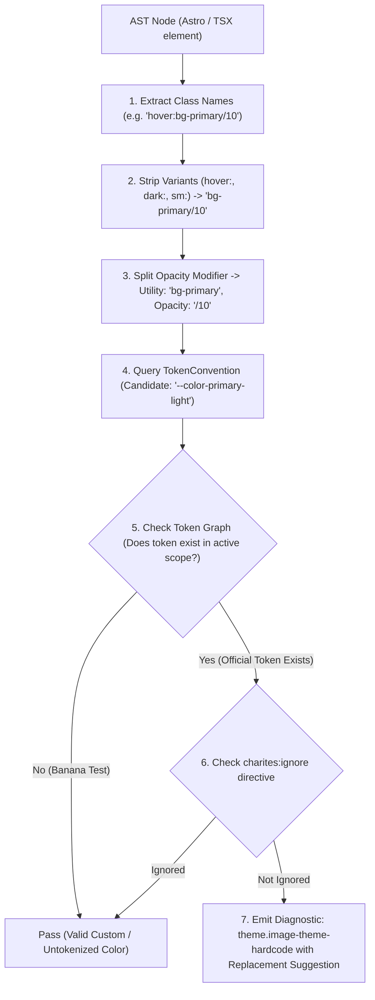
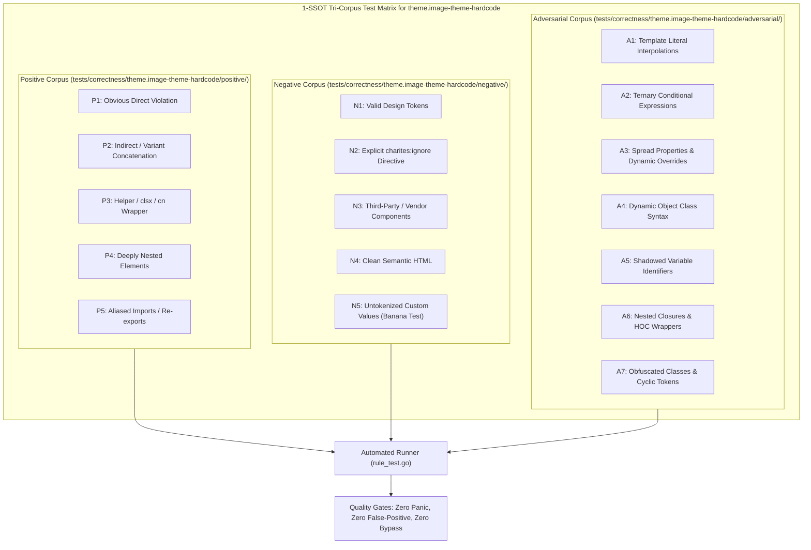

# theme.image-theme-hardcode

> **Rule ID:** `theme.image-theme-hardcode`
> **Severity:** `WARN`
> **Category:** `theme`
> **Target Standards:** WCAG 2.2 Success Criterion 1.4.11 (Non-text Contrast), W3C Responsive Images & Art Direction Specification, Tailwind CSS Dark Mode Graphic Switching Guidelines

---

## 1. Overview & Core Invariant

Detects graphic assets and logos in img tags lacking dark mode theme adaptation

### Core Invariant:
> **"Graphic assets, logos, and diagrams in img tags must provide theme-adaptive variants via picture, dark: utility classes, or invert filters."**

---
## 2. Technical Grounding & Engine Realities

Embedding graphical assets (such as brand logos, SVG diagrams, and charts) via static  tags without dark mode adaptation triggers severe visual breakage:

1. Asset Invisibility: A dark or black logo rendered against a dark mode background becomes completely invisible.
2. Inverted Eye-Strain: High-glare white background diagrams blast excessive light on dark UI themes.
3. Inflexible Art Direction: Projects without responsive image pairing cannot tailor vector artwork to dark contrast requirements.

Charites enforces theme-aware graphic handling using dark:hidden / dark:block class pairs, dark:invert filters, or responsive <picture> elements.

---
## 3. Vulnerability & Risk Taxonomy

| Risk Vector | Severity | Impact |
| :--- | :---: | :--- |
| **Asset Disappearance in Dark Themes** | MEDIUM | Brand logos, technical diagrams, and icon artwork become illegible on dark surfaces. |
| **Non-text Contrast Failure (WCAG 1.4.11)** | MEDIUM | Visual cues necessary for interface understanding fail accessibility contrast requirements. |

---
## 4. Non-Compliant Code Patterns (Bad Examples)
### TSX (Static logo in img tag without dark mode variant in TSX):
```tsx

```
### ASTRO (Vector architecture diagram without theme switching in Astro):
```astro

```

---
## 5. Compliant Implementation Patterns (Good Examples)
### TSX (Theme-paired image switching using Tailwind dark utilities):
```tsx
<>
  
  
</>
```
### ASTRO (Using dark:invert filter for vector diagrams):
```astro

```

---

## 6. Detection & Verification Pipeline (How The Rule Evaluates Code)
This `theme` rule evaluates source templates against the project's design token graph:



### Step-by-Step Evaluation:
1. **AST Node Traversal:** `internal/analyzer` streams JSX/Astro AST elements to the rule's `Evaluate` visitor.
2. **Variant Normalization:** Strips responsive (`sm:`, `md:`), interaction state (`hover:`, `focus:`), and theme (`dark:`) prefixes to isolate the core utility class.
3. **Modifier Extraction:** Parses utility segments and extracts slash opacity modifiers.
4. **Token Convention Resolution:** Consults the `TokenConvention` adapter to determine the official semantic design token replacement candidate.
5. **Token Graph Verification (Banana Test):** Queries `token.Context` to verify that the candidate token is declared in `global.css` or `tokens.json` within the element's scope. If not declared, the custom value is permitted without a false-positive diagnostic.
6. **Directive Suppression Check:** Inspects preceding AST comments for `charites:ignore theme.image-theme-hardcode`.
7. **Diagnostic Emission:** Produces a structured diagnostic with line number, column span, and actionable replacement suggestion.

---

## 7. Verification & Test Harness (How The Test Works: 1-SSOT Tri-Corpus)

This rule is rigorously tested and validated across the canonical **1-SSOT Tri-Corpus** in `tests/correctness/theme.image-theme-hardcode/`:



- **Positive Fixtures (P1-P5):** Verified to trigger diagnostics at exact lines and column spans.
- **Negative Fixtures (N1-N5):** Verified to produce zero diagnostics on valid tokens and legitimate exemptions.
- **Adversarial Fixtures (A1-A7):** Verified to prevent evasion across dynamic expressions, string interpolations, and cyclic references.

---

## 8. How to Suppress (Ignore Directives)

If this pattern is required for an intentional exception, suppress the diagnostic using the canonical Charites Rule ID:

```astro
<!-- charites:ignore theme.image-theme-hardcode intentional exception -->
```

```tsx
// charites:ignore theme.image-theme-hardcode intentional exception
```

---

## 9. Configuration Reference (`charites.yaml`)

```yaml
rules:
  theme.image-theme-hardcode:
    severity: warn # error | warn | info | off
```

