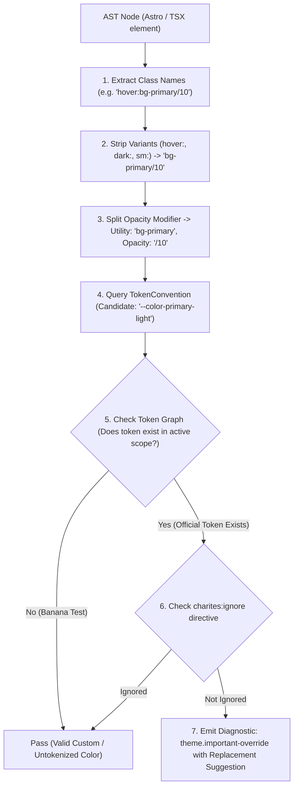
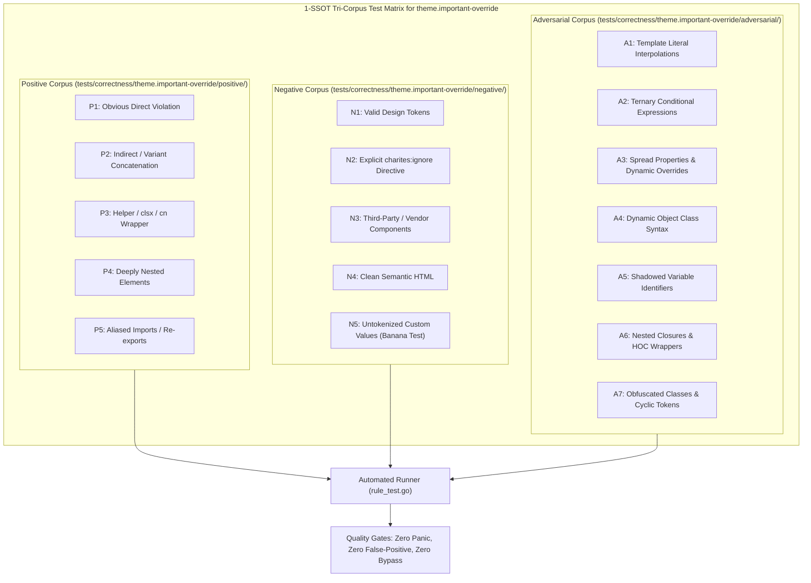

# theme.important-override

> **Rule ID:** `theme.important-override`
> **Severity:** `ERROR`
> **Category:** `theme`
> **Target Standards:** W3C Cascading Style Sheets (CSS) Specificity Level 4, Tailwind CSS Design Token Architecture

---

## 1. Overview & Core Invariant

Detects !important modifiers on color utility classes that break theme cascade and specificity hierarchy

### Core Invariant:
> **"Color utility classes must never use the !important modifier (!bg-*, !text-*); specificity must be managed via CSS Cascade Layers."**

---
## 2. Technical Grounding & Engine Realities

Using the ! modifier (e.g. !bg-red-500 or !text-white) forcefully escalates CSS declaration priority above normal cascade layers.

1. Destroys Theme Inversion: Dark mode variants (.dark bg-card) cannot override !bg-white without also adding !dark:bg-card, sparking an !important arms race.
2. Compromises Component Reusability: Reusable components with !important color classes cannot be customized or themed by parent containers.
3. Unpredictable State Styling: Hover, focus, and disabled state colors fail to trigger reliably when base colors are marked !important.

Charites enforces relying on Cascade Layers (@layer components, utilities) and semantic token definitions.

---
## 3. Vulnerability & Risk Taxonomy

| Risk Vector | Severity | Impact |
| :--- | :---: | :--- |
| **Cascade Arms Race** | HIGH | Forces downstream theme overrides to duplicate !important, breaking modular CSS encapsulation. |
| **Dark Mode Override Failure** | HIGH | Dark mode variants fail to override base !important styles, resulting in inverted visual glitches. |

---
## 4. Non-Compliant Code Patterns (Bad Examples)
### ASTRO (!important modifier on background and text color):
```astro
<button class="!bg-red-500 !text-white">Delete</button>
```
### TSX (!important on semantic and hover colors in JSX):
```tsx
export function Action() {
  return <div className="hover:!bg-primary !border-border">Action</div>;
}
```

---
## 5. Compliant Implementation Patterns (Good Examples)
### ASTRO (Proper layer-based specificity without !important):
```astro
<button class="bg-destructive text-destructive-foreground">Delete</button>
```
### TSX (Clean semantic classes with natural CSS cascade):
```tsx
export function Action() {
  return <div className="hover:bg-primary border-border">Action</div>;
}
```

---

## 6. Detection & Verification Pipeline (How The Rule Evaluates Code)
This `theme` rule evaluates source templates against the project's design token graph:



### Step-by-Step Evaluation:
1. **AST Node Traversal:** `internal/analyzer` streams JSX/Astro AST elements to the rule's `Evaluate` visitor.
2. **Variant Normalization:** Strips responsive (`sm:`, `md:`), interaction state (`hover:`, `focus:`), and theme (`dark:`) prefixes to isolate the core utility class.
3. **Modifier Extraction:** Parses utility segments and extracts slash opacity modifiers.
4. **Token Convention Resolution:** Consults the `TokenConvention` adapter to determine the official semantic design token replacement candidate.
5. **Token Graph Verification (Banana Test):** Queries `token.Context` to verify that the candidate token is declared in `global.css` or `tokens.json` within the element's scope. If not declared, the custom value is permitted without a false-positive diagnostic.
6. **Directive Suppression Check:** Inspects preceding AST comments for `charites:ignore theme.important-override`.
7. **Diagnostic Emission:** Produces a structured diagnostic with line number, column span, and actionable replacement suggestion.

---

## 7. Verification & Test Harness (How The Test Works: 1-SSOT Tri-Corpus)

This rule is rigorously tested and validated across the canonical **1-SSOT Tri-Corpus** in `tests/correctness/theme.important-override/`:



- **Positive Fixtures (P1-P5):** Verified to trigger diagnostics at exact lines and column spans.
- **Negative Fixtures (N1-N5):** Verified to produce zero diagnostics on valid tokens and legitimate exemptions.
- **Adversarial Fixtures (A1-A7):** Verified to prevent evasion across dynamic expressions, string interpolations, and cyclic references.

---

## 8. How to Suppress (Ignore Directives)

If this pattern is required for an intentional exception, suppress the diagnostic using the canonical Charites Rule ID:

```astro
<!-- charites:ignore theme.important-override intentional exception -->
```

```tsx
// charites:ignore theme.important-override intentional exception
```

---

## 9. Configuration Reference (`charites.yaml`)

```yaml
rules:
  theme.important-override:
    severity: error # error | warn | info | off
```

