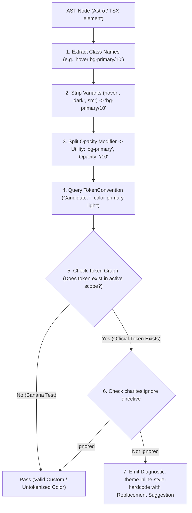
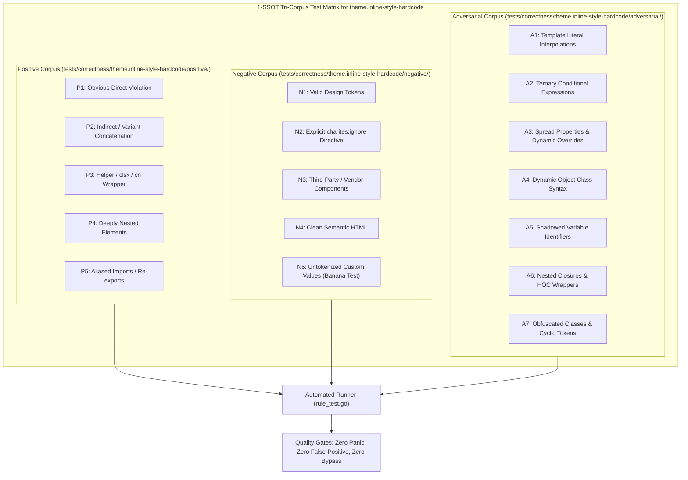

# theme.inline-style-hardcode

> **Rule ID:** `theme.inline-style-hardcode`
> **Severity:** `ERROR`
> **Category:** `theme`
> **Target Standards:** W3C Cascading Style Sheets (CSS) Level 3, W3C Design Tokens Community Group (DTCG)

---

## 1. Overview & Core Invariant

Detects hardcoded color literals inside HTML/JSX style attributes that prevent theme cascade

### Core Invariant:
> **"Color properties must not be declared as raw literals inside inline style attributes; they must use semantic classes or CSS variables."**

---
## 2. Technical Grounding & Engine Realities

Inline style attributes have the highest specificity in CSS, superseding all class selectors and theme cascades.

When developers write style="color: #2563eb" or style={{ background: '#fff' }}:
1. Impossible Dark Mode: The inline declaration cannot be targeted or overridden by .dark or [data-theme='dark'] class rules.
2. Broken Theming Pipeline: Token transformations (such as high-contrast mode or tenant styling) fail completely.
3. Maintenance Pitfall: Colors hidden in inline style strings avoid static analysis tools unless specifically parsed.

Charites enforces moving inline colors into utility classes or CSS custom properties.

---
## 3. Vulnerability & Risk Taxonomy

| Risk Vector | Severity | Impact |
| :--- | :---: | :--- |
| **Theme Specificity Lockout** | HIGH | Inline style specificity completely disables dark mode and stylesheet theming. |
| **Accessibility Barrier** | HIGH | High-contrast mode and accessibility themes cannot override inline hardcoded styles. |

---
## 4. Non-Compliant Code Patterns (Bad Examples)
### ASTRO (Hardcoded hex in HTML inline style):
```astro
<div style="color: #2563eb; background: #ffffff;">Inline Color</div>
```
### TSX (Hardcoded rgb in JSX style object):
```tsx
export function Card() {
  return <div style={{ color: '#2563eb', backgroundColor: 'rgb(255, 0, 0)' }}>Bad Style</div>;
}
```

---
## 5. Compliant Implementation Patterns (Good Examples)
### ASTRO (Semantic utility classes instead of inline style):
```astro
<div class="text-primary bg-background">Themed Color</div>
```
### TSX (CSS variable in inline style for dynamic calculations):
```tsx
export function Card() {
  return <div style={{ color: 'var(--primary)' }}>Safe Style</div>;
}
```

---

## 6. Detection & Verification Pipeline (How The Rule Evaluates Code)
This `theme` rule evaluates source templates against the project's design token graph:



### Step-by-Step Evaluation:
1. **AST Node Traversal:** `internal/analyzer` streams JSX/Astro AST elements to the rule's `Evaluate` visitor.
2. **Variant Normalization:** Strips responsive (`sm:`, `md:`), interaction state (`hover:`, `focus:`), and theme (`dark:`) prefixes to isolate the core utility class.
3. **Modifier Extraction:** Parses utility segments and extracts slash opacity modifiers.
4. **Token Convention Resolution:** Consults the `TokenConvention` adapter to determine the official semantic design token replacement candidate.
5. **Token Graph Verification (Banana Test):** Queries `token.Context` to verify that the candidate token is declared in `global.css` or `tokens.json` within the element's scope. If not declared, the custom value is permitted without a false-positive diagnostic.
6. **Directive Suppression Check:** Inspects preceding AST comments for `charites:ignore theme.inline-style-hardcode`.
7. **Diagnostic Emission:** Produces a structured diagnostic with line number, column span, and actionable replacement suggestion.

---

## 7. Verification & Test Harness (How The Test Works: 1-SSOT Tri-Corpus)

This rule is rigorously tested and validated across the canonical **1-SSOT Tri-Corpus** in `tests/correctness/theme.inline-style-hardcode/`:



- **Positive Fixtures (P1-P5):** Verified to trigger diagnostics at exact lines and column spans.
- **Negative Fixtures (N1-N5):** Verified to produce zero diagnostics on valid tokens and legitimate exemptions.
- **Adversarial Fixtures (A1-A7):** Verified to prevent evasion across dynamic expressions, string interpolations, and cyclic references.

---

## 8. How to Suppress (Ignore Directives)

If this pattern is required for an intentional exception, suppress the diagnostic using the canonical Charites Rule ID:

```astro
<!-- charites:ignore theme.inline-style-hardcode intentional exception -->
```

```tsx
// charites:ignore theme.inline-style-hardcode intentional exception
```

---

## 9. Configuration Reference (`charites.yaml`)

```yaml
rules:
  theme.inline-style-hardcode:
    severity: error # error | warn | info | off
```

