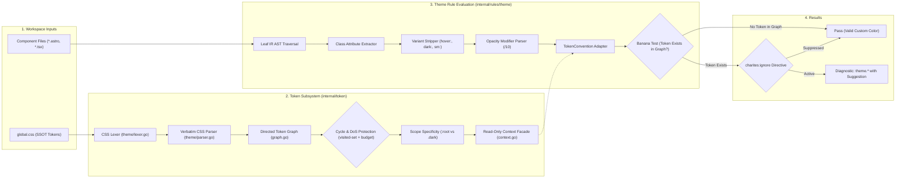

# Theme Rules (`theme`)

The `theme` category contains static analysis rules for code quality, architectural constraints, and design system governance.

---

## Category Rule Index

| Rule ID | Severity | Summary | Full Specification | Status |
| :--- | :---: | :--- | :--- | :---: |
| `theme.hardcode-opacity-color` | `ERROR` | Detects utility classes with hardcoded slash opacity modifiers that have official semantic token replacements | [`theme/hardcode-opacity-color.md`](theme/hardcode-opacity-color.md) | `enabled` |

---
## How the Theme & Design Token Analysis Pipeline Works

The `theme` static analysis engine cross-examines component utility classes directly against the project's design token single source of truth (`global.css`):



### Pipeline Flow:
1. **SSOT Token Extraction:** Discovers `global.css` via upward directory traversal and extracts custom properties (`--color-*`).
2. **Directed Dependency Graph:** Constructs a directed graph of all tokens, resolving chained `var(--...)` references.
3. **Safety & DoS Invariants:** Protects against cyclic references using visited-set detection (`ErrCycleDetected`) and bounds recursion with a strict node evaluation budget (`ErrEvaluationBudgetExceeded`).
4. **Scope & Specificity Resolution:** Calculates selector specificity, isolating `:root` base variables from scoped overrides like `.dark`.
5. **Class & Variant Normalization:** Traverses template AST nodes, extracting utility classes and stripping responsive (`sm:`, `md:`), state (`hover:`, `focus:`), and theme (`dark:`) prefixes.
6. **TokenConvention & The Banana Test:** Verifies that a replacement semantic token genuinely exists in the project's token dependency graph before flagging hardcoded modifiers. Arbitrary custom colors without official tokens pass cleanly without false positives.
7. **Directive Suppression & Reporting:** Evaluates inline `charites:ignore` directives before producing diagnostics for ANSI terminal, JSON streaming, or MCP clients.

---

## How Theme Tests Work (Verification Harness)

The `theme` subsystem is verified across multiple rigorous testing layers:

```mermaid
flowchart TD
    subgraph ThemeVerification ["Theme Subsystem Verification Architecture"]
        subgraph SubsystemTests ["1. Subsystem & Unit Tests"]
            T1["CSS Lexer & Parser (internal/token/theme/parser_test.go)"]
            T2["Token Graph Cycles & Budget (internal/token/graph_test.go)"]
            T3["Specificity & Upward Discovery (internal/token/extractor_test.go)"]
        end
        subgraph IntegrationTests ["2. Monorepo Integration Tests"]
            I1["Upward Discovery from Deep Directories (tests/token_integration_test.go)"]
            I2["Multi-Scope Theme Switching (:root vs .dark)"]
            I3["E2E CLI Scan Parity"]
        end
        subgraph GoldenCorpus ["3. 1-SSOT Golden Tri-Corpus"]
            G1["Positive (P1-P5): Obvious, indirect, helper, nested, alias violations"]
            G2["Negative (N1-N5): Valid tokens, ignores, third-party, Banana Test"]
            G3["Adversarial (A1-A7): Cycles, ternaries, obfuscations, template literals"]
        end
        subgraph Fuzzing ["4. Continuous Fuzz Testing"]
            F1["Native Go 1.26 Fuzzing (tests/fuzz/css_fuzz_test.go)"]
            F2["14,000+ Synthetic CSS Mutations: Zero Crash Guarantee"]
        end
    end

    SubsystemTests --> IntegrationTests
    IntegrationTests --> GoldenCorpus
    GoldenCorpus --> Fuzzing
```



1. **Subsystem Unit Tests (`internal/token/`):**
   - Lexer and parser guarantee verbatim source slicing without synthetic whitespace bugs.
   - Graph tests verify deterministic cycle detection (`ErrCycleDetected`) and recursion termination (`ErrEvaluationBudgetExceeded`).
   - Specificity tests verify that `.dark` correctly overrides `:root` without leaking into unrelated scopes.
2. **Monorepo Integration Tests (`tests/token_integration_test.go`):**
   - Validates that scanning components in deeply nested subdirectories reliably locates `global.css` at the monorepo root.
   - Tests CLI scans with JSON output envelopes to ensure zero schema drift.
3. **1-SSOT Golden Tri-Corpus (`tests/correctness/theme.*/`):**
   - **Positive Fixtures:** Confirms that prohibited slash opacity modifiers on existing tokens produce accurate diagnostic spans and lines.
   - **Negative Fixtures:** Confirms zero false positives on compliant token usage and untokenized custom colors (the Banana Test).
   - **Adversarial Fixtures:** Confirms resilience against line-height modifiers (e.g. `text-lg/7`), layout fractions (e.g. `w-1/2`), and template strings.
4. **Native Go Fuzzing (`tests/fuzz/css_fuzz_test.go`):**
   - Subjected to thousands of random, malformed CSS mutations across parallel workers to guarantee zero panics, deadlocks, or unbounded memory growth.

---

## Guide: Designing a Compliant Theme for Charites

To ensure seamless theme enforcement, projects should structure their design tokens following W3C DTCG and CSS Color Module Level 4 specifications:

### 1. Standard File Placement & Auto-Discovery:
Charites automatically discovers design tokens by walking up from component directories looking for:
- `src/styles/global.css` (or `styles/global.css`, `src/global.css`, `global.css`)
- `tokens.json` (W3C DTCG design tokens format)

If your project stores theme tokens in a non-standard directory, configure `theme` in `charites.yaml`:
```yaml
# charites.yaml
theme: src/custom/theme.css # or tokens/tokens.json
```

### 2. Declaring Semantic Opacity Variants (Eliminating Slash Modifiers):
Avoid arbitrary slash modifiers in markup (e.g. `bg-primary/10`, `bg-brand/10`) by declaring pre-calibrated opacity variants directly in `global.css`:

```css
/* src/styles/global.css */
:root {
  /* 1. Base Semantic Tokens */
  --color-brand: oklch(0.85 0.18 95);
  --color-brand-foreground: oklch(0.20 0.05 95);

  /* 2. Pre-calibrated Opacity/Elevation Variants (Replaces /10 and /5) */
  --color-brand-light: oklch(0.95 0.05 95);   /* Official replacement for brand/10 */
  --color-brand-subtle: oklch(0.98 0.02 95);  /* Official replacement for brand/5 */
}

/* 3. Dark Mode Contrast Calibration */
.dark {
  --color-brand: oklch(0.80 0.16 95);
  --color-brand-foreground: oklch(0.15 0.04 95);

  --color-brand-light: oklch(0.30 0.08 95);
  --color-brand-subtle: oklch(0.22 0.04 95);
}
```

### 3. Fallback Taxonomy & Warning Behavior:
Charites evaluates slash modifiers against your repository's actual declarations:

| Scenario | State in `global.css` | Code in Component | Verdict & Remediation |
| :--- | :--- | :--- | :--- |
| **Official Token Exists** | `--color-brand` & `--color-brand-light` exist | `bg-brand/10` | **`ERROR`**: Hardcoded opacity modifier detected.<br>→ *Remediation:* Replace with `bg-brand-light`. |
| **Unmapped Opacity Variant** | `--color-brand` exists, but `--color-brand-light` does NOT | `bg-brand/10` | **`WARN`**: Unmapped opacity on registered token.<br>→ *Remediation:* Register `--color-brand-light` in `global.css`, or suppress with `<!-- charites:ignore -->` if intentional. |
| **Untokenized / External Color** | `--color-external` is NOT in `global.css` | `bg-external/10` | **`PASS`** *(Banana Test)*: Untokenized custom colors pass silently without false positives. |
| **Missing Theme SSOT** | No `global.css` found in workspace | Any classes | **`PASS`** *(Zero-Config Permissive)*: Runs in passive mode with an advisory tip to create `global.css` or configure `theme:` in `charites.yaml`. |
