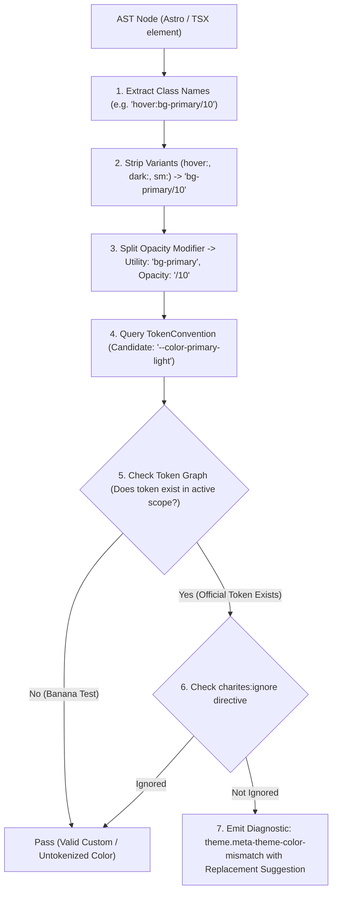
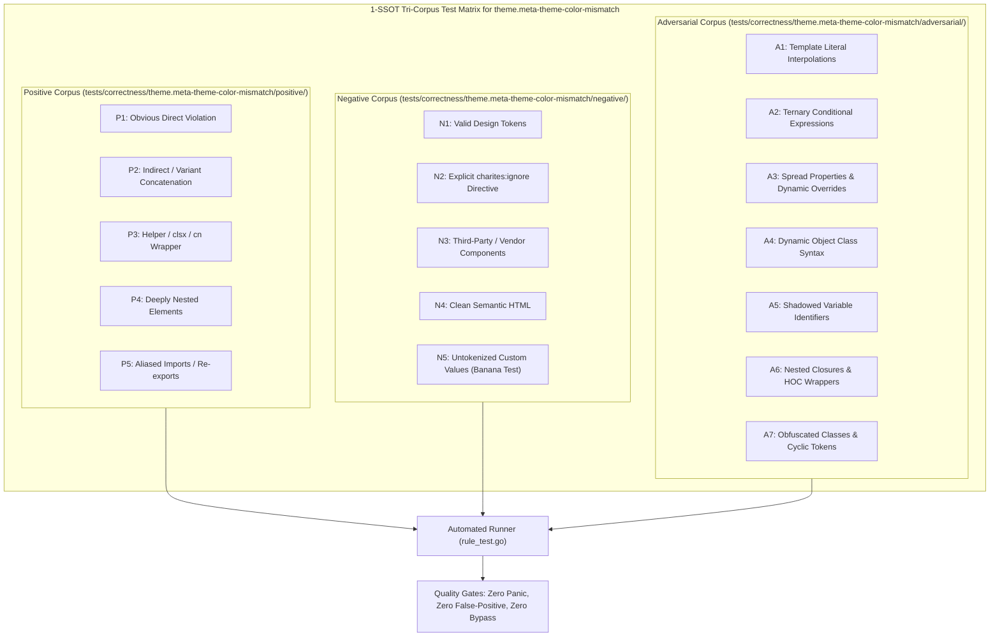

# theme.meta-theme-color-mismatch

> **Rule ID:** `theme.meta-theme-color-mismatch`
> **Severity:** `WARN`
> **Category:** `theme`
> **Target Standards:** HTML Living Standard Section 4.2.5 (The meta element), Web App Manifest & Mobile OS Theme Integration, WCAG 2.2 Success Criterion 1.4.11 (Non-text Contrast)

---

## 1. Overview & Core Invariant

Detects static meta theme-color tags lacking media prefers-color-scheme queries

### Core Invariant:
> **"Meta theme-color elements must provide media query pairs (prefers-color-scheme: light/dark) to synchronize mobile browser chrome."**

---
## 2. Technical Grounding & Engine Realities

Modern mobile browsers (Safari on iOS, Chrome on Android) color the operating system status bar and address bar based on the <meta name="theme-color"> element in the document <head>.

When developers specify a single static theme-color without media queries (e.g. <meta name="theme-color" content="#ffffff">):
1. Blinding Address Bar: When the user toggles dark mode, the mobile address bar and status bar remain stark white, causing harsh visual glare.
2. Inverted Chrome: When the page switches to dark background, white status bar text collapses against white browser chrome.

Charites enforces declaring media="(prefers-color-scheme: light)" and media="(prefers-color-scheme: dark)" pairs on all meta theme-color definitions.

---
## 3. Vulnerability & Risk Taxonomy

| Risk Vector | Severity | Impact |
| :--- | :---: | :--- |
| **Mobile Chrome Glare** | MEDIUM | Mobile Safari and Chrome address bars blast high-brightness white chrome when the application is viewed in dark mode. |
| **Status Bar Text Invisibility** | LOW | OS status bar text (time, battery, Wi-Fi) becomes invisible due to poor contrast against unadapted address bar backgrounds. |

---
## 4. Non-Compliant Code Patterns (Bad Examples)
### ASTRO (Static theme-color meta tag in Astro layout):
```astro
<meta name="theme-color" content="#ffffff" />
```
### TSX (Static theme-color in TSX Document head):
```tsx
<meta name="theme-color" content="#09090b" />
```

---
## 5. Compliant Implementation Patterns (Good Examples)
### ASTRO (Adaptive light/dark meta theme-color pair in Astro):
```astro
<>
  <meta name="theme-color" media="(prefers-color-scheme: light)" content="#ffffff" />
  <meta name="theme-color" media="(prefers-color-scheme: dark)" content="#09090b" />
</>
```
### TSX (Adaptive meta theme-color pair in TSX):
```tsx
<head>
  <meta name="theme-color" media="(prefers-color-scheme: light)" content="#ffffff" />
  <meta name="theme-color" media="(prefers-color-scheme: dark)" content="#09090b" />
</head>
```

---

## 6. Detection & Verification Pipeline (How The Rule Evaluates Code)
This `theme` rule evaluates source templates against the project's design token graph:



### Step-by-Step Evaluation:
1. **AST Node Traversal:** `internal/analyzer` streams JSX/Astro AST elements to the rule's `Evaluate` visitor.
2. **Variant Normalization:** Strips responsive (`sm:`, `md:`), interaction state (`hover:`, `focus:`), and theme (`dark:`) prefixes to isolate the core utility class.
3. **Modifier Extraction:** Parses utility segments and extracts slash opacity modifiers.
4. **Token Convention Resolution:** Consults the `TokenConvention` adapter to determine the official semantic design token replacement candidate.
5. **Token Graph Verification (Banana Test):** Queries `token.Context` to verify that the candidate token is declared in `global.css` or `tokens.json` within the element's scope. If not declared, the custom value is permitted without a false-positive diagnostic.
6. **Directive Suppression Check:** Inspects preceding AST comments for `charites:ignore theme.meta-theme-color-mismatch`.
7. **Diagnostic Emission:** Produces a structured diagnostic with line number, column span, and actionable replacement suggestion.

---

## 7. Verification & Test Harness (How The Test Works: 1-SSOT Tri-Corpus)

This rule is rigorously tested and validated across the canonical **1-SSOT Tri-Corpus** in `tests/correctness/theme.meta-theme-color-mismatch/`:



- **Positive Fixtures (P1-P5):** Verified to trigger diagnostics at exact lines and column spans.
- **Negative Fixtures (N1-N5):** Verified to produce zero diagnostics on valid tokens and legitimate exemptions.
- **Adversarial Fixtures (A1-A7):** Verified to prevent evasion across dynamic expressions, string interpolations, and cyclic references.

---

## 8. How to Suppress (Ignore Directives)

If this pattern is required for an intentional exception, suppress the diagnostic using the canonical Charites Rule ID:

```astro
<!-- charites:ignore theme.meta-theme-color-mismatch intentional exception -->
```

```tsx
// charites:ignore theme.meta-theme-color-mismatch intentional exception
```

---

## 9. Configuration Reference (`charites.yaml`)

```yaml
rules:
  theme.meta-theme-color-mismatch:
    severity: warn # error | warn | info | off
```

