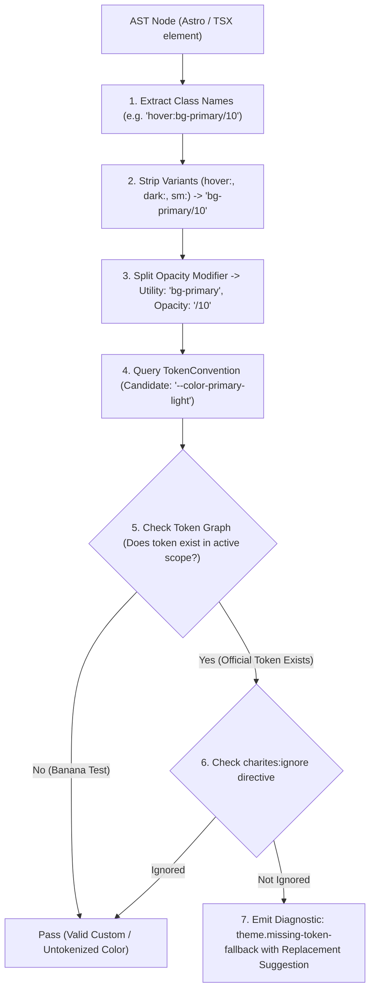
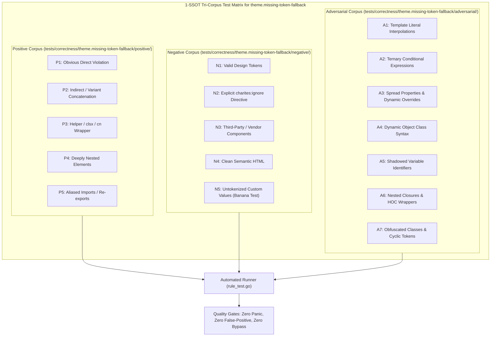

# theme.missing-token-fallback

> **Rule ID:** `theme.missing-token-fallback`
> **Severity:** `WARN`
> **Category:** `theme`
> **Target Standards:** W3C CSS Custom Properties for Cascading Variables Module Level 1, WCAG 2.2 Guideline 4.1 Compatible (Robust Graceful Degradation)

---

## 1. Overview & Core Invariant

Detects CSS variable references without fallback values

### Core Invariant:
> **"CSS variable references in production code must supply a safe fallback value to guard against unresolved design tokens."**

---
## 2. Technical Grounding & Engine Realities

CSS variables evaluated via var(--name) without a fallback revert to the CSS specification's 'guaranteed-invalid value' when undefined or failing to load.

When developers write color: var(--text-brand) or bg-[var(--brand)] without a fallback:
1. Broken Visual Contrast: Elements render completely transparent or default black, failing WCAG AA contrast.
2. Unhandled CDN / Token Latency: If design tokens load asynchronously or via isolated packages, missing fallbacks cause flash of broken unstyled content (FOBUC).
3. Graceful Degradation Failure: Micro-frontends or embedded widgets fail without host variable injection.

Charites recommends always supplying a fallback argument: var(--name, fallback-value).

---
## 3. Vulnerability & Risk Taxonomy

| Risk Vector | Severity | Impact |
| :--- | :---: | :--- |
| **Guaranteed-Invalid Property Rendering** | MEDIUM | Missing tokens evaluate to transparent/initial CSS values, causing catastrophic unreadable contrast. |
| **Micro-frontend Style Decoupling** | LOW | Components embedded in foreign hosts break when global tokens are not shared. |

---
## 4. Non-Compliant Code Patterns (Bad Examples)
### ASTRO (Missing fallback in arbitrary Tailwind utility class):
```astro
<div class="bg-[var(--brand)] text-[var(--text-color)]">Unsafe Variable</div>
```
### TSX (Missing fallback in inline style attribute):
```tsx
export function Card() {
  return <div style={{ color: "var(--brand-primary)" }}>Missing Fallback</div>;
}
```
### ASTRO (Missing fallback inside style block):
```astro
<style>
  .badge {
    background-color: var(--accent-color);
  }
</style>
```

---
## 5. Compliant Implementation Patterns (Good Examples)
### ASTRO (Safe fallback in arbitrary Tailwind utility class):
```astro
<div class="bg-[var(--brand,#2563eb)] text-[var(--text-color,currentColor)]">Safe Variable</div>
```
### TSX (Safe fallback in inline style attribute):
```tsx
export function Card() {
  return <div style={{ color: "var(--brand-primary, #1e293b)" }}>Safe Fallback</div>;
}
```
### ASTRO (Safe fallback inside style block):
```astro
<style>
  .badge {
    background-color: var(--accent-color, #f59e0b);
  }
</style>
```

---

## 6. Detection & Verification Pipeline (How The Rule Evaluates Code)
This `theme` rule evaluates source templates against the project's design token graph:



### Step-by-Step Evaluation:
1. **AST Node Traversal:** `internal/analyzer` streams JSX/Astro AST elements to the rule's `Evaluate` visitor.
2. **Variant Normalization:** Strips responsive (`sm:`, `md:`), interaction state (`hover:`, `focus:`), and theme (`dark:`) prefixes to isolate the core utility class.
3. **Modifier Extraction:** Parses utility segments and extracts slash opacity modifiers.
4. **Token Convention Resolution:** Consults the `TokenConvention` adapter to determine the official semantic design token replacement candidate.
5. **Token Graph Verification (Banana Test):** Queries `token.Context` to verify that the candidate token is declared in `global.css` or `tokens.json` within the element's scope. If not declared, the custom value is permitted without a false-positive diagnostic.
6. **Directive Suppression Check:** Inspects preceding AST comments for `charites:ignore theme.missing-token-fallback`.
7. **Diagnostic Emission:** Produces a structured diagnostic with line number, column span, and actionable replacement suggestion.

---

## 7. Verification & Test Harness (How The Test Works: 1-SSOT Tri-Corpus)

This rule is rigorously tested and validated across the canonical **1-SSOT Tri-Corpus** in `tests/correctness/theme.missing-token-fallback/`:



- **Positive Fixtures (P1-P5):** Verified to trigger diagnostics at exact lines and column spans.
- **Negative Fixtures (N1-N5):** Verified to produce zero diagnostics on valid tokens and legitimate exemptions.
- **Adversarial Fixtures (A1-A7):** Verified to prevent evasion across dynamic expressions, string interpolations, and cyclic references.

---

## 8. How to Suppress (Ignore Directives)

If this pattern is required for an intentional exception, suppress the diagnostic using the canonical Charites Rule ID:

```astro
<!-- charites:ignore theme.missing-token-fallback intentional exception -->
```

```tsx
// charites:ignore theme.missing-token-fallback intentional exception
```

---

## 9. Configuration Reference (`charites.yaml`)

```yaml
rules:
  theme.missing-token-fallback:
    severity: warn # error | warn | info | off
```

