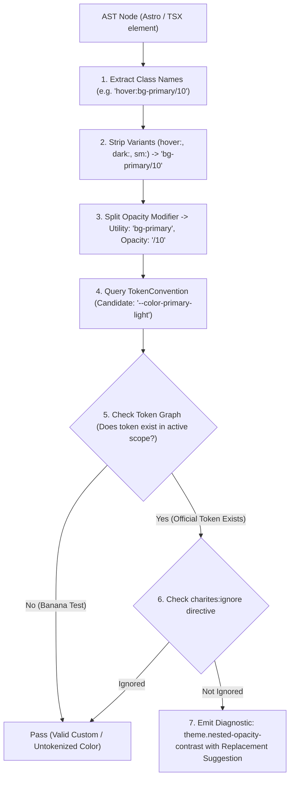
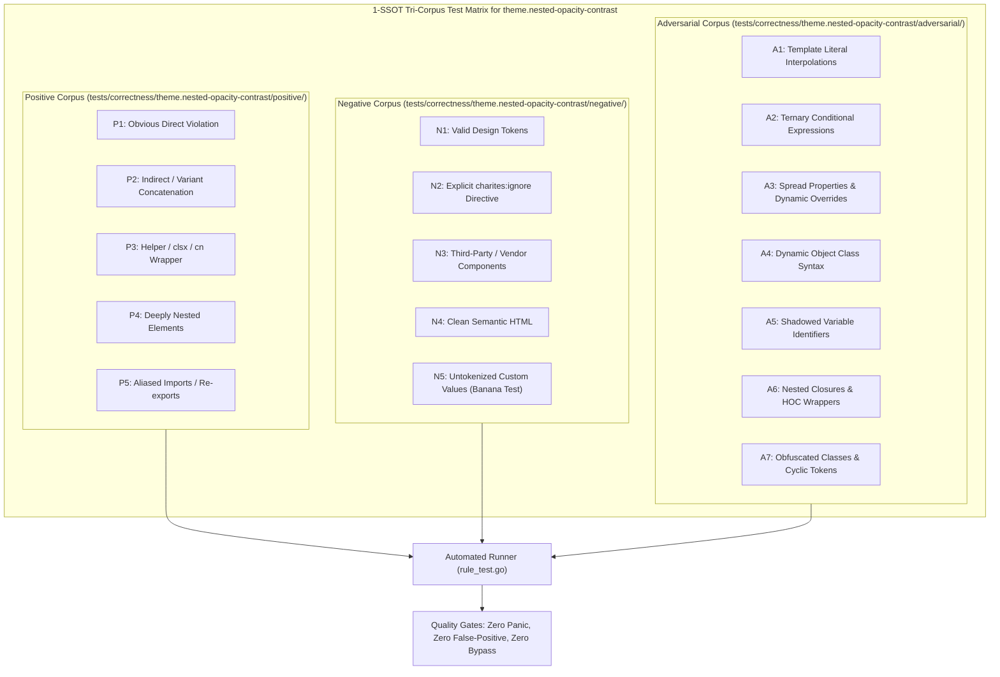

# theme.nested-opacity-contrast

> **Rule ID:** `theme.nested-opacity-contrast`
> **Severity:** `WARN`
> **Category:** `theme`
> **Target Standards:** WCAG 2.2 Success Criterion 1.4.3 (Contrast Minimum - 4.5:1), W3C DTCG State & Opacity Token Architecture, Hardware-Accelerated Compositing & Alpha Blending

---

## 1. Overview & Core Invariant

Detects nested opacity modifiers that compound to cause catastrophic text contrast degradation

### Core Invariant:
> **"Containers with opacity or semi-transparent backgrounds must not enclose child elements with compounded opacity modifiers."**

---
## 2. Technical Grounding & Engine Realities

When a parent container declares opacity (e.g. opacity-80 or bg-muted/40) and encloses child text or elements with another opacity modifier (e.g. text-foreground/50 or opacity-60), the browser multiplies effective alpha channels (0.8 × 0.5 = 0.40):

1. WCAG Contrast Catastrophe: Text that was theoretically compliant plummets below 2.5:1 contrast against the surface.
2. Inverted Washed-Out Appearance: Nested semi-transparency produces muddy, unreadable grey layers in dark mode.
3. Unpredictable Compositing: Nested opacity triggers extra GPU compositing passes and subpixel rendering degradation.

Charites enforces using pre-calibrated solid semantic tokens (e.g. text-muted-foreground instead of compounding text-foreground/50 over an opacity container).

---
## 3. Vulnerability & Risk Taxonomy

| Risk Vector | Severity | Impact |
| :--- | :---: | :--- |
| **Multiplicative Alpha Collapse** | HIGH | Compounded opacity causes text contrast to fail WCAG AA 4.5:1 accessibility requirements. |
| **Compositing Performance Overhead** | LOW | Nested alpha layers force browser rasterization pipelines into multiple offscreen passes. |

---
## 4. Non-Compliant Code Patterns (Bad Examples)
### TSX (Container opacity compounded with child slash opacity in TSX):
```tsx
<div className="bg-muted/40 opacity-80">
  <p className="text-foreground/50">Notice</p>
</div>
```
### ASTRO (Nested opacity on parent and child text in Astro):
```astro
<section class="opacity-75">
  <span class="text-white/60">Subtle</span>
</section>
```

---
## 5. Compliant Implementation Patterns (Good Examples)
### TSX (Using solid semantic container and pre-calibrated muted text token):
```tsx
<div className="bg-muted">
  <p className="text-muted-foreground">Notice</p>
</div>
```
### ASTRO (Solid background token and semantic foreground):
```astro
<section class="bg-card">
  <span class="text-foreground">Subtle</span>
</section>
```

---

## 6. Detection & Verification Pipeline (How The Rule Evaluates Code)
This `theme` rule evaluates source templates against the project's design token graph:



### Step-by-Step Evaluation:
1. **AST Node Traversal:** `internal/analyzer` streams JSX/Astro AST elements to the rule's `Evaluate` visitor.
2. **Variant Normalization:** Strips responsive (`sm:`, `md:`), interaction state (`hover:`, `focus:`), and theme (`dark:`) prefixes to isolate the core utility class.
3. **Modifier Extraction:** Parses utility segments and extracts slash opacity modifiers.
4. **Token Convention Resolution:** Consults the `TokenConvention` adapter to determine the official semantic design token replacement candidate.
5. **Token Graph Verification (Banana Test):** Queries `token.Context` to verify that the candidate token is declared in `global.css` or `tokens.json` within the element's scope. If not declared, the custom value is permitted without a false-positive diagnostic.
6. **Directive Suppression Check:** Inspects preceding AST comments for `charites:ignore theme.nested-opacity-contrast`.
7. **Diagnostic Emission:** Produces a structured diagnostic with line number, column span, and actionable replacement suggestion.

---

## 7. Verification & Test Harness (How The Test Works: 1-SSOT Tri-Corpus)

This rule is rigorously tested and validated across the canonical **1-SSOT Tri-Corpus** in `tests/correctness/theme.nested-opacity-contrast/`:



- **Positive Fixtures (P1-P5):** Verified to trigger diagnostics at exact lines and column spans.
- **Negative Fixtures (N1-N5):** Verified to produce zero diagnostics on valid tokens and legitimate exemptions.
- **Adversarial Fixtures (A1-A7):** Verified to prevent evasion across dynamic expressions, string interpolations, and cyclic references.

---

## 8. How to Suppress (Ignore Directives)

If this pattern is required for an intentional exception, suppress the diagnostic using the canonical Charites Rule ID:

```astro
<!-- charites:ignore theme.nested-opacity-contrast intentional exception -->
```

```tsx
// charites:ignore theme.nested-opacity-contrast intentional exception
```

---

## 9. Configuration Reference (`charites.yaml`)

```yaml
rules:
  theme.nested-opacity-contrast:
    severity: warn # error | warn | info | off
```

